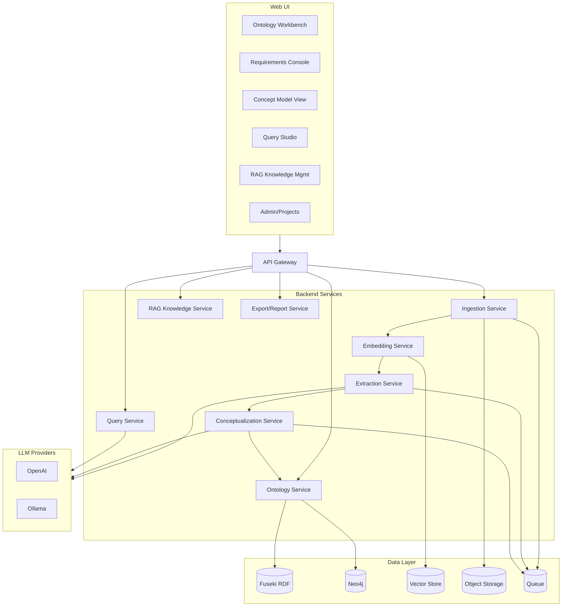

## Concept Tool — Comprehensive Specification (v1.0)

This specification defines the architecture, data models, APIs, workflows, and governance for the Concept Tool. It builds on `docs/concept_need_reviewed.md` and turns it into an implementable plan.

## 1. Overview

- **Purpose**: Manage projects and documents; extract requirements; conceptualize systems; govern ontology-backed knowledge; and enable safe, auditable LLM-assisted workflows.
- **Audience**: Product, engineering, ontology, data governance, QA, and devops teams.
- **References**: `docs/concept_need_reviewed.md` (Reviewed Needs v0.1).

## 2. Goals and Non-goals

- **Goals**:
  - End-to-end pipeline: ingest → parse → chunk/embed → extract requirements → review/approve → conceptualize → persist → query/report.
  - RDF as canonical source; Neo4j as a projection.
  - Schema-constrained LLM outputs (JSON) with prompt governance and evaluation.
  - UI for ontology workbench, requirements console, conceptual model view, query studio, and RAG knowledge management.
- **Non-goals** (v1.0):
  - Full auto-ontology extraction (roadmap).
  - Multi-cloud vendor-specific managed services integration beyond standard OSS components.

## 3. User Roles and Permissions (RBAC)

- **Admin**: Org/project admin, settings, user management, secrets, approvals override.
- **Architect**: Ontology editing, conceptualization operations, projections.
- **SME**: Requirement review/approval, RAG knowledge curation.
- **Viewer**: Read-only across approved items, run read-only queries.

## 4. Functional Requirements

- **Project/User Management**: CRUD projects, invite users, assign roles; audit log of changes.
- **Document Ingestion**: Upload PDF/DOCX/MD/TXT; OCR; capture metadata; version documents; delta re-ingest.
- **Chunking/Embeddings**: Configurable chunk size/overlap; embeddings stored with metadata; re-embed on model/parser change.
- **Requirement Extraction**: Detect patterns (shall/should/will/must; passive voice); quality checks; dedup; link to source spans; version and review workflow.
- **Ontology Workbench**: CRUD Classes, Object/Data/Annotation properties; manage URIs/datatypes; React Flow graph and tree views.
- **Conceptualization**: Generate candidate Components, Interfaces, Processes, Functions, Conditions; cluster with probabilities; convergence criteria; persistence.
- **Traceability**: `Requirement → constrained_by/satisfied_by/verified_by/derived_from/refines/...` and links to concepts/tests.
- **RAG Knowledge Management**: Upload a priori knowledge (e.g., requirement-writing guides); parse, embed, validate; enable per task/persona; citations.
- **NL → Query**: Generate SPARQL/Cypher with preview and read-only execution by default; schema-aware validation.
- **Reporting/Export**: Requirements and conceptualization reports; ReqIF/OSLC, CSV/JSON/TTL, PDF/DOCX; MBSE export to Teamwork Cloud (SysML); BPMN to Camunda.

## 5. Non-functional Requirements

- **Performance**:
  - Ingestion parse throughput: ≥ 30 pages/minute per worker.
  - Requirement extraction latency: p95 ≤ 5s per 10 pages with cached embeddings.
  - NL→query generation: p95 ≤ 2s (local) / ≤ 4s (remote LLM).
- **Reliability**: 99.5% monthly availability for APIs; idempotent pipelines with retries/backoff.
- **Security**: RBAC, project isolation, PII scanning in RAG uploads, secrets via vault, TLS in transit.
- **Auditability**: Immutable logs for approvals, ontology edits, prompt usage, query executions.
- **Portability**: Dockerized; single-node compose for dev; scalable services for prod.

## 6. System Architecture



### 6.1 Services

- **API Gateway**: Auth, rate limit, request routing; error normalization.
- **Ingestion**: File upload, parsing, OCR; writes to object storage and metadata; enqueues chunking/embedding.
- **Embedding**: Chunking; embeddings; vector upsert; metadata tagging/versioning.
- **Extraction**: Requirement extraction; quality checks; linking to source; enqueue for review.
- **Conceptualization**: Concept proposals, clustering, convergence; persistence to RDF; projection to Neo4j.
- **Ontology**: CRUD ontology objects; SHACL validation; projection jobs to Neo4j.
- **Query**: NL→SPARQL/Cypher; schema validation; safe execution; result caching.
- **RAG Knowledge**: Managed knowledge sets; pipeline mirroring document ingestion; enablement per task/persona.
- **Export/Report**: ReqIF/OSLC/CSV/JSON/TTL and PDF/DOCX generation; MBSE and BPMN export.

## 7. Data Model

### 7.1 Ontology (RDF canonical)

- **Classes**: `Requirement`, `Constraint`, `Component`, `Interface`, `Function`, `Process`, `Condition`, `Stakeholder`, `SourceDocument`, `TestCase`, `Verification`, `RequirementSet`, `Rationale`, `Assumption`, `Risk`.
- **Object properties**: `constrained_by`, `satisfied_by`, `verified_by`, `originates_from`, `derived_from`, `refines`, `has_interface`, `allocated_to`, `realizes`, `triggered_by`, `conflicts_with`, `duplicates`, `replaces`, `related_to`.
- **Data/annotation**: `id`, `title`, `text`, `state`, `priority`, `risk_level`, `rationale`, `created_at`, `updated_at`, `version`, `provenance`.
- **Validation**: SHACL shapes for each class; enforce required properties and value sets.

### 7.2 Vector Store Schema

- **Fields**: `embedding` (array<float>), `doc_id`, `chunk_id`, `chunk_idx`, `project_id`, `source`, `page_ref`, `section_ref`, `lang`, `embedding_model`, `parser_version`, `content_hash`, `version`, `created_at`.

### 7.3 Neo4j Projection

- **Projection**: Via n10s or ETL of selected classes/properties.
- **Naming**: Labels mirror class names; relationships mirror object properties; include `iri` and `uuid` as identifiers.

## 8. APIs (High-level)

- **Auth**: OAuth2 or token-based; project scoping via headers.
- **Content-type**: JSON; binary upload via multipart/form-data.

### 8.1 Documents

- `POST /api/projects/{pid}/documents` (multipart) → { `document_id`, metadata }
- `GET /api/projects/{pid}/documents/{id}` → metadata + status
- `POST /api/projects/{pid}/documents/{id}/reingest` → re-parse/version

### 8.2 Requirements

- `POST /api/projects/{pid}/requirements/extract` → starts extraction for a document/version
- `GET /api/projects/{pid}/requirements` → list with states
- `POST /api/projects/{pid}/requirements/{rid}/review` → { decision: approve|reject, comments }

### 8.3 Ontology

- CRUD for classes and properties; SHACL validation endpoint.
- `POST /api/ontology/projection` → project canonical RDF to Neo4j.

### 8.4 Conceptualization

- `POST /api/projects/{pid}/concepts/propose` → generate candidate concepts
- `GET /api/projects/{pid}/concepts` → list clusters, probabilities
- `POST /api/projects/{pid}/concepts/{cid}/accept` → persist to RDF

### 8.5 RAG Knowledge

- `POST /api/projects/{pid}/knowledge` (multipart) → create knowledge set and ingest content
- `GET /api/projects/{pid}/knowledge` → list sets and versions
- `POST /api/projects/{pid}/knowledge/{kid}/enable` → enable for tasks/personas

### 8.6 NL → Query

- `POST /api/query/generate` { intent, modality: sparql|cypher, constraints } → { query, rationale }
- `POST /api/query/execute` { query, modality } → { rows, stats } (read-only by default)

### 8.7 Export

- `POST /api/projects/{pid}/export` { format } → downloadable artifact

## 9. LLM Output Contracts (JSON Schemas)

### 9.1 Requirement Schema

```json
{
  "$schema": "https://json-schema.org/draft/2020-12/schema",
  "$id": "https://example.com/schemas/requirement.schema.json",
  "type": "object",
  "required": ["id", "text", "state", "originates_from"],
  "properties": {
    "id": {"type": "string"},
    "text": {"type": "string"},
    "state": {"enum": ["Draft", "Reviewed", "Approved"]},
    "priority": {"type": "string"},
    "risk_level": {"type": "string"},
    "originates_from": {"type": "string"},
    "constrained_by": {"type": "array", "items": {"type": "string"}},
    "satisfied_by": {"type": "array", "items": {"type": "string"}},
    "verified_by": {"type": "array", "items": {"type": "string"}}
  }
}
```

### 9.2 Concept Proposal Schema

```json
{
  "$schema": "https://json-schema.org/draft/2020-12/schema",
  "$id": "https://example.com/schemas/concept_proposal.schema.json",
  "type": "object",
  "required": ["concepts", "clusters"],
  "properties": {
    "concepts": {
      "type": "array",
      "items": {
        "type": "object",
        "required": ["id", "type", "label", "probability"],
        "properties": {
          "id": {"type": "string"},
          "type": {"enum": ["Component", "Interface", "Process", "Function", "Condition"]},
          "label": {"type": "string"},
          "probability": {"type": "number", "minimum": 0, "maximum": 1}
        }
      }
    },
    "clusters": {
      "type": "array",
      "items": {
        "type": "object",
        "required": ["id", "members", "probability"],
        "properties": {
          "id": {"type": "string"},
          "members": {"type": "array", "items": {"type": "string"}},
          "probability": {"type": "number", "minimum": 0, "maximum": 1}
        }
      }
    }
  }
}
```

### 9.3 NL→Query Generation Schema

```json
{
  "$schema": "https://json-schema.org/draft/2020-12/schema",
  "$id": "https://example.com/schemas/query_generation.schema.json",
  "type": "object",
  "required": ["modality", "query", "explanations"],
  "properties": {
    "modality": {"enum": ["sparql", "cypher"]},
    "query": {"type": "string"},
    "explanations": {"type": "array", "items": {"type": "string"}},
    "safety": {"type": "object", "properties": {"estimated_read_rows": {"type": "integer"}}}
  }
}
```

## 10. Pipelines and Jobs

- **Queues**: Use a durable queue for long-running or retryable tasks (e.g., chunking, embeddings, extraction, conceptualization, projection, export).
- **Idempotency**: Content-hash keys and version tags; safe re-runs.
- **Backoff**: Exponential backoff on provider/API failures; circuit breakers for LLMs.
- **Scheduling**: Cron for re-projection and evaluation runs.

## 11. UI Specification

- **Ontology Workbench**: React Flow graph and hierarchical tree; CRUD over ontology; SHACL validation feedback; URI/datatype management.
- **Requirements Console**: Side-by-side source text with highlighted spans; quality warnings; review actions; trace link suggestions.
- **Concept Model View**: Clusters with probabilities; merge/split; accept/reject; view traceability to requirements.
- **Query Studio**: NL intent input → generated SPARQL/Cypher preview → run read-only; saved queries; result table and graph view.
- **RAG Knowledge Management**: Upload a priori knowledge; show parsing/embedding status; validation report; enable/disable per task/persona; citation previews.
- **Admin**: Projects, roles, audit log, prompt versions, model routing policies.

## 12. LLM Team and Governance

- **Providers**: OpenAI and Ollama via a routing layer; model capability registry per task.
- **Prompt lifecycle**: Draft → Tested → Approved; store with versions and metrics; only Approved prompts in production.
- **Contracts**: All constrained tasks must produce JSON validated against schemas in Section 9.
- **Observability**: Prompt and output logging with PII redaction; per-task latency and cost budgets.

## 13. Security and Compliance

- **AuthZ**: RBAC at org/project levels; endpoint guards per role.
- **Data**: Tenant isolation; encrypted at rest/in transit; content hashing; redaction on exports when configured.
- **Audit**: Append-only logs for sensitive actions (approvals, ontology changes, query executes).

## 14. Observability and QA

- **Telemetry**: Structured logs, metrics, tracing; dashboards for extraction quality, approvals throughput, LLM latency/costs, vector recall.
- **Evaluation**: Regression suites for extraction, NL→query, conceptualization; tracked over time.

## 15. Versioning, Baselines, and IDs

- **Versioning**: Documents, embeddings, requirements, ontology, concepts, prompts, and knowledge sets are versioned.
- **Baselines**: Project-wide snapshots; immutable; diff support.
- **IDs**: Human-friendly IDs + immutable UUIDs across stores.

## 16. Deployment and Environments

- **Dev (local)**: Docker compose; services for API, workers, Fuseki, Neo4j, vector store, object store, queue, UI.
- **Dev helpers**: Use `./blueforce-start.sh` to manage the dev UI server and local LLM; UI on port 4000, Ollama on 11434; check status to avoid port hangs.
- **Staging/Prod**: Containerized; externalized secrets; backups for RDF/Neo4j/vector/object stores; health probes and autoscaling.

## 17. Performance Targets (SLOs)

- **API availability**: 99.5% monthly.
- **NL→Query latency**: p95 ≤ 2–4s depending on provider.
- **Extraction throughput**: ≥ 10 documents/hour/worker (50–100 pages each), excluding OCR-heavy docs.

## 18. Risks and Mitigations

- **Model drift**: Regular evaluation with alerts; prompt and model version pinning.
- **Hallucinations**: Strict schema validation; citations required for RAG-augmented outputs.
- **Cost overrun**: Caching, budgets, and rate limiting; local model fallbacks for heavy tasks.
- **Data leakage**: Redaction, PII scanning for RAG uploads, and tenant isolation enforcement.

## 19. Roadmap

- **Phase 1 (MVP)**: Ingestion, embeddings, extraction with review, RDF canonical store, basic ontology workbench, NL→SPARQL/Cypher preview, RAG knowledge upload, basic reports.
- **Phase 2**: Probabilistic conceptualization with convergence, Neo4j projection, dashboards, export to ReqIF/OSLC and MBSE, BPMN→Camunda.
- **Phase 3**: Semi-automatic ontology extraction by agent team; active learning loops.

## 20. Appendices

- **Example SPARQL (Requirements by State)**:

```sparql
PREFIX ex: <http://example.com/ontology/>
SELECT ?req ?title ?state WHERE {
  ?req a ex:Requirement ;
       ex:title ?title ;
       ex:state ?state .
}
```

- **Example Cypher (Concepts satisfied by Components)**:

```cypher
MATCH (r:Requirement)-[:SATISFIED_BY]->(c:Component)
RETURN r.id, c.id
LIMIT 50
```

- **SHACL Sketch (Requirement)**:

```turtle
@prefix sh: <http://www.w3.org/ns/shacl#> .
@prefix ex: <http://example.com/ontology/> .

ex:RequirementShape a sh:NodeShape ;
  sh:targetClass ex:Requirement ;
  sh:property [ sh:path ex:title ; sh:minCount 1 ; sh:datatype xsd:string ] ;
  sh:property [ sh:path ex:state ; sh:minCount 1 ; sh:in ("Draft" "Reviewed" "Approved") ] .
```
