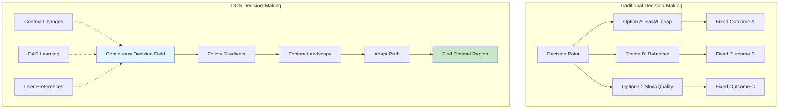

# Decision Options Space (DOS) for Beginners: A Gentle Introduction

> ### 🌟 **Understanding Decisions as Landscapes, Not Points**
> *"Imagine standing on a hill looking at a vast landscape of possibilities, rather than choosing between a few doors."*
> 
> This guide introduces the Decision Options Space (DOS) concept in simple terms, with practical examples showing how it works with DAS (Digital Assistance System) to create ambient intelligence in DADMS.

## Table of Contents

1. [The Big Idea: From Points to Fields](#the-big-idea-from-points-to-fields)
2. [Understanding Fields Through Everyday Examples](#understanding-fields-through-everyday-examples)
3. [The Mathematics Made Simple](#the-mathematics-made-simple)
4. [A Complete Example: Planning a Simulation Study](#a-complete-example-planning-a-simulation-study)
5. [How DAS Uses DOS](#how-das-uses-dos)
6. [Building Your Intuition](#building-your-intuition)
7. [Practical Exercises](#practical-exercises)

## The Big Idea: From Points to Fields

### Traditional Decision-Making (The Old Way)
Imagine you're at a restaurant with a menu:
- Option A: Burger ($10)
- Option B: Salad ($8)
- Option C: Pizza ($12)

You pick one. That's it. Decision made.

### DOS Decision-Making (The New Way)
Now imagine you're a chef creating your own meal:
- You have a **continuous spectrum** of ingredients
- You can combine them in **infinite ways**
- Each combination has **smooth trade-offs**
- The "best" meal **depends on context** (hunger level, dietary needs, time available)

This is DOS - decisions exist in a continuous field of possibilities, not just discrete points.

## Understanding Fields Through Everyday Examples

### Example 1: Temperature Field in a Room
Think about temperature in your room:
- It's not the same everywhere
- It varies **continuously** from the heater to the window
- You can measure it at any point
- It changes over time

This is a **field** - a value that exists at every point in space and time.

### Example 2: Decision Fields
Now imagine "decision quality" like temperature:
- Every possible decision has a quality value
- Similar decisions have similar quality (continuity)
- Quality changes based on context (time-dependence)
- You can "feel" the gradient toward better decisions

## The Mathematics Made Simple

### 1. The Option Field Φ(x,t)

**What it means**: At any point x (your situation) and time t, there's a field value Φ telling you about available options.

**Simple analogy**: Like a weather map showing pressure at every location.

```
Example:
- x = [budget=1000, time=5days, quality_needed=high]
- t = current moment
- Φ(x,t) = strength of options available at this point
```

### 2. The Gradient ∇Φ

**What it means**: The direction of steepest improvement from where you are.

**Simple analogy**: If you're on a hillside, the gradient points uphill.

```
Example:
- Current position: budget=$1000, time=5 days
- Gradient might say: "Increasing budget by $100 improves options more than adding 1 day"
```

### 3. The Jacobian Matrix

**What it means**: How sensitive your options are to changes in each parameter.

**Simple analogy**: Like a car's dashboard showing how each control affects speed.

```
Jacobian = [
  [∂options/∂budget,  ∂options/∂time,  ∂options/∂quality],
  [∂risk/∂budget,     ∂risk/∂time,     ∂risk/∂quality],
  [∂cost/∂budget,     ∂cost/∂time,     ∂cost/∂quality]
]
```

**In plain English**: 
- First row: How do options change when you adjust budget, time, or quality?
- Second row: How does risk change?
- Third row: How does cost change?

### 4. The Hessian (Curvature)

**What it means**: Is this a stable decision point or a risky one?

**Simple analogy**: 
- **Valley** (positive curvature) = stable decision
- **Peak** (negative curvature) = unstable decision
- **Saddle** (mixed) = stable in some directions, unstable in others


## The Magic of Weight-Free Decisions

### Why DOS Doesn't Use Weights

Traditional decision-making often asks you to assign weights:
- "How important is cost vs. quality?" (70% vs 30%?)
- "Do you prioritize speed or accuracy?" (60% vs 40%?)

**The problem**: These weights are arbitrary and biased!

### DOS's Revolutionary Approach: Let Geometry Decide

Instead of you deciding what's important, DOS discovers importance from the natural shape of the decision landscape.

#### Simple Analogy: River Flow

Think about how water flows down a mountain:
- Water doesn't "weight" different paths
- It naturally finds the path of least resistance
- The landscape geometry determines the flow
- Different starting points lead to different streams

DOS works the same way with decisions!

### How It Works in Practice

#### Traditional (Weighted) Approach:
```
Decision Score = 0.3 × Cost + 0.5 × Quality + 0.2 × Time
```
❌ Who decided these weights? Why 0.3 and not 0.4?

#### DOS (Geometric) Approach:
```
Decision Flow follows the natural contours where:
- Steep slopes = Critical trade-offs (naturally important)
- Flat areas = Flexible choices (less critical)
- Valleys = Stable solutions (good resting points)
```
✅ Importance emerges from the landscape itself!

### Real Example: Choosing Simulation Parameters

**Old way**: "I'll weight accuracy at 70% and speed at 30%"

**DOS way**: The system discovers that:
- Below 100,000 mesh cells, accuracy drops steeply (critical region)
- Between 100,000-500,000, moderate improvement (balanced region)
- Above 500,000, minimal gains (flat region)

The geometry tells you where the important decisions are!

### DAS Makes It Even Smarter

DAS doesn't impose weights either. Instead, it:
1. **Learns the landscape** from all users' experiences
2. **Identifies natural paths** through the decision space
3. **Guides you along contours** that match your context
4. **Adapts the geometry** based on outcomes

### The Freedom of Weight-Free Thinking

Without fixed weights:
- **Morning**: When you're time-pressed, you naturally flow toward quick solutions
- **Afternoon**: With more time, you might explore quality regions
- **Project phase**: Early explorations follow different paths than final validations

The same landscape, different contexts, natural navigation!

### Visual Example: Weight-Free Navigation

```
Traditional Weighted Decision:
    Cost (30%) ─┐
    Time (20%) ──┼──→ Fixed Formula → Single Score
    Quality (50%)─┘

DOS Geometric Decision:
    ┌─── High Quality Region (steep climb)
    │    ┌─── Balanced Region (gentle slope)
    │    │    ┌─── Fast Region (easy path)
    ↓    ↓    ↓
    ▲    ▲    ▲     <-- You naturally flow
    █    █    █         to what matters now
    ███  ███  ███
    ████████████████ <-- The landscape itself
```

### Key Insight

> "In DOS, importance isn't assigned - it's discovered. The geometry of the problem space naturally reveals what matters, when it matters, and how much it matters."

This is true intelligence: not following predetermined weights, but understanding the natural structure of decisions.


## A Complete Example: Planning a Simulation Study

Let's walk through how DOS works in DADMS when planning an engineering simulation.

### Scenario Setup
You're an engineer needing to run CFD simulations for an aircraft design. Traditional approach would give you options like:
- Option A: Quick simulation (1 hour, low accuracy)
- Option B: Standard simulation (8 hours, medium accuracy)
- Option C: Detailed simulation (48 hours, high accuracy)

### The DOS Approach

#### Step 1: Define the Decision Space
Instead of 3 options, we have continuous parameters:
- **Mesh density**: 10,000 to 10,000,000 cells
- **Time steps**: 100 to 100,000
- **Solver precision**: 1e-3 to 1e-9
- **Computational resources**: 1 to 1000 cores

#### Step 2: The Option Field Forms
DOS creates a field Φ(mesh, time, precision, cores) that represents the "quality" of outcomes at each point.

```typescript
// Simplified representation
function optionField(params: SimulationParams): OptionQuality {
  const accuracy = Math.log(params.mesh) * Math.log(params.timeSteps) * (-Math.log(params.precision));
  const speed = params.cores / (params.mesh * params.timeSteps);
  const cost = params.cores * (params.mesh / 1000000) * (params.timeSteps / 1000);
  
  return {
    accuracy,
    speed,
    cost,
    overall: accuracy * 0.5 + speed * 0.3 - cost * 0.2
  };
}
```

#### Step 3: DAS Analyzes the Landscape

DAS doesn't just evaluate fixed points - it understands the entire landscape:

```typescript
class DASAnalysis {
  analyzeDecisionLandscape(context: UserContext): Insight {
    // 1. Sample the field at multiple points
    const samples = this.sampleField(1000);
    
    // 2. Find critical points (peaks, valleys, saddles)
    const criticalPoints = this.findCriticalPoints(samples);
    
    // 3. Compute gradients to understand trade-offs
    const gradients = this.computeGradients(criticalPoints);
    
    // 4. Identify stable regions (positive Hessian)
    const stableRegions = this.findStableRegions(gradients);
    
    return {
      optimal: criticalPoints.filter(p => p.type === 'maximum'),
      stable: stableRegions,
      tradeoffs: this.analyzeTradeoffs(gradients)
    };
  }
}
```

#### Step 4: Ambient Intelligence in Action

Here's where it gets magical. DAS doesn't just give you an answer - it helps you navigate:

```typescript
class AmbientGuidance {
  async guideUser(currentPosition: DecisionPoint): Promise<Guidance> {
    // DAS senses where you are in the decision space
    const location = this.locateInField(currentPosition);
    
    // It understands the local landscape
    const localField = this.analyzeLocalField(location);
    
    // It knows your constraints and preferences
    const constraints = await this.getUserConstraints();
    
    // It suggests not just what, but why and how
    return {
      // Direction of improvement
      suggestion: "Increasing mesh density by 20% would improve accuracy by 15% 
                   with only 5% time increase",
      
      // Alternative paths
      alternatives: [
        "If time is critical, reduce precision to 1e-4 and double cores",
        "For publication quality, follow the ridge to 2M cells with adaptive refinement"
      ],
      
      // Contextual warnings
      warnings: "You're approaching a instability region where convergence becomes unpredictable",
      
      // Learning from similar decisions
      historical: "Similar projects found sweet spot at 1.5M cells with 16 cores"
    };
  }
}
```

### The User Experience

Instead of picking A, B, or C, the user experience becomes:

1. **DAS presents the landscape**: "Here's the simulation quality landscape for your problem"

2. **User explores**: "What if I had more time?" 
   - DAS instantly shows how the landscape shifts

3. **DAS guides**: "I notice you're prioritizing accuracy. There's a sweet spot at these parameters where you get 95% of max accuracy at 40% of the cost"

4. **User adjusts**: Smoothly slides parameters while seeing real-time field updates

5. **DAS learns**: "Users with similar problems often find this path through the landscape most effective"

## How DAS Uses DOS

### 1. Sensing the Field
DAS continuously monitors the decision landscape:

```typescript
class FieldSensor {
  sense(): FieldState {
    return {
      // Current option density
      density: this.measureOptionDensity(),
      
      // Rate of change
      velocity: this.measureFieldVelocity(),
      
      // Stability
      turbulence: this.measureFieldTurbulence()
    };
  }
}
```

### 2. Shaping the Field
DAS can modify the landscape based on learning:

```typescript
class FieldShaper {
  async adaptField(feedback: UserFeedback): Promise<void> {
    // Learn what worked
    const success = this.analyzeFeedback(feedback);
    
    // Strengthen successful paths
    await this.reinforcePath(success.path);
    
    // Smooth out difficult regions
    await this.smoothRoughRegions(success.difficulties);
    
    // Create new options where needed
    await this.generateNewOptions(success.gaps);
  }
}
```

### 3. Navigating Users
DAS provides ambient guidance:

```typescript
class AmbientNavigator {
  provideGuidance(userState: State): ContinuousGuidance {
    // Not "turn left" but "drift toward higher quality"
    const gradient = this.computeGradient(userState.position);
    
    // Not "stop here" but "you're entering a stable region"
    const stability = this.assessLocalStability(userState.position);
    
    // Not "choose A" but "explore this promising direction"
    const exploration = this.suggestExploration(gradient, stability);
    
    return {
      direction: gradient,
      confidence: stability,
      exploration: exploration
    };
  }
}
```

## Building Your Intuition

### Think Like Water
Decisions flow like water through a landscape:
- They naturally follow gradients
- They pool in stable regions (local optima)
- They avoid high-energy barriers
- They find the path of least resistance

### The Ambient Difference
Traditional AI: "Based on analysis, choose Option B"
Ambient Intelligence: "You're in a good region, but there's an even better valley if you slightly increase X while decreasing Y"

### Context Changes Everything
The same decision point can be:
- A peak in one context (best for speed)
- A valley in another context (worst for accuracy)
- A saddle point in a third (good for balance)

## Practical Exercises

### Exercise 1: Visualize Your Own Decision Field
Think of a recent complex decision:
1. What were the continuous parameters? (not just discrete options)
2. How did they trade off against each other?
3. Where did you end up in the landscape?
4. Could you have "slid" to a better position?

### Exercise 2: Identify Gradients
In your daily work:
1. When you make a decision, ask: "Which direction would improve this?"
2. Are you at a stable point or could small changes help?
3. What's the "gradient" telling you?

### Exercise 3: Spot the Ambient Intelligence
When using DADMS:
1. Notice when DAS suggests alternatives rather than fixed options
2. Observe how suggestions change with context
3. Feel how the system guides rather than dictates

## Summary: The DOS Mindset

DOS transforms decision-making from:
- **Discrete → Continuous**: Infinite possibilities, not limited menus
- **Static → Dynamic**: Landscapes that evolve with context
- **Isolated → Connected**: Decisions exist in relationship
- **Binary → Gradient**: Smooth transitions, not hard boundaries
- **Prescriptive → Ambient**: Guidance, not commands

With DAS as the ambient intelligence, you don't just make decisions - you navigate through a rich landscape of possibilities, with the system continuously sensing, adapting, and guiding your journey.

## Next Steps
5. **Quick Reference**: Keep the [DOS Quick Reference Card](./DOS_QUICK_REFERENCE.md) handy for mathematical concepts

1. **Read**: [Decision Options Space Mathematical Foundations](./DECISION_OPTIONS_SPACE_MATHEMATICAL_FOUNDATIONS.md) - for deeper mathematical details
2. **Explore**: [DAS Digital Assistance System](./DAS_DIGITAL_ASSISTANCE_SYSTEM.md) - to understand the ambient intelligence
3. **Practice**: Start thinking of your decisions as fields rather than points
4. **Experiment**: Use DADMS and notice the DOS principles in action

Remember: DOS isn't just a mathematical framework - it's a new way of thinking about decisions as continuous, contextual, and navigable landscapes rather than isolated choices.

## Visual Summary: Traditional vs DOS Decision-Making



## Key Takeaway

The revolution of DOS is not in making better decisions, but in fundamentally changing how we think about decisions. Instead of choosing from a menu, we navigate through a landscape. Instead of picking doors, we flow like water finding the optimal path. And with DAS as our ambient intelligence, we don't navigate alone - the very medium we move through is intelligent, adaptive, and supportive.

Welcome to the future of decision-making, where every choice exists in a rich, continuous field of possibilities!
