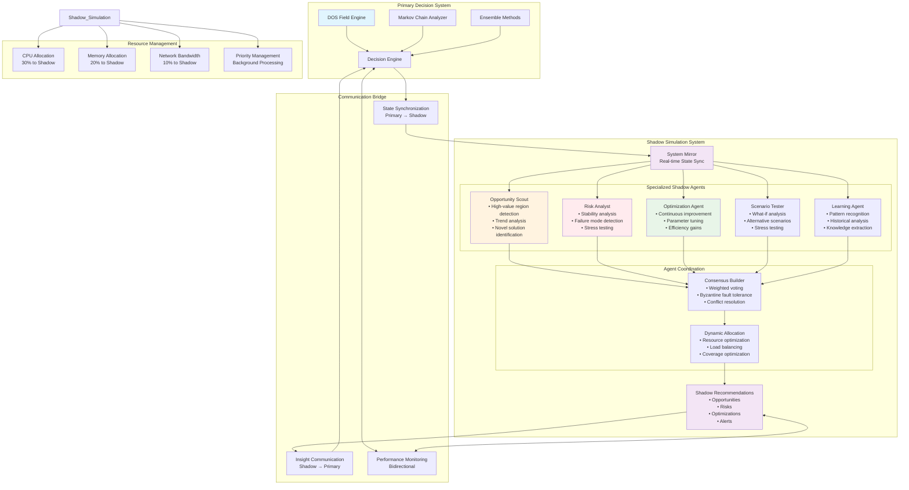
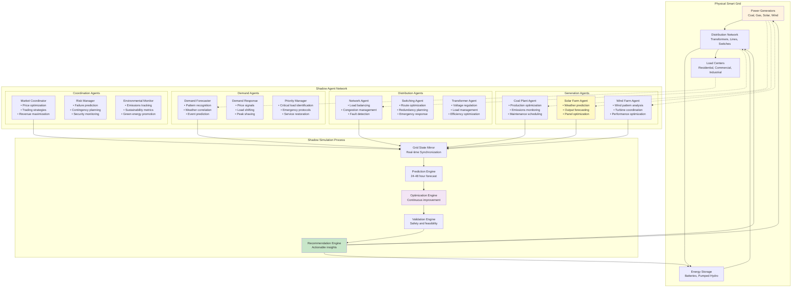
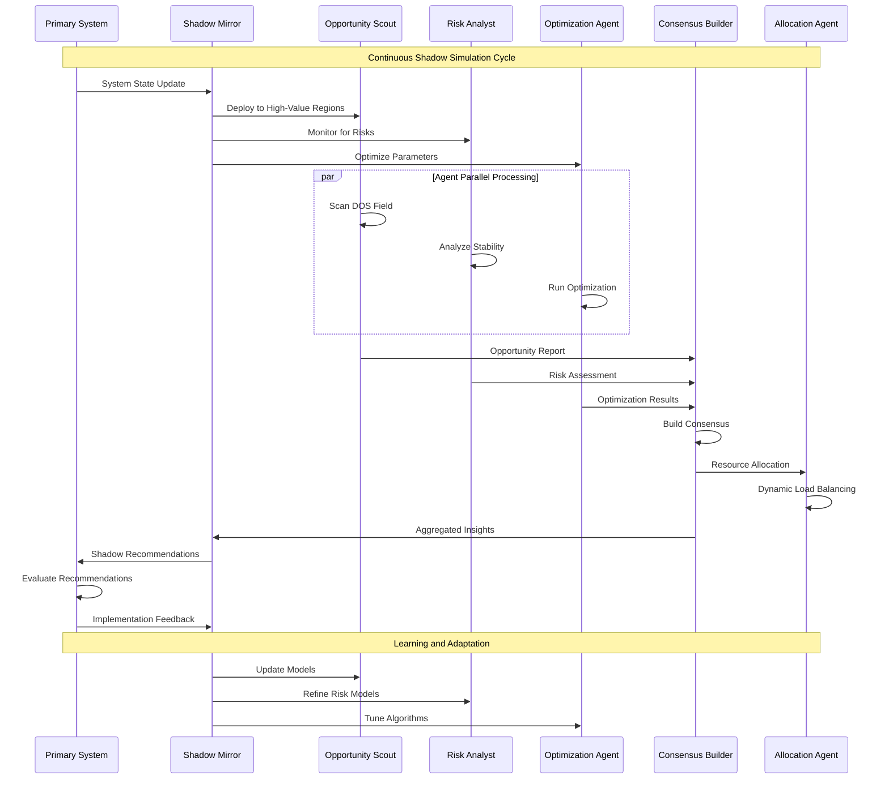
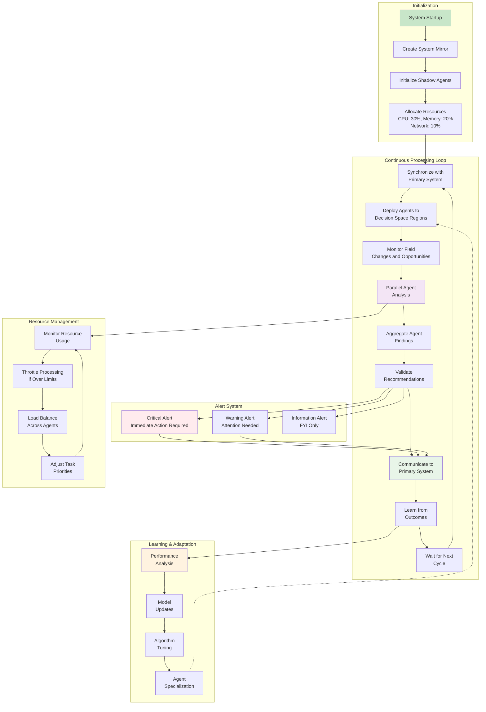
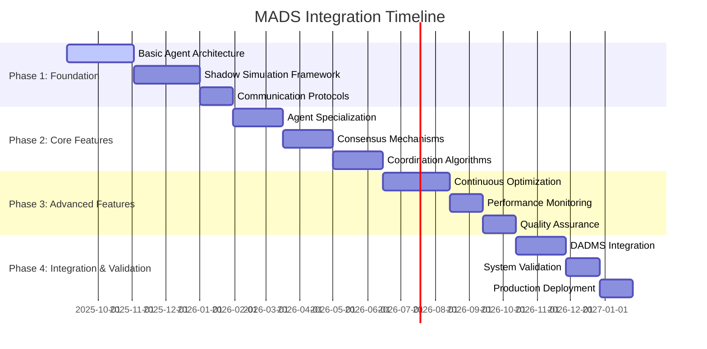
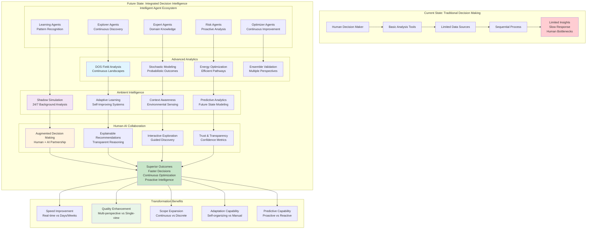

# Multi-Agent Decision Systems in DOS-Markov Framework: Shadow Simulation for Continuous Decision Space Evaluation

> ### 🤖 **Distributed Intelligence for Continuous Decision Optimization**
> *"Where multiple minds think in parallel, shadow simulations reveal the paths not yet taken."*
> 
> This document presents a comprehensive framework for integrating Multi-Agent Decision Systems (MADS) into the hybrid DOS-Markov-Ensemble framework, with special emphasis on shadow simulation capabilities that provide continuous, parallel evaluation of decision spaces without disrupting primary operations.

## Table of Contents

1. [Executive Summary](#executive-summary)
2. [Multi-Agent Decision Systems: Theoretical Foundation](#multi-agent-decision-systems-theoretical-foundation)
3. [Integration with DOS-Markov-Ensemble Framework](#integration-with-dos-markov-ensemble-framework)
4. [Shadow Simulation Architecture](#shadow-simulation-architecture)
5. [Continuous Decision Space Evaluation](#continuous-decision-space-evaluation)
6. [Detailed Implementation Examples](#detailed-implementation-examples)
7. [Agent Coordination Mechanisms](#agent-coordination-mechanisms)
8. [Gray Instance Operations](#gray-instance-operations)
9. [Performance Analysis and Validation](#performance-analysis-and-validation)
10. [Benefits and Challenges](#benefits-and-challenges)
11. [Future Directions and Research Opportunities](#future-directions-and-research-opportunities)

## Executive Summary

Multi-Agent Decision Systems (MADS) represent a paradigm shift from centralized decision-making to distributed, collaborative intelligence. When integrated with the DOS-Markov-Ensemble framework, MADS enable unprecedented capabilities in decision space exploration through continuous parallel evaluation.

### Shadow Simulation Architecture Overview



### Key Innovations

1. **Shadow Simulation Architecture**: Parallel agent-based systems that continuously evaluate decision landscapes without interfering with primary operations
2. **Distributed DOS Navigation**: Multiple specialized agents exploring different regions of the decision option space simultaneously  
3. **Consensus-Based Integration**: Sophisticated mechanisms for aggregating diverse agent perspectives into coherent recommendations
4. **Adaptive Agent Specialization**: Agents that evolve and specialize based on domain expertise and historical performance

### Core Benefits

- **Continuous Monitoring**: 24/7 evaluation of decision spaces and emerging opportunities
- **Risk Mitigation**: Early detection of potential issues through parallel scenario analysis
- **Scalability**: Distributed processing enables handling of complex, high-dimensional decision problems
- **Robustness**: Fault tolerance through redundancy and consensus mechanisms

## Multi-Agent Decision Systems: Theoretical Foundation

### Definition and Core Principles

A Multi-Agent Decision System consists of multiple autonomous agents that interact within a shared environment to achieve individual and collective objectives. In the context of decision-making, these agents collaborate to explore, evaluate, and recommend actions within complex decision spaces.

#### Fundamental Characteristics

```typescript
interface MultiAgentDecisionSystem {
  agents: AutonomousAgent[];
  environment: SharedEnvironment;
  communication: CommunicationProtocol;
  coordination: CoordinationMechanism;
  learning: CollectiveLearningFramework;
}

interface AutonomousAgent {
  id: string;
  specialization: AgentSpecialization;
  knowledge: DomainKnowledge;
  objectives: ObjectiveFunction[];
  capabilities: AgentCapability[];
  state: AgentState;
  
  // Core agent functions
  perceive(environment: Environment): Perception;
  reason(perception: Perception): Decision;
  act(decision: Decision): Action;
  learn(feedback: Feedback): void;
  communicate(message: Message, targets: Agent[]): void;
}
```

#### Agent Specialization Types

```mermaid
graph TB
    subgraph "Agent Specialization Ecosystem"
        subgraph "Domain Expert Agents"
            DEA_Tech[Technical Expert<br/>• System architecture<br/>• Performance analysis<br/>• Feasibility assessment]
            DEA_Fin[Financial Expert<br/>• Cost modeling<br/>• ROI analysis<br/>• Budget optimization]
            DEA_Reg[Regulatory Expert<br/>• Compliance checking<br/>• Risk assessment<br/>• Standards verification]
            DEA_Ops[Operational Expert<br/>• Deployment planning<br/>• Maintenance strategy<br/>• User requirements]
        end
        
        subgraph "Explorer Agents"
            EA_Random[Random Explorer<br/>• Uniform sampling<br/>• Broad coverage<br/>• Baseline exploration]
            EA_Systematic[Systematic Explorer<br/>• Grid-based search<br/>• Complete coverage<br/>• Methodical approach]
            EA_Adaptive[Adaptive Explorer<br/>• Learning-based<br/>• Focus on promising areas<br/>• Intelligent sampling]
            EA_Curiosity[Curiosity-Driven<br/>• Novel region seeking<br/>• Unexplored areas<br/>• Innovation discovery]
        end
        
        subgraph "Consensus Facilitators"
            CF_Mediator[Conflict Mediator<br/>• Dispute resolution<br/>• Compromise solutions<br/>• Negotiation protocols]
            CF_Voter[Voting Coordinator<br/>• Democratic processes<br/>• Weight assignment<br/>• Fairness assurance]
            CF_Negotiator[Negotiation Manager<br/>• Multi-party discussions<br/>• Trade-off analysis<br/>• Agreement facilitation]
        end
        
        subgraph "Monitor Validators"
            MV_Performance[Performance Monitor<br/>• System metrics<br/>• Efficiency tracking<br/>• Benchmark comparison]
            MV_Quality[Quality Validator<br/>• Solution validation<br/>• Standards compliance<br/>• Accuracy verification]
            MV_Anomaly[Anomaly Detector<br/>• Unusual patterns<br/>• Risk identification<br/>• Alert generation]
        end
    end
    
    subgraph "Agent Coordination Matrix"
        ACM_Communication[Inter-Agent<br/>Communication<br/>Protocols]
        ACM_Resource[Resource<br/>Sharing<br/>Mechanisms]
        ACM_Learning[Collective<br/>Learning<br/>Framework]
    end
    
    DEA_Tech --> ACM_Communication
    EA_Adaptive --> ACM_Communication
    CF_Mediator --> ACM_Communication
    MV_Performance --> ACM_Communication
    
    DEA_Fin --> ACM_Resource
    EA_Systematic --> ACM_Resource
    CF_Voter --> ACM_Resource
    MV_Quality --> ACM_Resource
    
    DEA_Ops --> ACM_Learning
    EA_Curiosity --> ACM_Learning
    CF_Negotiator --> ACM_Learning
    MV_Anomaly --> ACM_Learning
    
    style DEA_Tech fill:#e1f5fe
    style EA_Adaptive fill:#fff3e0
    style CF_Mediator fill:#f3e5f5
    style MV_Performance fill:#e8f5e8
```



**1. Domain Expert Agents**
```typescript
interface DomainExpertAgent extends AutonomousAgent {
  expertise: 'technical' | 'financial' | 'regulatory' | 'operational' | 'strategic';
  knowledgeBase: ExpertSystem;
  heuristics: DomainHeuristic[];
  
  evaluateFromExpertise(decisionPoint: DOSPoint): ExpertEvaluation;
  provideDomainConstraints(): Constraint[];
  assessRiskFromDomain(scenario: Scenario): RiskAssessment;
}
```

**2. Explorer Agents**
```typescript
interface ExplorerAgent extends AutonomousAgent {
  explorationStrategy: 'random' | 'systematic' | 'adaptive' | 'curiosity_driven';
  coverage: DOSRegion[];
  discoveryHistory: Discovery[];
  
  exploreUncharted(dosRegion: DOSRegion): ExplorationResult;
  identifyNovelSolutions(field: DOSField): NovelSolution[];
  mapDecisionLandscape(bounds: DOSBounds): LandscapeMap;
}
```

**3. Consensus Facilitator Agents**
```typescript
interface ConsensusFacilitatorAgent extends AutonomousAgent {
  conflictResolution: ConflictResolutionStrategy;
  votingMechanisms: VotingMethod[];
  negotiationProtocols: NegotiationProtocol[];
  
  facilitateConsensus(agentOpinions: AgentOpinion[]): ConsensusResult;
  resolveConflicts(conflicts: Conflict[]): Resolution[];
  coordinateDecisionMaking(agents: Agent[]): CoordinatedDecision;
}
```

**4. Monitor and Validator Agents**
```typescript
interface MonitorValidatorAgent extends AutonomousAgent {
  validationRules: ValidationRule[];
  monitoringMetrics: Metric[];
  alertThresholds: Threshold[];
  
  validateDecision(decision: Decision): ValidationResult;
  monitorPerformance(system: DecisionSystem): PerformanceReport;
  detectAnomalies(data: SystemData): Anomaly[];
}
```

### Mathematical Foundation

#### Agent Interaction Dynamics
The behavior of the multi-agent system can be modeled using game theory and distributed optimization:

**Nash Equilibrium for Agent Coordination:**
```
For each agent i with strategy set S_i and payoff function u_i:
s* = (s₁*, s₂*, ..., sₙ*) is a Nash equilibrium if:
∀i, ∀s_i ∈ S_i: u_i(s₁*, ..., s_{i-1}*, s_i*, s_{i+1}*, ..., sₙ*) ≥ u_i(s₁*, ..., s_{i-1}*, s_i, s_{i+1}*, ..., sₙ*)
```

**Distributed Consensus Algorithm:**
```
Let x_i(t) be agent i's state at time t
Consensus protocol: x_i(t+1) = x_i(t) + α Σⱼ∈Nᵢ (x_j(t) - x_i(t))
where Nᵢ is the neighborhood of agent i and α is the convergence rate
```

#### Multi-Agent Markov Decision Process (MA-MDP)
```typescript
interface MultiAgentMDP {
  states: StateSpace;
  actions: JointActionSpace; // Cartesian product of individual agent actions
  transitions: JointTransitionFunction; // P(s'|s,a₁,a₂,...,aₙ)
  rewards: JointRewardFunction; // R(s,a₁,a₂,...,aₙ,s')
  
  // Solve for joint policy
  solveJointPolicy(): JointPolicy;
}
```

## Integration with DOS-Markov-Ensemble Framework

### Architectural Integration

The integration of MADS with the existing DOS-Markov-Ensemble framework creates a four-tier decision intelligence system:

```typescript
interface IntegratedDecisionFramework {
  // Tier 1: Continuous Field Analysis (DOS)
  dosLayer: {
    fieldComputation: DOSFieldComputation;
    geometricAnalysis: GeometricAnalysis;
    gradientCalculation: GradientCalculation;
  };
  
  // Tier 2: Stochastic Transition Modeling (Markov)
  markovLayer: {
    stateDiscretization: StateDiscretization;
    transitionComputation: TransitionComputation;
    probabilisticAnalysis: ProbabilisticAnalysis;
  };
  
  // Tier 3: Multi-Method Validation (Ensemble)
  ensembleLayer: {
    methodCollection: EnsembleMethodCollection;
    crossValidation: CrossValidation;
    uncertaintyQuantification: UncertaintyQuantification;
  };
  
  // Tier 4: Distributed Intelligence (MADS)
  madsLayer: {
    agentNetwork: MultiAgentNetwork;
    shadowSimulation: ShadowSimulationEngine;
    consensusMechanism: ConsensusEngine;
    continuousEvaluation: ContinuousEvaluator;
  };
}
```

### Agent-DOS Integration

Each agent operates within the DOS field but with specialized perspectives and capabilities:

```typescript
class DOSAwareAgent extends AutonomousAgent {
  private dosInterface: DOSInterface;
  private fieldRegion: DOSRegion;
  private expertise: ExpertiseDomain;
  
  constructor(
    dosField: DOSField, 
    specialization: AgentSpecialization,
    assignedRegion: DOSRegion
  ) {
    super();
    this.dosInterface = new DOSInterface(dosField);
    this.fieldRegion = assignedRegion;
    this.expertise = specialization;
  }
  
  // Navigate DOS field from agent perspective
  navigateDOSField(): NavigationPath {
    const localGradient = this.dosInterface.computeLocalGradient(
      this.currentPosition, 
      this.expertise
    );
    
    const expertiseWeighting = this.applyExpertiseFilter(localGradient);
    const pathPlanning = this.planPath(expertiseWeighting);
    
    return pathPlanning;
  }
  
  // Evaluate decision points using agent-specific criteria
  evaluateDecisionPoint(point: DOSPoint): AgentEvaluation {
    const fieldValue = this.dosInterface.evaluateField(point);
    const expertiseAssessment = this.assessFromExpertise(point);
    const riskEvaluation = this.evaluateRisk(point);
    
    return {
      fieldValue,
      expertiseScore: expertiseAssessment,
      riskAssessment: riskEvaluation,
      confidence: this.computeConfidence(point),
      recommendation: this.generateRecommendation(point)
    };
  }
  
  // Share insights with other agents
  shareInsights(): AgentInsight[] {
    return [
      {
        source: this.id,
        expertise: this.expertise,
        discoveries: this.recentDiscoveries,
        recommendations: this.currentRecommendations,
        warnings: this.identifiedRisks
      }
    ];
  }
}
```

### Agent-Markov Integration

Agents can represent different aspects of the Markov transition process:

```typescript
class MarkovAwareAgent extends DOSAwareAgent {
  private transitionPredictor: TransitionPredictor;
  private stateTracker: StateTracker;
  
  // Predict state transitions from agent perspective
  predictTransitions(
    currentState: MarkovState,
    timeHorizon: number
  ): TransitionPrediction {
    const agentPerspective = this.computeAgentPerspective(currentState);
    const expertiseInfluence = this.computeExpertiseInfluence(currentState);
    
    return this.transitionPredictor.predict(
      currentState,
      timeHorizon,
      agentPerspective,
      expertiseInfluence
    );
  }
  
  // Contribute to transition matrix computation
  contributeToTransitionMatrix(
    fromState: MarkovState,
    toState: MarkovState
  ): TransitionContribution {
    const expertiseRelevance = this.assessRelevance(fromState, toState);
    const transitionProbability = this.computeTransitionProbability(
      fromState,
      toState,
      this.expertise
    );
    
    return {
      weight: expertiseRelevance,
      probability: transitionProbability,
      confidence: this.confidence,
      rationale: this.generateRationale(fromState, toState)
    };
  }
}
```

## Shadow Simulation Architecture

### Core Shadow Simulation Concept

Shadow simulation creates a parallel reality where agents can explore decision spaces without affecting the primary system. This enables continuous evaluation, what-if analysis, and proactive optimization.

```typescript
interface ShadowSimulationEngine {
  // Primary system mirror
  primarySystemMirror: SystemMirror;
  
  // Agent ecosystem
  shadowAgents: ShadowAgent[];
  
  // Simulation environment
  shadowEnvironment: SimulationEnvironment;
  
  // Communication bridge
  primaryCommunicationBridge: CommunicationBridge;
  
  // Evaluation engine
  continuousEvaluator: ContinuousEvaluator;
}

class ShadowSimulationFramework {
  private primarySystem: PrimaryDecisionSystem;
  private shadowSystem: ShadowDecisionSystem;
  private synchronizer: SystemSynchronizer;
  private evaluationEngine: EvaluationEngine;
  
  constructor(primarySystem: PrimaryDecisionSystem) {
    this.primarySystem = primarySystem;
    this.shadowSystem = this.createShadowSystem(primarySystem);
    this.synchronizer = new SystemSynchronizer(primarySystem, this.shadowSystem);
    this.evaluationEngine = new EvaluationEngine();
  }
  
  // Create shadow system that mirrors primary
  private createShadowSystem(primary: PrimaryDecisionSystem): ShadowDecisionSystem {
    return {
      dosField: this.mirrorDOSField(primary.dosField),
      markovChain: this.mirrorMarkovChain(primary.markovChain),
      ensembleMethods: this.mirrorEnsembleMethods(primary.ensembleMethods),
      
      // Add shadow-specific components
      shadowAgents: this.createShadowAgents(),
      experimentalFeatures: this.initializeExperimentalFeatures(),
      continuousMonitoring: this.setupContinuousMonitoring()
    };
  }
  
  // Continuous evaluation loop
  async runContinuousEvaluation(): Promise<void> {
    while (this.isActive) {
      // Synchronize with primary system
      await this.synchronizer.synchronizeState();
      
      // Run agent-based evaluation
      const agentEvaluations = await this.runAgentEvaluations();
      
      // Analyze alternative scenarios
      const scenarioAnalysis = await this.analyzeAlternativeScenarios();
      
      // Generate insights and recommendations
      const insights = await this.generateInsights(agentEvaluations, scenarioAnalysis);
      
      // Communicate findings to primary system
      await this.communicateInsights(insights);
      
      // Update shadow system based on learnings
      await this.updateShadowSystem(insights);
      
      // Wait for next evaluation cycle
      await this.waitForNextCycle();
    }
  }
  
  // Create specialized shadow agents
  private createShadowAgents(): ShadowAgent[] {
    return [
      new OpportunityScoutAgent({
        role: 'identify_opportunities',
        scope: 'global_dos_field',
        priority: 'high_reward_regions'
      }),
      
      new RiskAnalystAgent({
        role: 'risk_assessment',
        scope: 'stability_analysis',
        priority: 'vulnerability_detection'
      }),
      
      new OptimizationAgent({
        role: 'continuous_improvement',
        scope: 'parameter_optimization',
        priority: 'efficiency_gains'
      }),
      
      new ScenarioTesterAgent({
        role: 'what_if_analysis',
        scope: 'alternative_scenarios',
        priority: 'stress_testing'
      }),
      
      new LearningAgent({
        role: 'pattern_recognition',
        scope: 'historical_analysis',
        priority: 'knowledge_extraction'
      })
    ];
  }
}
```

### Shadow Agent Specializations

#### 1. Opportunity Scout Agent
```typescript
class OpportunityScoutAgent extends ShadowAgent {
  private opportunityDetector: OpportunityDetector;
  private trendAnalyzer: TrendAnalyzer;
  
  async scoutOpportunities(): Promise<OpportunityReport> {
    // Scan DOS field for high-value regions
    const highValueRegions = await this.scanDOSField({
      criteria: 'gradient_magnitude > threshold',
      unexploredOnly: true
    });
    
    // Analyze emerging trends
    const trends = await this.trendAnalyzer.detectTrends({
      timeWindow: '30_days',
      changeThreshold: 0.1
    });
    
    // Identify convergence opportunities
    const convergencePoints = await this.identifyConvergenceOpportunities(
      highValueRegions,
      trends
    );
    
    return {
      discoveredOpportunities: highValueRegions,
      emergingTrends: trends,
      convergenceOpportunities: convergencePoints,
      prioritizedRecommendations: this.prioritizeOpportunities([
        ...highValueRegions,
        ...convergencePoints
      ])
    };
  }
}
```

#### 2. Risk Analyst Agent
```typescript
class RiskAnalystAgent extends ShadowAgent {
  private riskModels: RiskModel[];
  private vulnerabilityScanner: VulnerabilityScanner;
  
  async analyzeRisks(): Promise<RiskReport> {
    // Analyze DOS field stability
    const stabilityAnalysis = await this.analyzeFieldStability();
    
    // Identify potential failure modes
    const failureModes = await this.identifyFailureModes();
    
    // Assess transition risks in Markov chain
    const transitionRisks = await this.assessTransitionRisks();
    
    // Run stress tests
    const stressTestResults = await this.runStressTests({
      scenarios: this.generateStressScenarios(),
      iterations: 1000
    });
    
    return {
      stabilityAssessment: stabilityAnalysis,
      identifiedRisks: [...failureModes, ...transitionRisks],
      stressTestResults,
      riskMitigationRecommendations: this.generateMitigationStrategies(
        failureModes,
        transitionRisks
      )
    };
  }
  
  private async analyzeFieldStability(): Promise<StabilityAssessment> {
    const hessianEigenvalues = await this.computeHessianEigenvalues();
    const gradientDivergence = await this.computeGradientDivergence();
    const noiseResilience = await this.testNoiseResilience();
    
    return {
      stability: this.assessStability(hessianEigenvalues),
      convergence: this.assessConvergence(gradientDivergence),
      robustness: this.assessRobustness(noiseResilience)
    };
  }
}
```

#### 3. Optimization Agent
```typescript
class OptimizationAgent extends ShadowAgent {
  private optimizers: Optimizer[];
  private performanceTracker: PerformanceTracker;
  
  async optimizeSystem(): Promise<OptimizationReport> {
    // Current performance baseline
    const currentPerformance = await this.measureCurrentPerformance();
    
    // Run optimization algorithms
    const optimizationResults = await Promise.all([
      this.runGradientOptimization(),
      this.runEvolutionaryOptimization(),
      this.runBayesianOptimization(),
      this.runReinforcementLearningOptimization()
    ]);
    
    // Evaluate optimization results
    const evaluatedResults = await this.evaluateOptimizations(
      optimizationResults,
      currentPerformance
    );
    
    // Generate recommendations
    const recommendations = this.generateOptimizationRecommendations(
      evaluatedResults
    );
    
    return {
      currentBaseline: currentPerformance,
      optimizationResults: evaluatedResults,
      recommendations,
      implementationPlan: this.createImplementationPlan(recommendations)
    };
  }
}
```

## Continuous Decision Space Evaluation

### Real-Time Monitoring Framework

The shadow simulation provides continuous monitoring of the decision space through multiple parallel processes:

```typescript
class ContinuousEvaluationFramework {
  private monitoringAgents: MonitoringAgent[];
  private alertSystem: AlertSystem;
  private trendAnalyzer: TrendAnalyzer;
  private performanceTracker: PerformanceTracker;
  
  async startContinuousMonitoring(): Promise<void> {
    // Initialize monitoring streams
    const monitoringStreams = await this.initializeMonitoringStreams();
    
    // Start parallel monitoring processes
    await Promise.all([
      this.monitorDecisionFieldChanges(),
      this.monitorAgentPerformance(),
      this.monitorSystemHealth(),
      this.monitorOpportunityEmergence(),
      this.monitorRiskAccumulation()
    ]);
  }
  
  private async monitorDecisionFieldChanges(): Promise<void> {
    const fieldMonitor = new DOSFieldMonitor({
      samplingRate: 100, // samples per second
      changeThreshold: 0.01,
      alertThreshold: 0.05
    });
    
    fieldMonitor.onFieldChange(async (change: FieldChange) => {
      // Analyze the change
      const changeAnalysis = await this.analyzeFieldChange(change);
      
      // Assess impact on current decisions
      const impact = await this.assessChangeImpact(changeAnalysis);
      
      // Generate alerts if necessary
      if (impact.severity > this.alertThreshold) {
        await this.alertSystem.generateAlert({
          type: 'field_change',
          severity: impact.severity,
          description: impact.description,
          recommendations: impact.recommendations
        });
      }
      
      // Update shadow agents with new information
      await this.updateAgentsWithFieldChange(change, changeAnalysis);
    });
  }
  
  private async monitorOpportunityEmergence(): Promise<void> {
    const opportunityMonitor = new OpportunityMonitor({
      scanInterval: 30000, // 30 seconds
      opportunityThreshold: 0.7,
      noveltyThreshold: 0.8
    });
    
    opportunityMonitor.onOpportunityDetected(async (opportunity: Opportunity) => {
      // Validate opportunity through multiple agents
      const validationResults = await Promise.all(
        this.monitoringAgents.map(agent => 
          agent.validateOpportunity(opportunity)
        )
      );
      
      // Consensus on opportunity validity
      const consensus = await this.buildConsensus(validationResults);
      
      if (consensus.valid && consensus.confidence > 0.8) {
        // Notify primary system
        await this.notifyPrimarySystem({
          type: 'opportunity_detected',
          opportunity,
          consensus,
          urgency: this.computeUrgency(opportunity)
        });
        
        // Assign agents to investigate further
        await this.assignAgentsToInvestigate(opportunity);
      }
    });
  }
}
```

### Dynamic Agent Allocation

Agents are dynamically allocated to different regions of the decision space based on current needs and opportunities:

```typescript
class DynamicAgentAllocation {
  private agentPool: AgentPool;
  private allocationOptimizer: AllocationOptimizer;
  private workloadBalancer: WorkloadBalancer;
  
  async optimizeAgentAllocation(): Promise<AllocationPlan> {
    // Assess current decision space demands
    const spaceDemands = await this.assessDecisionSpaceDemands();
    
    // Evaluate agent performance and availability
    const agentCapabilities = await this.evaluateAgentCapabilities();
    
    // Solve allocation optimization problem
    const optimalAllocation = await this.allocationOptimizer.optimize({
      demands: spaceDemands,
      capabilities: agentCapabilities,
      constraints: this.getAllocationConstraints(),
      objectives: ['coverage', 'efficiency', 'redundancy']
    });
    
    return optimalAllocation;
  }
  
  private async assessDecisionSpaceDemands(): Promise<SpaceDemands> {
    return {
      highGradientRegions: await this.identifyHighGradientRegions(),
      unstableRegions: await this.identifyUnstableRegions(),
      unexploredRegions: await this.identifyUnexploredRegions(),
      convergencePoints: await this.identifyConvergencePoints(),
      riskzones: await this.identifyRiskZones()
    };
  }
}
```

## Detailed Implementation Examples

### Example 1: Smart Grid Energy Management

Consider a smart grid system that manages energy distribution across a city. The multi-agent shadow simulation provides continuous optimization and risk management.

#### Smart Grid MADS Architecture



#### System Architecture
```typescript
interface SmartGridMADS {
  // Primary system components
  primaryGrid: {
    generators: PowerGenerator[];
    distributionNetwork: DistributionNetwork;
    consumers: EnergyConsumer[];
    storage: EnergyStorage[];
  };
  
  // Shadow simulation components  
  shadowSimulation: {
    generatorAgents: GeneratorAgent[];
    distributionAgents: DistributionAgent[];
    consumerAgents: ConsumerAgent[];
    optimizationAgents: OptimizationAgent[];
    predictiveAgents: PredictiveAgent[];
  };
  
  // Decision space representation
  energyDOS: {
    parameters: {
      generation: [0, max_generation],
      distribution: [0, max_capacity],
      storage: [0, max_storage],
      price: [min_price, max_price]
    },
    objectives: {
      reliability: ReliabilityFunction,
      cost: CostFunction,
      sustainability: SustainabilityFunction,
      efficiency: EfficiencyFunction
    }
  };
}
```

#### Agent Specializations
```typescript
class GeneratorAgent extends ShadowAgent {
  private generatorModel: GeneratorModel;
  private maintenancePredictor: MaintenancePredictor;
  
  async optimizeGeneration(forecast: DemandForecast): Promise<GenerationPlan> {
    // Analyze DOS field for generation optimization
    const optimalRegion = await this.findOptimalGenerationRegion({
      demand: forecast,
      constraints: this.generatorModel.constraints,
      efficiency: this.generatorModel.efficiencyFunction
    });
    
    // Consider maintenance windows
    const maintenanceSchedule = await this.maintenancePredictor.predict({
      currentCondition: this.generatorModel.currentCondition,
      usage: this.generatorModel.projectedUsage
    });
    
    // Generate optimized plan
    return {
      generation: optimalRegion.centroid.generation,
      schedule: this.generateSchedule(optimalRegion, maintenanceSchedule),
      riskAssessment: this.assessGenerationRisks(optimalRegion),
      alternatives: this.identifyAlternatives(optimalRegion)
    };
  }
}

class DistributionAgent extends ShadowAgent {
  private networkModel: NetworkModel;
  private loadBalancer: LoadBalancer;
  
  async optimizeDistribution(generationPlan: GenerationPlan): Promise<DistributionPlan> {
    // Navigate DOS field for distribution optimization
    const distributionPath = await this.navigateDOSField({
      startPoint: this.currentDistributionState,
      objective: 'minimize_loss_maximize_reliability',
      constraints: this.networkModel.constraints
    });
    
    // Load balancing optimization
    const loadBalancingPlan = await this.loadBalancer.optimize({
      generation: generationPlan,
      demand: this.currentDemand,
      networkCapacity: this.networkModel.capacity
    });
    
    return {
      routing: distributionPath,
      loadBalancing: loadBalancingPlan,
      contingencyPlans: this.generateContingencyPlans(),
      performanceMetrics: this.computePerformanceMetrics()
    };
  }
}
```

#### Shadow Simulation Operation
```typescript
class SmartGridShadowSimulation extends ShadowSimulationFramework {
  async runEnergyOptimization(): Promise<OptimizationResults> {
    // Continuous 24/7 operation
    while (this.isActive) {
      // Synchronize with real grid state
      const gridState = await this.synchronizeGridState();
      
      // Run parallel agent optimizations
      const optimizationResults = await Promise.all([
        this.generatorAgents.map(agent => agent.optimizeGeneration(gridState.forecast)),
        this.distributionAgents.map(agent => agent.optimizeDistribution(gridState.generation)),
        this.predictiveAgents.map(agent => agent.predictDemand(gridState.historical))
      ]);
      
      // Build consensus among agents
      const consensus = await this.buildConsensus(optimizationResults);
      
      // Validate through simulation
      const validationResults = await this.validateThroughSimulation(consensus);
      
      // Generate recommendations for primary grid
      const recommendations = await this.generateRecommendations(
        consensus,
        validationResults
      );
      
      // Communicate to primary system
      await this.communicateToGrid(recommendations);
      
      // Learn from outcomes
      await this.updateAgentsFromOutcomes(gridState.actual);
      
      // Sleep until next cycle
      await this.sleep(this.optimizationInterval);
    }
  }
}
```

### Example 2: Supply Chain Optimization

A global supply chain with multiple suppliers, manufacturers, distributors, and retailers using MADS for continuous optimization.

#### System Architecture
```typescript
interface SupplyChainMADS {
  // Supply chain entities
  entities: {
    suppliers: Supplier[];
    manufacturers: Manufacturer[];
    distributors: Distributor[];
    retailers: Retailer[];
    transporters: Transporter[];
  };
  
  // Shadow agent network
  shadowAgents: {
    demandPredictors: DemandPredictorAgent[];
    inventoryOptimizers: InventoryOptimizerAgent[];
    routingOptimizers: RoutingOptimizerAgent[];
    riskAssessors: RiskAssessorAgent[];
    qualityMonitors: QualityMonitorAgent[];
  };
  
  // Decision space
  supplyChainDOS: {
    parameters: {
      inventoryLevels: InventoryRange[],
      productionSchedule: ProductionScheduleRange,
      transportation: TransportationOptions,
      supplierSelection: SupplierOptions
    },
    objectives: {
      cost: CostMinimizationFunction,
      speed: DeliveryTimeFunction,
      quality: QualityFunction,
      resilience: ResilienceFunction
    }
  };
}
```

#### Implementation Example
```typescript
class SupplyChainShadowSimulation extends ShadowSimulationFramework {
  private supplyChainModel: SupplyChainModel;
  
  async runSupplyChainOptimization(): Promise<void> {
    // Initialize shadow supply chain model
    const shadowChain = await this.createShadowSupplyChain();
    
    // Continuous optimization loop
    while (this.isActive) {
      // Multi-agent parallel processing
      const [
        demandForecast,
        inventoryOptimization,
        routingOptimization,
        riskAssessment
      ] = await Promise.all([
        this.runDemandForecasting(),
        this.runInventoryOptimization(),
        this.runRoutingOptimization(),
        this.runRiskAssessment()
      ]);
      
      // Integrate agent results using DOS navigation
      const integratedPlan = await this.integrateThroughDOS({
        demand: demandForecast,
        inventory: inventoryOptimization,
        routing: routingOptimization,
        risks: riskAssessment
      });
      
      // Validate through shadow supply chain simulation
      const validation = await this.validatePlan(integratedPlan);
      
      if (validation.feasible && validation.improvement > 0.05) {
        // Recommend to primary supply chain
        await this.recommendToPrimary({
          plan: integratedPlan,
          validation,
          confidence: validation.confidence,
          implementationSteps: this.generateImplementationSteps(integratedPlan)
        });
      }
      
      // Learn and adapt
      await this.updateModelsFromActual();
    }
  }
  
  private async integrateThroughDOS(
    agentResults: AgentResults
  ): Promise<IntegratedPlan> {
    // Use DOS field to find optimal integration point
    const integrationField = this.constructIntegrationField(agentResults);
    
    // Navigate to optimal integration point
    const optimalPoint = await this.navigateDOSField({
      field: integrationField,
      startPoint: this.currentState,
      objective: 'maximize_integrated_value',
      constraints: this.getIntegrationConstraints()
    });
    
    return {
      demandFulfillment: optimalPoint.demand,
      inventoryStrategy: optimalPoint.inventory,
      routingPlan: optimalPoint.routing,
      riskMitigation: optimalPoint.risk,
      expectedPerformance: this.computeExpectedPerformance(optimalPoint)
    };
  }
}
```

### Example 3: Financial Portfolio Management

A multi-agent shadow simulation for continuous portfolio optimization and risk management.

```typescript
interface PortfolioManagementMADS {
  // Portfolio components
  portfolio: {
    assets: Asset[];
    allocations: AllocationStrategy;
    riskProfile: RiskProfile;
    constraints: PortfolioConstraint[];
  };
  
  // Specialized agents
  agents: {
    marketAnalysts: MarketAnalystAgent[];
    riskManagers: RiskManagerAgent[];
    opportunityScouts: OpportunityScoutAgent[];
    rebalancingAgents: RebalancingAgent[];
    complianceMonitors: ComplianceMonitorAgent[];
  };
  
  // Decision space
  portfolioDOS: {
    parameters: {
      assetAllocation: AllocationSpace,
      riskExposure: RiskSpace,
      timeHorizon: TimeHorizonSpace,
      liquidityRequirement: LiquiditySpace
    },
    objectives: {
      return: ReturnMaximizationFunction,
      risk: RiskMinimizationFunction,
      diversification: DiversificationFunction,
      liquidity: LiquidityFunction
    }
  };
}

class PortfolioShadowSimulation extends ShadowSimulationFramework {
  async runPortfolioOptimization(): Promise<void> {
    while (this.isActive) {
      // Real-time market data ingestion
      const marketState = await this.ingestMarketData();
      
      // Parallel agent analysis
      const analyses = await Promise.all([
        this.runMarketAnalysis(marketState),
        this.runRiskAnalysis(marketState),
        this.runOpportunityScanning(marketState),
        this.runComplianceCheck(marketState)
      ]);
      
      // DOS-based integration
      const portfolioRecommendation = await this.integrateAnalyses(analyses);
      
      // Shadow portfolio simulation
      const simulationResults = await this.simulatePortfolioPerformance(
        portfolioRecommendation,
        this.generateScenarios(1000)
      );
      
      // Risk-adjusted recommendation
      const finalRecommendation = await this.generateRiskAdjustedRecommendation(
        portfolioRecommendation,
        simulationResults
      );
      
      // Communicate to primary portfolio system
      if (finalRecommendation.confidence > 0.8) {
        await this.communicateToPrimary(finalRecommendation);
      }
      
      await this.sleep(this.rebalancingInterval);
    }
  }
}
```

## Agent Coordination Mechanisms

### Consensus Building Algorithms

#### Agent Lifecycle and Coordination Process



Multiple agents must reach consensus on recommendations. Several algorithms can be employed:

#### 1. Weighted Voting Consensus
```typescript
class WeightedVotingConsensus implements ConsensusAlgorithm {
  async buildConsensus(
    agentRecommendations: AgentRecommendation[],
    agentWeights: AgentWeight[]
  ): Promise<ConsensusResult> {
    // Weight recommendations by agent expertise and past performance
    const weightedRecommendations = agentRecommendations.map((rec, index) => ({
      recommendation: rec,
      weight: agentWeights[index].expertise * agentWeights[index].performance,
      confidence: rec.confidence
    }));
    
    // Compute weighted average recommendation
    const consensusRecommendation = this.computeWeightedAverage(
      weightedRecommendations
    );
    
    // Compute consensus strength
    const consensusStrength = this.computeConsensusStrength(
      weightedRecommendations
    );
    
    return {
      recommendation: consensusRecommendation,
      strength: consensusStrength,
      participating: agentRecommendations.length,
      dissenting: this.identifyDissenters(weightedRecommendations),
      confidence: this.computeOverallConfidence(weightedRecommendations)
    };
  }
}
```

#### 2. Byzantine Fault Tolerant Consensus
```typescript
class ByzantineFaultTolerantConsensus implements ConsensusAlgorithm {
  private faultThreshold: number = 1/3; // Can tolerate up to 1/3 faulty agents
  
  async buildConsensus(
    agentRecommendations: AgentRecommendation[]
  ): Promise<ConsensusResult> {
    const n = agentRecommendations.length;
    const f = Math.floor(n * this.faultThreshold);
    
    if (agentRecommendations.length < 3 * f + 1) {
      throw new Error('Insufficient agents for Byzantine fault tolerance');
    }
    
    // PBFT-style consensus
    const [preparePhase, commitPhase] = await Promise.all([
      this.runPreparePhase(agentRecommendations),
      this.runCommitPhase(agentRecommendations)
    ]);
    
    // Check if consensus achieved
    if (preparePhase.agreements >= 2 * f && commitPhase.agreements >= 2 * f) {
      return {
        recommendation: preparePhase.recommendation,
        strength: (preparePhase.agreements + commitPhase.agreements) / (2 * n),
        participating: n,
        byzantine: this.identifyByzantine(preparePhase, commitPhase),
        confidence: 0.9 // High confidence due to fault tolerance
      };
    }
    
    // Fallback to partial consensus
    return this.buildPartialConsensus(agentRecommendations);
  }
}
```

#### 3. Auction-Based Resource Allocation
```typescript
class AuctionBasedCoordination implements CoordinationMechanism {
  async allocateResources(
    agents: Agent[],
    resources: Resource[],
    tasks: Task[]
  ): Promise<AllocationResult> {
    // Each agent bids for tasks based on their capability and current load
    const bids = await Promise.all(
      agents.map(agent => agent.generateBids(tasks))
    );
    
    // Run combinatorial auction
    const allocation = this.solveCombinorialAuction({
      bids,
      resources,
      tasks,
      constraints: this.getAllocationConstraints()
    });
    
    // Verify allocation feasibility
    const verification = await this.verifyAllocation(allocation);
    
    return {
      allocation: verification.feasible ? allocation : this.fallbackAllocation,
      efficiency: this.computeAllocationEfficiency(allocation),
      fairness: this.computeAllocationFairness(allocation),
      socialWelfare: this.computeSocialWelfare(allocation)
    };
  }
}
```

### Conflict Resolution

When agents disagree, sophisticated conflict resolution mechanisms are employed:

```typescript
class AgentConflictResolver {
  private mediationStrategies: MediationStrategy[];
  
  async resolveConflict(
    conflictingAgents: Agent[],
    conflictContext: ConflictContext
  ): Promise<ConflictResolution> {
    // Analyze conflict characteristics
    const conflictAnalysis = await this.analyzeConflict({
      agents: conflictingAgents,
      positions: conflictingAgents.map(agent => agent.getPosition()),
      context: conflictContext
    });
    
    // Select appropriate mediation strategy
    const strategy = this.selectMediationStrategy(conflictAnalysis);
    
    // Apply mediation strategy
    const resolution = await strategy.mediate({
      agents: conflictingAgents,
      analysis: conflictAnalysis,
      context: conflictContext
    });
    
    // Validate resolution
    const validation = await this.validateResolution(resolution);
    
    return {
      resolution: validation.valid ? resolution : this.escalateConflict(conflictContext),
      satisfaction: this.measureSatisfaction(conflictingAgents, resolution),
      stability: this.assessStability(resolution),
      learnings: this.extractLearnings(conflictAnalysis, resolution)
    };
  }
  
  private selectMediationStrategy(analysis: ConflictAnalysis): MediationStrategy {
    if (analysis.type === 'resource_competition') {
      return new AuctionMediationStrategy();
    } else if (analysis.type === 'goal_incompatibility') {
      return new CompromiseMediationStrategy();
    } else if (analysis.type === 'information_asymmetry') {
      return new InformationSharingStrategy();
    } else {
      return new NegotiationMediationStrategy();
    }
  }
}
```

## Gray Instance Operations

### Gray Instance Continuous Operation Flow



### Continuous Background Processing

The gray instance operates continuously in the background, maintaining a parallel evaluation of the decision space:

```typescript
class GrayInstanceManager {
  private grayInstance: GrayInstance;
  private resourceManager: ResourceManager;
  private performanceMonitor: PerformanceMonitor;
  
  constructor(primarySystem: PrimaryDecisionSystem) {
    this.grayInstance = this.createGrayInstance(primarySystem);
    this.resourceManager = new ResourceManager({
      cpuAllocation: 0.3, // Use 30% of available CPU
      memoryAllocation: 0.2, // Use 20% of available memory
      networkBandwidth: 0.1 // Use 10% of network bandwidth
    });
    this.performanceMonitor = new PerformanceMonitor();
  }
  
  async startGrayInstance(): Promise<void> {
    // Initialize gray instance
    await this.grayInstance.initialize();
    
    // Start background processes
    await Promise.all([
      this.runContinuousMonitoring(),
      this.runContinuousOptimization(),
      this.runContinuousLearning(),
      this.runContinuousValidation()
    ]);
  }
  
  private async runContinuousMonitoring(): Promise<void> {
    const monitor = new ContinuousMonitor({
      samplingRate: 10, // 10 Hz monitoring
      adaptiveThresholds: true,
      anomalyDetection: true
    });
    
    monitor.onAnomalyDetected(async (anomaly: Anomaly) => {
      // Analyze anomaly in gray instance
      const analysis = await this.grayInstance.analyzeAnomaly(anomaly);
      
      // Generate alert if significant
      if (analysis.severity > this.alertThreshold) {
        await this.alertPrimarySystem(analysis);
      }
      
      // Update models based on anomaly
      await this.grayInstance.updateModels(analysis);
    });
  }
  
  private async runContinuousOptimization(): Promise<void> {
    const optimizer = new ContinuousOptimizer({
      optimizationInterval: 60000, // 1 minute intervals
      convergenceThreshold: 0.001,
      maxIterations: 1000
    });
    
    while (this.isActive) {
      // Run optimization in gray instance
      const optimization = await this.grayInstance.optimize({
        currentState: await this.getCurrentState(),
        objectives: this.getOptimizationObjectives(),
        constraints: this.getOptimizationConstraints()
      });
      
      // Validate optimization results
      const validation = await this.validateOptimization(optimization);
      
      // Recommend if improvement significant
      if (validation.improvement > 0.05 && validation.risk < 0.1) {
        await this.recommendToPrimary({
          optimization,
          validation,
          implementation: this.generateImplementationPlan(optimization)
        });
      }
      
      await this.sleep(optimizer.optimizationInterval);
    }
  }
  
  private async runContinuousLearning(): Promise<void> {
    const learner = new ContinuousLearner({
      learningRate: 0.01,
      adaptiveLearning: true,
      knowledgeRetention: 0.95
    });
    
    // Continuously learn from system behavior
    learner.onNewData(async (data: SystemData) => {
      // Update agent models
      await Promise.all(
        this.grayInstance.agents.map(agent => 
          agent.updateModel(data)
        )
      );
      
      // Update DOS field representation
      await this.grayInstance.updateDOSField(data);
      
      // Update Markov transition probabilities
      await this.grayInstance.updateTransitions(data);
      
      // Retrain ensemble models
      await this.grayInstance.retrainEnsemble(data);
    });
  }
}
```

### Resource Management

The gray instance must efficiently manage computational resources:

```typescript
class GrayInstanceResourceManager {
  private resourceLimits: ResourceLimits;
  private priorityQueue: PriorityQueue<Task>;
  private loadBalancer: LoadBalancer;
  
  async manageResources(): Promise<void> {
    while (this.isActive) {
      // Monitor resource usage
      const usage = await this.monitorResourceUsage();
      
      // Adjust processing priorities
      if (usage.cpu > this.resourceLimits.cpu * 0.8) {
        await this.reduceCPUIntensiveTasks();
      }
      
      if (usage.memory > this.resourceLimits.memory * 0.8) {
        await this.freeMemory();
      }
      
      // Balance load across agents
      await this.loadBalancer.balance(this.grayInstance.agents);
      
      // Schedule next resource check
      await this.sleep(5000); // Check every 5 seconds
    }
  }
  
  private async reduceCPUIntensiveTasks(): Promise<void> {
    // Temporarily reduce optimization frequency
    this.grayInstance.setOptimizationInterval(
      this.grayInstance.optimizationInterval * 1.5
    );
    
    // Reduce agent processing frequency
    this.grayInstance.agents.forEach(agent => 
      agent.setProcessingInterval(agent.processingInterval * 1.2)
    );
    
    // Defer non-critical analyses
    await this.grayInstance.deferNonCriticalAnalyses();
  }
}
```

## Performance Analysis and Validation

### Benchmarking Framework

```typescript
class MADSPerformanceBenchmark {
  private benchmarkSuites: BenchmarkSuite[];
  private performanceMetrics: PerformanceMetric[];
  
  async runBenchmarks(): Promise<BenchmarkResults> {
    const results = [];
    
    for (const suite of this.benchmarkSuites) {
      // Baseline: Original DOS-Markov-Ensemble system
      const baselineResult = await this.runBaseline(suite);
      
      // MADS-enhanced system
      const madsResult = await this.runMADSSystem(suite);
      
      // Compare performance
      const comparison = this.comparePerformance(baselineResult, madsResult);
      
      results.push({
        suite: suite.name,
        baseline: baselineResult,
        mads: madsResult,
        improvement: comparison.improvement,
        degradation: comparison.degradation,
        significance: comparison.statisticalSignificance
      });
    }
    
    return {
      overallResults: results,
      summary: this.generateSummary(results),
      recommendations: this.generateRecommendations(results)
    };
  }
  
  private async runMADSSystem(suite: BenchmarkSuite): Promise<BenchmarkResult> {
    const startTime = Date.now();
    
    // Initialize MADS system
    const madsSystem = new IntegratedMADSSystem(suite.configuration);
    await madsSystem.initialize();
    
    // Run benchmark problems
    const problemResults = [];
    for (const problem of suite.problems) {
      const problemStart = Date.now();
      
      // Primary system solution
      const primarySolution = await madsSystem.solvePrimary(problem);
      
      // Shadow system recommendations
      const shadowRecommendations = await madsSystem.getShadowRecommendations();
      
      // Integrated solution
      const integratedSolution = await madsSystem.integrateRecommendations(
        primarySolution,
        shadowRecommendations
      );
      
      problemResults.push({
        problem: problem.id,
        primary: primarySolution,
        shadow: shadowRecommendations,
        integrated: integratedSolution,
        processingTime: Date.now() - problemStart
      });
    }
    
    const totalTime = Date.now() - startTime;
    
    return {
      problemResults,
      totalProcessingTime: totalTime,
      averageProcessingTime: totalTime / suite.problems.length,
      systemUtilization: await madsSystem.getSystemUtilization(),
      agentPerformance: await madsSystem.getAgentPerformanceMetrics()
    };
  }
}
```

### Validation Metrics

```typescript
interface ValidationMetrics {
  // Decision quality metrics
  decisionQuality: {
    optimality: number;        // How close to theoretical optimum
    robustness: number;        // Performance under uncertainty
    adaptability: number;      // Response to changing conditions
  };
  
  // System performance metrics  
  systemPerformance: {
    throughput: number;        // Decisions per unit time
    latency: number;          // Time to decision
    scalability: number;      // Performance with increased load
    resourceEfficiency: number; // Resource utilization efficiency
  };
  
  // Agent coordination metrics
  coordination: {
    consensus: number;         // Level of agent agreement
    communication: number;     // Communication efficiency
    conflictResolution: number; // Speed of conflict resolution
  };
  
  // Shadow simulation metrics
  shadowSimulation: {
    coverage: number;          // Decision space coverage
    accuracy: number;          // Prediction accuracy
    timeliness: number;        // Early warning capability
  };
}

class MADSValidator {
  async validateSystem(madsSystem: IntegratedMADSSystem): Promise<ValidationReport> {
    // Run validation tests
    const [
      qualityValidation,
      performanceValidation,
      coordinationValidation,
      shadowValidation
    ] = await Promise.all([
      this.validateDecisionQuality(madsSystem),
      this.validateSystemPerformance(madsSystem),
      this.validateCoordination(madsSystem),
      this.validateShadowSimulation(madsSystem)
    ]);
    
    // Compute overall validation score
    const overallScore = this.computeOverallScore([
      qualityValidation,
      performanceValidation,
      coordinationValidation,
      shadowValidation
    ]);
    
    return {
      overall: overallScore,
      quality: qualityValidation,
      performance: performanceValidation,
      coordination: coordinationValidation,
      shadow: shadowValidation,
      recommendations: this.generateValidationRecommendations(overallScore)
    };
  }
}
```

## Benefits and Challenges

### Benefits of MADS Integration

#### 1. Enhanced Decision Coverage
- **Parallel Exploration**: Multiple agents explore different regions of decision space simultaneously
- **Diverse Perspectives**: Each agent brings specialized knowledge and viewpoints
- **Comprehensive Analysis**: No single approach bias limits the exploration

#### 2. Continuous Optimization
- **24/7 Operation**: Shadow simulation provides round-the-clock monitoring and optimization
- **Real-time Adaptation**: Immediate response to changing conditions and new information
- **Proactive Planning**: Anticipation of future scenarios and preparation of responses

#### 3. Improved Robustness
- **Fault Tolerance**: Distributed system continues operating even if individual agents fail
- **Redundancy**: Multiple agents can perform similar functions as backup
- **Consensus Building**: Multiple perspectives reduce risk of single-point-of-failure decisions

#### 4. Scalability
- **Horizontal Scaling**: Additional agents can be added to handle increased complexity
- **Specialized Scaling**: New agent types can be introduced for new domains
- **Resource Efficiency**: Background processing utilizes idle computational resources

### Challenges and Mitigation Strategies

#### 1. Computational Complexity
**Challenge**: Running multiple agents and shadow simulations increases computational requirements

**Mitigation Strategies**:
```typescript
interface ComputationalOptimization {
  // Adaptive resource allocation
  dynamicResourceAllocation: {
    priorityBasedScheduling: boolean;
    loadBalancing: boolean;
    elasticScaling: boolean;
  };
  
  // Efficient algorithms
  algorithmicOptimizations: {
    approximationAlgorithms: boolean;
    hierarchicalProcessing: boolean;
    caching: boolean;
  };
  
  // Hardware acceleration
  hardwareOptimizations: {
    gpuAcceleration: boolean;
    distributedComputing: boolean;
    edgeComputing: boolean;
  };
}
```

#### 2. Coordination Complexity
**Challenge**: Coordinating multiple autonomous agents while avoiding conflicts and deadlocks

**Mitigation Strategies**:
- **Hierarchical Coordination**: Clear authority structures and escalation paths
- **Protocol-Based Communication**: Standardized communication protocols
- **Consensus Mechanisms**: Robust voting and agreement mechanisms

#### 3. Quality Assurance
**Challenge**: Ensuring that distributed decision-making maintains quality and consistency

**Mitigation Strategies**:
```typescript
interface QualityAssurance {
  // Validation mechanisms
  validation: {
    crossValidation: boolean;
    expertReview: boolean;
    simulationTesting: boolean;
  };
  
  // Monitoring systems
  monitoring: {
    performanceTracking: boolean;
    anomalyDetection: boolean;
    qualityMetrics: boolean;
  };
  
  // Feedback loops
  feedback: {
    continuousLearning: boolean;
    adaptiveImprovement: boolean;
    errorCorrection: boolean;
  };
}
```

## Future Directions and Research Opportunities

### 1. Advanced Agent Architectures

#### Hybrid AI Agents
```typescript
interface HybridAIAgent extends AutonomousAgent {
  // Combine multiple AI paradigms
  neuralNetworks: NeuralNetwork[];
  symbolicReasoning: SymbolicReasoner;
  reinforcementLearning: RLAgent;
  evolutionaryAlgorithms: EvolutionaryOptimizer;
  
  // Meta-learning capabilities
  metaLearning: {
    learnToLearn: boolean;
    taskAdaptation: boolean;
    knowledgeTransfer: boolean;
  };
}
```

#### Quantum-Enhanced Agents
```typescript
interface QuantumEnhancedAgent extends AutonomousAgent {
  quantumProcessor: QuantumProcessor;
  quantumAlgorithms: {
    quantumOptimization: QuantumOptimizer;
    quantumMachineLearning: QuantumMLModel;
    quantumSimulation: QuantumSimulator;
  };
  
  // Quantum advantage applications
  advantageAreas: {
    combinatorialOptimization: boolean;
    samplingProblems: boolean;
    patternRecognition: boolean;
  };
}
```

### 2. Evolutionary Agent Networks

#### Self-Organizing Agent Ecosystems
```typescript
interface EvolutionaryAgentNetwork {
  // Evolutionary mechanisms
  evolution: {
    geneticAlgorithms: GeneticAlgorithm;
    neuralEvolution: NeuroEvolution;
    swarmIntelligence: SwarmOptimizer;
  };
  
  // Network topology evolution
  topologyEvolution: {
    connectionWeights: number[][];
    networkStructure: NetworkTopology;
    communicationProtocols: Protocol[];
  };
  
  // Emergent behaviors
  emergence: {
    collectiveIntelligence: boolean;
    swarmBehavior: boolean;
    selfOrganization: boolean;
  };
}
```

### 3. Human-AI Collaboration

#### Augmented Decision-Making
```typescript
interface HumanAICollaboration {
  // Human-in-the-loop systems
  humanInTheLoop: {
    expertValidation: boolean;
    interactiveOptimization: boolean;
    creativeProblemSolving: boolean;
  };
  
  // Explainable AI
  explainability: {
    decisionExplanations: ExplanationEngine;
    visualizations: VisualizationEngine;
    interactiveExploration: InteractionEngine;
  };
  
  // Trust and transparency
  trust: {
    confidenceMetrics: ConfidenceCalculator;
    uncertaintyQuantification: UncertaintyEngine;
    biasDetection: BiasDetector;
  };
}
```

### 4. Domain-Specific Applications

#### Autonomous Systems
- **Autonomous Vehicles**: Fleet coordination and traffic optimization
- **Robotics**: Multi-robot coordination for complex tasks
- **Drones**: Swarm intelligence for search and rescue operations

#### Financial Systems
- **Algorithmic Trading**: Multi-agent trading strategies
- **Risk Management**: Distributed risk assessment and mitigation
- **Portfolio Management**: Dynamic portfolio optimization

#### Healthcare
- **Treatment Planning**: Multi-disciplinary treatment optimization
- **Drug Discovery**: Distributed computational drug design
- **Hospital Operations**: Resource allocation and scheduling

### Implementation Timeline



## Conclusion

The integration of Multi-Agent Decision Systems into the DOS-Markov-Ensemble framework represents a significant advancement in decision-making technology. Through shadow simulation and continuous evaluation, MADS provides:

1. **Distributed Intelligence**: Multiple specialized agents working in parallel
2. **Continuous Optimization**: 24/7 background processing and improvement
3. **Enhanced Robustness**: Fault-tolerant, redundant system architecture
4. **Scalable Solutions**: Ability to handle complex, large-scale decision problems

The shadow simulation architecture enables organizations to:
- **Explore alternatives** without disrupting primary operations
- **Anticipate challenges** before they impact the business
- **Optimize continuously** based on real-time data and analysis
- **Validate decisions** through multiple independent perspectives

### Key Innovations

1. **Gray Instance Architecture**: Parallel processing that provides continuous evaluation without interference
2. **Agent Specialization Framework**: Diverse agent types optimized for specific aspects of decision-making
3. **Consensus-Based Integration**: Sophisticated mechanisms for combining multiple agent perspectives
4. **Continuous Learning System**: Adaptive agents that improve performance over time

### Expected Impact

Organizations implementing this MADS-enhanced framework can expect:
- **Improved Decision Quality**: More comprehensive analysis and validation
- **Faster Response Times**: Proactive identification of opportunities and threats
- **Better Resource Utilization**: Efficient use of computational resources
- **Enhanced Competitive Advantage**: Superior decision-making capabilities

The future of decision-making lies in the intelligent collaboration between multiple specialized agents, continuously exploring and optimizing the decision landscape while learning from every outcome. This MADS integration framework provides the foundation for that future.

### Future Vision: Integrated Decision Intelligence Ecosystem



### Next Steps

1. **Pilot Implementation**: Start with a specific domain to validate the approach
2. **Agent Development**: Build and test specialized agent types
3. **Integration Testing**: Validate integration with existing DOS-Markov-Ensemble system
4. **Performance Optimization**: Optimize resource usage and coordination mechanisms
5. **Production Deployment**: Roll out to production environments with monitoring and feedback systems

The integration of Multi-Agent Decision Systems with shadow simulation capabilities represents the next evolution in intelligent decision-making, providing organizations with unprecedented insights and optimization capabilities through distributed, continuous analysis of their decision landscapes.
