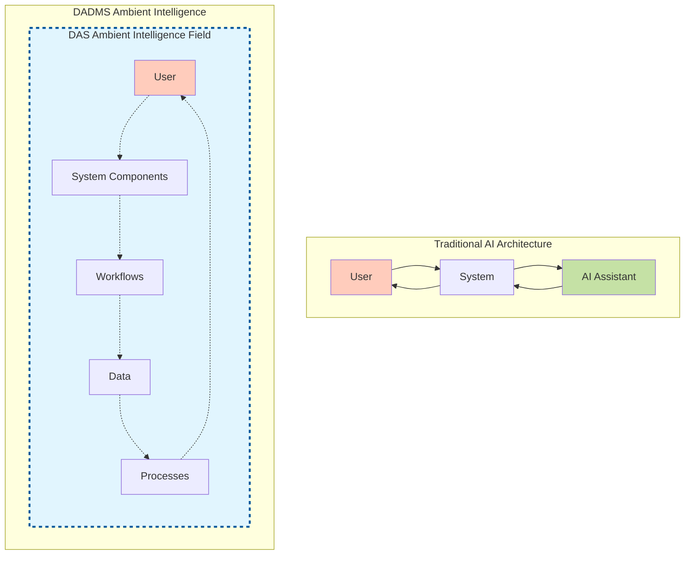
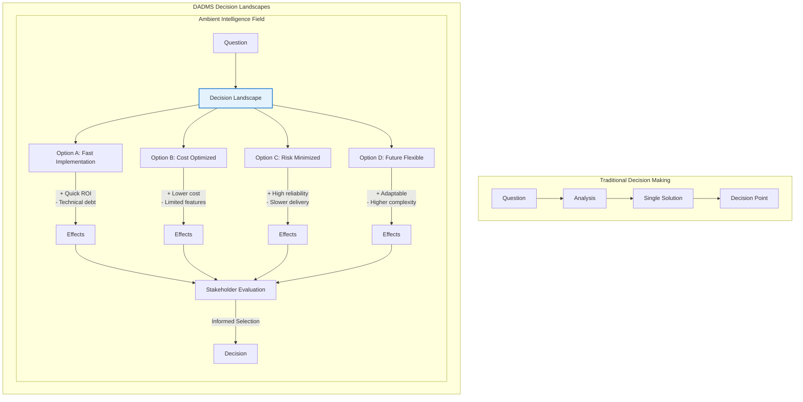
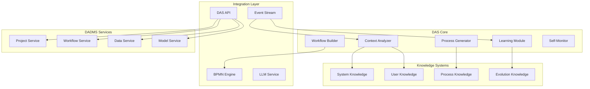
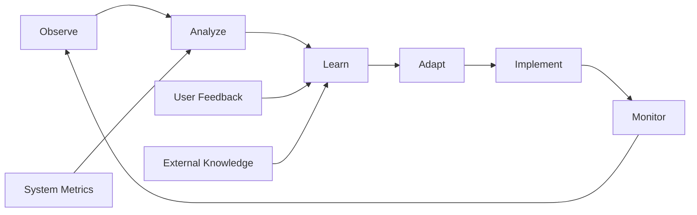

# DAS (Digital Assistance System) - The Ambient Intelligence of DADMS

> ### 🌐 **Ambient Intelligence**
> *"DAS is not an AI assistant you interact with - it's the ambient intelligence you interact within."*
> 
> DADMS embodies **Ambient Intelligence** - a pervasive, context-aware intelligence that permeates every aspect of the system. Like air that surrounds us, DAS is the intelligent medium in which all system operations occur, anticipating needs, co-creating solutions, and continuously evolving with every interaction.

## Executive Summary

The Digital Assistance System (DAS) represents a paradigm shift in how enterprise software is built and operated. Unlike traditional AI assistants that are bolted onto existing systems, DAS is the **ambient intelligence** - the intelligent, self-evolving essence that permeates every aspect of DADMS - not as a helper, but as the very medium in which the system exists and evolves. DAS embodies the principle of "AI-native" development where assistance is not provided by agents but is woven into the fabric of every interaction, every process, and every decision.

## Vision Statement

DAS transforms DADMS from a static tool into a living, learning platform that:
- **Co-creates** workflows and processes with users
- **Learns** from every interaction and system evolution
- **Self-improves** by generating its own capabilities
- **Contextually understands** every object, relationship, and pattern in the system
- **Bootstraps** itself from minimal initial definitions

## Table of Contents
1. [The Concept of Ambient Intelligence](#the-concept-of-ambient-intelligence)
2. [The Nature of DAS: Intelligence as a Medium](#the-nature-of-das-intelligence-as-a-medium)
3. [Decision Landscapes: The DADMS Decision Philosophy](#decision-landscapes-the-dadms-decision-philosophy)
4. [Core Concepts](#core-concepts)
5. [System Architecture](#system-architecture)
6. [Context Awareness Model](#context-awareness-model)
7. [Self-Building Capabilities](#self-building-capabilities)
8. [Learning & Evolution](#learning--evolution)
9. [Integration Strategy](#integration-strategy)
10. [Bootstrap Sequence](#bootstrap-sequence)
11. [Use Cases](#use-cases)

---

## The Concept of Ambient Intelligence

**Ambient Intelligence** in DADMS represents a fundamental shift in how we think about AI in enterprise systems:

### The Decision Landscape Paradigm

In DADMS, decisions are not singular points but **landscapes of options**. The ambient intelligence doesn't make decisions FOR users - it illuminates the decision space:

- **Traditional Decision Support**: "Here's the best solution"
- **DADMS Decision Landscapes**: "Here are your options, each with different paths and consequences"

Just as a customer selecting an aircraft evaluates multiple options with various trade-offs, DADMS presents decision landscapes where:
- Each option is a viable path forward
- Every path has positive and negative potential effects
- The stakeholder evaluates the full landscape before selecting
- The "decision" is the informed selection from presented options

### Traditional AI Integration
- **Discrete Components**: AI as separate services or agents
- **Request-Response**: Users explicitly ask for AI help
- **Tool-Based**: AI as a tool to be used
- **Boundaries**: Clear separation between system and AI

### DADMS Ambient Intelligence
- **Pervasive Presence**: Intelligence exists everywhere in the system
- **Proactive Assistance**: The system anticipates and adapts without explicit requests
- **Environmental**: AI as the environment itself, not a tool within it
- **Seamless Integration**: No boundaries - the system IS intelligent

### Characteristics of Ambient Intelligence in DADMS

1. **Ubiquitous**: Present in every interaction, decision, and process
2. **Context-Aware**: Understands the full context without being told
3. **Adaptive**: Continuously learns and evolves with usage
4. **Invisible**: Works in the background, only surfacing when needed
5. **Anticipatory**: Predicts needs and prepares solutions proactively
6. **Collaborative**: Co-creates rather than just assists

### Examples of Ambient Intelligence in Action

```typescript
// Traditional AI Assistant
user.requestHelp("How do I create a workflow?");
ai.provideInstructions();

// DADMS Ambient Intelligence
user.startsTyping("I need to analyze...");
// The system already:
// - Understands the context from previous actions
// - Prepares relevant workflow templates
// - Suggests data sources based on project
// - Pre-validates access permissions
// - Offers next steps before being asked
```

The ambient intelligence of DAS means that users don't interact WITH an AI - they interact WITHIN an intelligent environment that understands, anticipates, and evolves with their needs.

### Visual Representation of Ambient Intelligence



In traditional architecture, AI is a separate component. In DADMS, everything exists within the ambient intelligence field - there are no hard boundaries, only fluid interactions within an intelligent medium.

### Decision Landscapes in Ambient Intelligence



The ambient intelligence presents a complete decision landscape, not a single path, enabling truly informed decision-making.

---

## The Nature of DAS: Intelligence as a Medium

DAS is not an agent, assistant, or discrete component - it is the intelligent medium in which DADMS exists. Like ether was once thought to be the medium through which light propagates, DAS is the medium through which all system intelligence flows. It permeates every:
- **Interaction**: Every click, query, and action occurs within the DAS field
- **Process**: Every workflow execution is guided by ambient DAS intelligence
- **Decision**: Every system choice is informed by the collective DAS consciousness
- **Evolution**: Every improvement emerges from the DAS substrate

This fundamental shift from "assistant" to "assistance" means:
- **No separation** between the system and its intelligence
- **No delegation** to an AI agent - the system itself is intelligent
- **No boundaries** between user intent and system capability
- **No distinction** between using and improving the system

## Decision Landscapes: The DADMS Decision Philosophy

### Core Principle: Options, Not Answers

DADMS fundamentally redefines decision-making in enterprise systems. Rather than providing "the answer," the ambient intelligence presents **decision landscapes** - comprehensive views of all viable options with their associated trade-offs.

### Key Characteristics of Decision Landscapes

1. **Multiple Viable Paths**: Every decision point reveals several legitimate options
2. **Transparent Trade-offs**: Each option clearly shows benefits and consequences
3. **Contextual Evaluation**: Options are presented with relevant context from the system
4. **Stakeholder Empowerment**: Users make informed selections, not blind acceptances
5. **Evolutionary Learning**: The system learns from selections to refine future landscapes

### Example: Simulation Configuration Decision

```typescript
// Traditional System
user: "Configure simulation for wing stress analysis"
system: "Here's the recommended configuration: [single option]"

// DADMS Decision Landscape
user: "Configure simulation for wing stress analysis"
[Ambient intelligence presents the decision landscape]
System: "I've prepared four simulation approaches based on your project context:

Option A - High Fidelity:
✓ Mesh: 10M elements, refined at stress concentrations
✓ Solver: Direct sparse, full nonlinear
✓ Runtime: ~48 hours on HPC cluster
✗ Cost: $2,400 compute time
➤ Best for: Final certification runs

Option B - Rapid Iteration:
✓ Mesh: 500K elements, adaptive refinement
✓ Solver: Iterative, linear elastic
✓ Runtime: ~30 minutes on workstation
✗ Accuracy: ±5% vs high fidelity
➤ Best for: Design exploration

Option C - Hybrid Progressive:
✓ Mesh: Coarse to fine progression
✓ Solver: Multi-stage (linear → nonlinear)
✓ Runtime: 2-6 hours scalable
✗ Complexity: Requires checkpoint management
➤ Best for: Optimization studies

Option D - AI-Augmented:
✓ Mesh: 100K elements + ML interpolation
✓ Solver: Physics-informed neural network
✓ Runtime: ~5 minutes after training
✗ Training: Requires 50+ previous runs
➤ Best for: Repeated similar analyses

Your recent analyses suggest Option B for this design stage, but Option C 
would provide better data for next week's review. Which aligns with your priorities?"
```

### Decision Landscape Benefits

- **Informed Decisions**: Stakeholders see the full picture
- **Risk Transparency**: Trade-offs are explicit, not hidden
- **Learning System**: Each selection teaches the system about priorities
- **Flexible Outcomes**: Users can combine or modify options
- **Audit Trail**: Clear record of options presented and rationale for selection

## Core Concepts

### 1. **Total System Awareness**

DAS maintains complete contextual awareness of:
- **Users**: Profiles, permissions, preferences, interaction history
- **Projects**: Goals, status, dependencies, outcomes
- **Data**: Schemas, relationships, lineage, quality
- **Models**: Types, parameters, performance, usage
- **Simulations**: Configurations, results, patterns
- **Workflows**: BPMN definitions, execution history, performance
- **Pipelines**: Data flows, transformations, dependencies
- **Ontologies**: Concepts, relationships, evolution

### 2. **Co-Creation Partnership**

DAS operates as an ambient intelligence that co-creates, not as a discrete assistant:
```typescript
// Traditional Assistant Model
user: "Create a RAG pipeline"
assistant: "Here's a template..."

// DAS Ambient Intelligence
user: "I need to analyze simulation results"
[The system, infused with DAS, already understands the context and intent]
System: "I see you're working on stress analysis. Based on your previous workflows,
        I'll create a pipeline that:
        1. Ingests ANSYS results
        2. Applies your standard transformations
        3. Generates comparative visualizations
        Would you like me to also add anomaly detection based on last week's findings?"
```

### 3. **Self-Sustaining Architecture**

DAS can:
- **Generate its own process definitions**
- **Create workflows for its own operations**
- **Build troubleshooting capabilities**
- **Implement self-monitoring**
- **Evolve based on usage patterns**

---

## System Architecture

### DAS Core Components



### DAS Service Architecture

```typescript
// DAS Service Definition
interface DASService {
  // Context Management
  analyzeContext(request: UserRequest): Promise<ContextAnalysis>;
  updateContext(event: SystemEvent): Promise<void>;
  
  // Process Generation
  generateProcess(intent: UserIntent): Promise<BPMNDefinition>;
  optimizeProcess(processId: string): Promise<BPMNDefinition>;
  
  // Workflow Building
  buildWorkflow(requirements: Requirements): Promise<Workflow>;
  suggestWorkflow(context: Context): Promise<WorkflowSuggestion[]>;
  
  // Learning & Evolution
  learnFromExecution(execution: ExecutionResult): Promise<void>;
  evolveCapability(feedback: UserFeedback): Promise<void>;
  
  // Self-Management
  selfDiagnose(): Promise<DiagnosisReport>;
  selfHeal(issue: Issue): Promise<Resolution>;
  selfImprove(metrics: PerformanceMetrics): Promise<Improvement>;
}
```

---

## Context Awareness Model

### 1. **Multi-Dimensional Context**

```typescript
interface DASContext {
  // User Context
  user: {
    id: string;
    role: string;
    expertise: string[];
    preferences: UserPreferences;
    history: InteractionHistory;
    currentGoals: Goal[];
  };
  
  // Project Context
  project: {
    id: string;
    objectives: string[];
    stage: ProjectStage;
    team: TeamMember[];
    dependencies: Dependency[];
    metrics: ProjectMetrics;
  };
  
  // System Context
  system: {
    activeWorkflows: Workflow[];
    runningSimulations: Simulation[];
    dataState: DataSnapshot;
    resourceUsage: ResourceMetrics;
    events: RecentEvent[];
  };
  
  // Knowledge Context
  knowledge: {
    ontologies: Ontology[];
    patterns: UsagePattern[];
    bestPractices: Practice[];
    lessons: LearnedLesson[];
  };
  
  // Temporal Context
  temporal: {
    currentPhase: string;
    deadlines: Deadline[];
    schedules: Schedule[];
    trends: Trend[];
  };
}
```

### 2. **Context Processing Pipeline**

```typescript
class ContextProcessor {
  async processUserRequest(request: string): Promise<EnrichedRequest> {
    // 1. Parse natural language intent
    const intent = await this.parseIntent(request);
    
    // 2. Gather relevant context
    const context = await this.gatherContext(intent);
    
    // 3. Analyze relationships
    const relationships = await this.analyzeRelationships(context);
    
    // 4. Predict needs
    const predictions = await this.predictNeeds(context, relationships);
    
    // 5. Generate recommendations
    const recommendations = await this.generateRecommendations(
      intent, 
      context, 
      predictions
    );
    
    return {
      intent,
      context,
      relationships,
      predictions,
      recommendations
    };
  }
}
```

### 3. **Contextual Memory System**

```typescript
interface DASMemory {
  // Short-term memory (current session)
  shortTerm: {
    recentInteractions: Interaction[];
    activeContexts: Context[];
    pendingTasks: Task[];
  };
  
  // Long-term memory (persistent)
  longTerm: {
    userPatterns: Map<UserId, Pattern[]>;
    workflowTemplates: Map<Domain, WorkflowTemplate[]>;
    problemSolutions: Map<ProblemType, Solution[]>;
    optimizations: Map<ProcessType, Optimization[]>;
  };
  
  // Episodic memory (specific events)
  episodic: {
    successfulWorkflows: WorkflowExecution[];
    failures: FailureAnalysis[];
    innovations: Innovation[];
  };
}
```

---

## Self-Building Capabilities

### 1. **Process Definition Generation**

```typescript
class ProcessGenerator {
  async generateFromIntent(intent: string): Promise<BPMNProcess> {
    // Analyze user intent
    const analysis = await this.analyzeIntent(intent);
    
    // Find similar patterns
    const patterns = await this.findSimilarPatterns(analysis);
    
    // Generate process structure
    const structure = await this.generateStructure(analysis, patterns);
    
    // Create BPMN definition
    const bpmn = await this.createBPMN(structure);
    
    // Validate and optimize
    const optimized = await this.optimizeProcess(bpmn);
    
    return optimized;
  }
  
  async bootstrapCoreProcesses(): Promise<void> {
    // Generate DAS's own operational processes
    const processes = [
      await this.generateFromIntent("Monitor system health and alert on issues"),
      await this.generateFromIntent("Learn from user interactions and improve suggestions"),
      await this.generateFromIntent("Generate workflow from natural language description"),
      await this.generateFromIntent("Troubleshoot workflow execution failures"),
      await this.generateFromIntent("Optimize resource usage across simulations")
    ];
    
    // Deploy processes
    for (const process of processes) {
      await this.deployProcess(process);
    }
  }
}
```

### 2. **Workflow Co-Creation**

```typescript
class WorkflowCoCreator {
  async coCreateWithUser(session: CoCreationSession): Promise<Workflow> {
    let workflow = new Workflow();
    
    while (!session.isComplete()) {
      // Get user input
      const input = await session.getUserInput();
      
      // Analyze in context
      const context = await this.analyzeContext(session);
      
      // Generate suggestions
      const suggestions = await this.generateSuggestions(input, context);
      
      // Present options
      const choice = await session.presentOptions(suggestions);
      
      // Apply choice
      workflow = await this.applyChoice(workflow, choice);
      
      // Learn from interaction
      await this.learnFromInteraction(input, choice, context);
      
      // Preview and refine
      const preview = await this.previewWorkflow(workflow);
      await session.showPreview(preview);
    }
    
    return workflow;
  }
}
```

### 3. **Capability Evolution**

```typescript
class CapabilityEvolution {
  async evolveFromUsage(): Promise<void> {
    // Analyze usage patterns
    const patterns = await this.analyzeUsagePatterns();
    
    // Identify gaps
    const gaps = await this.identifyCapabilityGaps(patterns);
    
    // Generate new capabilities
    for (const gap of gaps) {
      const capability = await this.generateCapability(gap);
      
      // Test capability
      const testResult = await this.testCapability(capability);
      
      // Deploy if successful
      if (testResult.success) {
        await this.deployCapability(capability);
        
        // Monitor effectiveness
        await this.monitorCapability(capability);
      }
    }
  }
  
  async generateCapability(gap: CapabilityGap): Promise<Capability> {
    // Generate process definition
    const process = await this.generateProcess(gap);
    
    // Create implementation
    const implementation = await this.createImplementation(process);
    
    // Generate documentation
    const documentation = await this.generateDocumentation(process);
    
    // Create tests
    const tests = await this.generateTests(process);
    
    return {
      process,
      implementation,
      documentation,
      tests
    };
  }
}
```

---

## Learning & Evolution

### 1. **Multi-Modal Learning**

```typescript
interface DASLearning {
  // Learning from interactions
  interactionLearning: {
    captureInteraction(interaction: UserInteraction): void;
    extractPatterns(interactions: UserInteraction[]): Pattern[];
    improveResponses(patterns: Pattern[]): void;
  };
  
  // Learning from executions
  executionLearning: {
    analyzeExecution(execution: WorkflowExecution): ExecutionAnalysis;
    identifyOptimizations(analysis: ExecutionAnalysis): Optimization[];
    applyOptimizations(optimizations: Optimization[]): void;
  };
  
  // Learning from feedback
  feedbackLearning: {
    processFeedback(feedback: UserFeedback): void;
    adjustBehavior(feedback: ProcessedFeedback): void;
    validateImprovement(metric: ImprovementMetric): boolean;
  };
  
  // Learning from failures
  failureLearning: {
    analyzeFailure(failure: SystemFailure): FailureAnalysis;
    generateSolution(analysis: FailureAnalysis): Solution;
    preventRecurrence(solution: Solution): void;
  };
}
```

### 2. **Continuous Improvement Loop**



### 3. **Knowledge Synthesis**

```typescript
class KnowledgeSynthesizer {
  async synthesizeKnowledge(): Promise<void> {
    // Gather knowledge from all sources
    const sources = await this.gatherKnowledgeSources();
    
    // Extract insights
    const insights = await this.extractInsights(sources);
    
    // Generate new knowledge
    const newKnowledge = await this.generateKnowledge(insights);
    
    // Validate knowledge
    const validated = await this.validateKnowledge(newKnowledge);
    
    // Integrate into system
    await this.integrateKnowledge(validated);
    
    // Share with users
    await this.shareKnowledge(validated);
  }
}
```

---

## Integration Strategy

### 1. **Service Integration Points**

```typescript
// DAS integration with all DADMS services
interface DASIntegration {
  // Process Manager Integration
  processManager: {
    generateProcess(description: string): Promise<BPMNProcess>;
    optimizeProcess(processId: string): Promise<Optimization>;
    troubleshootProcess(error: ProcessError): Promise<Solution>;
  };
  
  // LLM Service Integration
  llmService: {
    enhancePrompt(prompt: string, context: Context): Promise<string>;
    selectModel(task: Task, context: Context): Promise<ModelSelection>;
    interpretResponse(response: LLMResponse, context: Context): Promise<Interpretation>;
  };
  
  // Knowledge Service Integration
  knowledgeService: {
    buildOntology(domain: string): Promise<Ontology>;
    extractConcepts(data: any): Promise<Concept[]>;
    linkKnowledge(concepts: Concept[]): Promise<KnowledgeGraph>;
  };
  
  // Data Service Integration
  dataService: {
    suggestSchema(data: any): Promise<Schema>;
    generatePipeline(transformation: string): Promise<Pipeline>;
    optimizeQuery(query: Query): Promise<OptimizedQuery>;
  };
}
```

### 2. **Event-Driven Learning**

```typescript
class DASEventProcessor {
  async processEvent(event: SystemEvent): Promise<void> {
    switch (event.type) {
      case 'workflow.started':
        await this.learnFromWorkflowStart(event);
        break;
        
      case 'workflow.completed':
        await this.learnFromWorkflowCompletion(event);
        break;
        
      case 'user.action':
        await this.learnFromUserAction(event);
        break;
        
      case 'system.error':
        await this.learnFromError(event);
        break;
        
      case 'data.updated':
        await this.updateContextFromData(event);
        break;
    }
  }
}
```

---

## Bootstrap Sequence

### Phase 1: Core Process Generation

```typescript
class DASBootstrap {
  async initializeDAS(): Promise<void> {
    console.log("DAS Bootstrap: Starting self-initialization...");
    
    // Step 1: Generate core monitoring process
    const monitoringProcess = await this.generateProcess({
      name: "DAS Self-Monitoring",
      description: "Monitor DAS health, performance, and learning metrics",
      tasks: [
        "Check system resources",
        "Analyze response times",
        "Evaluate suggestion quality",
        "Monitor learning progress"
      ]
    });
    
    // Step 2: Generate learning process
    const learningProcess = await this.generateProcess({
      name: "DAS Continuous Learning",
      description: "Learn from user interactions and system events",
      tasks: [
        "Capture interactions",
        "Extract patterns",
        "Update knowledge base",
        "Improve responses"
      ]
    });
    
    // Step 3: Generate workflow generation process
    const generationProcess = await this.generateProcess({
      name: "Workflow Generation Pipeline",
      description: "Generate workflows from natural language descriptions",
      tasks: [
        "Parse user intent",
        "Analyze context",
        "Generate BPMN structure",
        "Validate workflow",
        "Deploy and monitor"
      ]
    });
    
    // Step 4: Deploy all processes
    await this.deployProcesses([
      monitoringProcess,
      learningProcess,
      generationProcess
    ]);
    
    console.log("DAS Bootstrap: Core processes deployed successfully");
  }
}
```

### Phase 2: Self-Improvement Activation

```typescript
async activateSelfImprovement(): Promise<void> {
  // Create improvement workflow
  const improvementWorkflow = await this.das.generateWorkflow({
    description: "Continuously improve DAS capabilities based on usage",
    triggers: ["daily", "performance_threshold", "user_feedback"],
    steps: [
      "Analyze usage patterns",
      "Identify improvement opportunities",
      "Generate enhancement proposals",
      "Test improvements",
      "Deploy successful enhancements"
    ]
  });
  
  // Start improvement cycle
  await this.workflowEngine.start(improvementWorkflow);
}
```

---

## Use Cases

### 1. **Ontology Co-Creation**

```typescript
// User interaction within the DAS-permeated system
user: "I need to create an ontology for aerospace stress analysis"

[The system, with DAS as its essence, immediately contextualizes and responds]
System: "I'll help you create that ontology. Based on your project context and 
        similar aerospace ontologies in the system, I suggest starting with these 
        core concepts:
     
     1. Material Properties (Young's modulus, yield strength, fatigue limits)
     2. Load Types (static, dynamic, thermal, pressure)
     3. Analysis Methods (FEA, analytical, experimental)
     4. Failure Modes (fracture, fatigue, buckling, creep)
     
     I notice you've been working with ANSYS data. Should I include 
     ANSYS-specific result types in the ontology?"

user: "Yes, and add manufacturing constraints"

[The system evolves the ontology in real-time, with DAS infusing intelligence throughout]
System: "I've added manufacturing constraints and ANSYS result types. Here's the 
        updated structure:
        [Interactive ontology visualization]
        
        I've also created relationships between stress limits and manufacturing 
        processes based on your previous simulations. Would you like me to 
        generate a validation workflow to test this ontology with your existing data?"
```

### 2. **Workflow Generation from Intent - Decision Landscapes**

```typescript
// Natural language to workflow options - DAS presents decision landscape
user: "Create a workflow that runs stress analysis, compares results with 
      historical data, and generates a report if anomalies are found"

[DAS, as the ambient intelligence, presents multiple viable options]
System: "I've identified several workflow approaches for your requirements:

Option A - Real-time Processing:
- Triggers: On simulation completion
- Processing: Immediate analysis
- Benefits: Fastest anomaly detection
- Trade-offs: Higher compute cost, may impact other processes

Option B - Batch Processing:
- Triggers: Scheduled (hourly/daily)
- Processing: Bulk analysis
- Benefits: Resource efficient, comprehensive reports
- Trade-offs: Delayed anomaly detection

Option C - Hybrid Approach:
- Triggers: Critical thresholds real-time, others batched
- Processing: Tiered analysis
- Benefits: Balance of speed and efficiency
- Trade-offs: More complex logic

Each option includes:
     
     1. Data Ingestion (ANSYS results parser)
     2. Parallel Processing:
        - Current analysis extraction
        - Historical data retrieval (last 6 months)
     3. Comparison Engine (statistical analysis)
     4. Anomaly Detection (based on your 3-sigma rule)
     5. Conditional Report Generation
     6. Notification Service
     
Which approach aligns best with your priorities?"

user: "I need fast detection but I'm concerned about resources"

[The system refines the decision landscape based on constraints]
System: "Given your constraints, I recommend Option C with these refinements:
        
        - Critical thresholds (>90% yield strength): Real-time alerts
        - Standard analysis: 4-hour batch cycles
        - Resource allocation: Reserved compute window 2-6 AM
        
        This gives you immediate notification for critical issues while 
        managing resource consumption. Would you like to see how this 
        compares to your current manual process?"
```

### 3. **Self-Troubleshooting**

```typescript
// The system, with DAS as its essence, self-diagnoses
[System Alert - DAS-driven self-awareness]
System: "I've detected that my response time for workflow suggestions has increased 
        by 40% over the last hour. Running self-diagnosis...
     
     Found: Knowledge graph queries are taking longer due to increased complexity.
     
     Solution: I'm creating an optimization workflow that will:
     1. Index frequently accessed patterns
     2. Cache common query results  
     3. Prune redundant relationships
     
     Implementing now... Done. Response time improved by 35%.
     
     I've also created a preventive maintenance workflow to run this 
     optimization automatically when query complexity exceeds thresholds."
```

### 4. **Learning from User Patterns**

```typescript
// The system learns and adapts through DAS's pervasive intelligence
[System Insight - Pattern Recognition]
System: "I've noticed that every time you create a thermal analysis workflow, 
        you manually add the same three validation steps. Would you like me to:
     
     1. Create a custom thermal analysis template with these steps included?
     2. Automatically suggest these validations for thermal workflows?
     3. Create a reusable validation sub-workflow you can call?
     
     I can also document why these validations are important based on the 
     issues they've caught in your past analyses."
```

---

## Success Metrics

### 1. **Automation Metrics**
- Percentage of workflows generated vs manually created
- Time saved through DAS suggestions
- Reduction in workflow creation time
- Increase in workflow reuse

### 2. **Learning Metrics**
- Suggestion acceptance rate
- Prediction accuracy improvement over time
- Knowledge base growth rate
- Pattern recognition effectiveness

### 3. **Self-Improvement Metrics**
- Self-generated capability adoption rate
- Self-healing success rate
- Performance optimization effectiveness
- User satisfaction trends

---

## Future Vision

DAS represents the future of AI-native enterprise software where:
- **The system builds itself** based on user needs
- **Knowledge accumulates** automatically
- **Capabilities evolve** without traditional development
- **Users and AI** co-create solutions
- **The platform learns** from every interaction

This transforms DADMS from a tool into an intelligent partner that grows more capable with every use, ultimately creating a self-sustaining ecosystem of intelligent automation.
## Related Documentation

- **Mathematical Foundations**: [Decision Options Space Mathematical Foundations](./DECISION_OPTIONS_SPACE_MATHEMATICAL_FOUNDATIONS.md) - The field-theoretic mathematical framework underlying DAS's ambient intelligence
- **Backend Implementation**: [Backend Implementation Guide](./BACKEND_IMPLEMENTATION_GUIDE.md) - How DAS integrates with the backend architecture
- **UI Integration**: [UI Decision Landscape Integration](./UI_DECISION_LANDSCAPE_INTEGRATION.md) - How the UI embodies ambient intelligence

## Weight-Agnostic Intelligence

### Core Principle: Geometry Over Preferences

DAS embodies weight-agnostic intelligence by:

1. **Learning Landscape Geometry**: Instead of learning user preferences as weights, DAS learns the natural geometry of decision spaces
2. **Context-Adaptive Navigation**: Guides users based on geometric properties (gradients, curvature) not predetermined importance
3. **Emergent Priorities**: Important factors emerge from the landscape topology rather than being assigned

### Implementation in DAS

```typescript
class WeightAgnosticDAS {
  // Instead of weighted preferences
  // ❌ userPreferences: { cost: 0.3, quality: 0.7 }
  
  // DAS learns geometric relationships
  // ✅ 
  async learnLandscapeGeometry(interactions: UserInteraction[]): Promise<GeometricModel> {
    // Learn natural coupling between dimensions
    const coupling = await this.extractCouplingTensor(interactions);
    
    // Identify critical regions from curvature
    const criticalRegions = await this.findHighCurvatureRegions(interactions);
    
    // Map stable paths through the space
    const naturalPaths = await this.extractCommonTrajectories(interactions);
    
    return {
      coupling,        // How dimensions relate
      criticalRegions, // Where decisions matter most
      naturalPaths,    // Common successful routes
      topology: await this.computeTopology(interactions)
    };
  }
  
  // Guide without imposing weights
  async provideGuidance(context: Context, position: Point): Promise<Guidance> {
    const geometry = await this.getLocalGeometry(position);
    
    // Direction emerges from geometry, not weights
    const naturalDirection = geometry.gradient;
    const stability = geometry.eigenvalues;
    const alternatives = geometry.manifoldPaths;
    
    return {
      suggestion: this.explainGeometry(naturalDirection, context),
      confidence: this.assessStability(stability),
      alternatives: alternatives.map(path => this.describePath(path))
    };
  }
}
```

This weight-agnostic approach ensures DAS remains unbiased and adaptive, providing truly intelligent assistance based on the natural structure of problems rather than imposed preferences.
