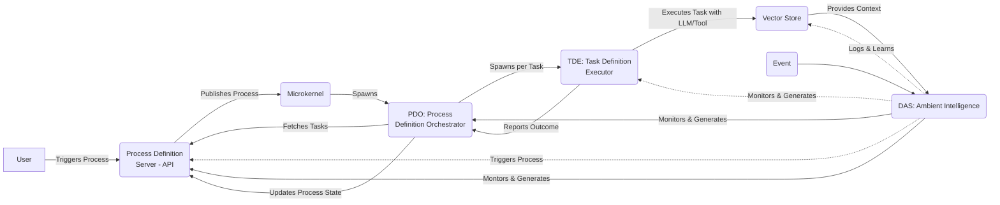
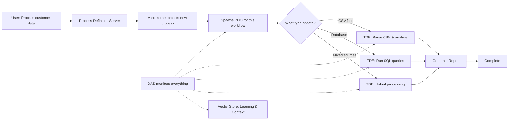

# KnowOS: A Knowledge-Driven, Process-Oriented Operating System

## Executive Summary

KnowOS is an innovative operating system architecture that empowers users to build personalized, process-driven environments by extracting their domain-specific knowledge into executable workflows. Leveraging Business Process Model and Notation (BPMN), large language models (LLMs), and an ambient intelligence system called DAS (Digital Assistance System), KnowOS starts as a minimal microkernel and evolves organically. Users—from traders to engineers—can create tailored processes for tasks like file operations, machine learning model training, or complex decision analysis. This white paper outlines the problem of rigid, non-adaptable operating systems, presents the KnowOS architecture, and discusses its benefits and implementation path. By integrating probabilistic execution with deterministic tools, KnowOS creates a flexible, scalable system that grows with user input, fostering a "knowledge grid" where processes become the core of computing.

## Introduction

Traditional operating systems, such as Unix-like kernels or Windows NT, are built around files, programs, and resource management, often requiring specialized coding skills to customize. In contrast, KnowOS reimagines the OS as a dynamic, process-oriented framework where workflows—modeled in BPMN—serve as the fundamental building blocks. Inspired by concepts from the 1960s and 1970s, like accessible "tinkerable" engines, KnowOS aims to democratize system development. Generalists can visually edit processes without deep programming knowledge, while super users access a robust backend. The system begins blank and grows as users input knowledge, turning expertise into BPMN processes executed via LLMs and tools. This approach addresses the gap in modern computing: processes drive everything, yet they are rarely scored, monitored, or made editable by non-experts.

## Problem Statement

Modern software development hides complexity behind frontends, making systems opaque and hard to modify. For instance:
- Engineers struggle with feedback loops in document releases or aircraft design bootstrapping, which can take months.
- Traders or supply chain professionals lack tools to encode their workflows into an adaptable OS.
- Probabilistic computing, powered by LLMs, is underutilized in OS design, leading to deterministic systems that fail to handle real-world uncertainty.

Key challenges include:
- Lack of accessibility: Systems require coding expertise, alienating generalists.
- Inefficiency in process management: Workflows are not scored (e.g., like a batting average for usage and success) or dynamically generated.
- Scalability issues: Handling parallel tasks, probabilistic decisions, and knowledge preservation during iterations is cumbersome.
- Knowledge loss: Development mistakes and insights are not systematically captured for future refinement.

These issues result in rigid systems that do not evolve with user knowledge, limiting innovation across domains like engineering, finance, and logistics.

## Proposed Solution: KnowOS Architecture

KnowOS is built on a microkernel foundation, emphasizing modularity, probabilistic execution, and ambient intelligence. Core components include the microkernel, Process Definition Orchestrator (PDO), Task Definition Executor (TDE), and DAS, all framed as BPMN processes for visual editability.

### Core Components

- **Microkernel**: A lean bootstrapper (<300 lines of code) that initializes the system, integrates with the Process Definition Server (PDS) for BPMN process publishing, and monitors for new executions. It spawns PDOs on demand, ensuring minimal overhead.

- **Process Definition Server (PDS)**: The conceptual engine for process management, responsible for storing, publishing, and versioning BPMN workflows. PDS acts as a state machine for each process, publishing when a process is active and tracking its current state or which task is active. It provides a standardized API for process orchestration, enabling dynamic creation, modification, and querying of processes. It abstracts away implementation details, serving as the backbone for workflow-driven OS behavior.

- **Process Definition Orchestrator (PDO)**: A BPMN process managing an entire workflow instance. It queries the PDS API for task states, handles sequential and parallel tasks, and spawns TDEs dynamically. Priorities are embedded in PDS definitions, with DAS suggesting optimizations.

- **Task Definition Executor (TDE)**: Generic BPMN processes for individual tasks, powered by LLMs with context-managed prompts. TDEs evaluate inputs, make probabilistic decisions (e.g., outcomes A at 80%, B at 15%), or call deterministic tools (e.g., MATLAB, Python). They support containerization via Docker for specialized environments and terminate after execution to conserve resources.

- **Digital Assistance System (DAS)**: The ambient intelligence core, integrated from startup. DAS monitors all activity via a vector store (e.g., Milvus or Pinecone), generates BPMN processes from user inputs (e.g., "Build a process to ingest data and train a model"), and refines them using pre-loaded a priori memory. It logs iterations, errors, and outcomes, enabling self-improvement and knowledge preservation.



### Key Features

- **Probabilistic Execution**: TDEs can run tasks iteratively until convergence (e.g., stabilizing on weighted outcomes), blending LLMs for fuzzy decisions with deterministic tools for reliability.
- **Process Scoring**: Processes are evaluated like a "batting average" based on usage and success, feeding back into DAS for optimization.
- **Low-Level Processes**: KnowOS starts with generalized BPMN processes for fundamentals, such as file creation, memory allocation, or API requests, generated by DAS.
- **Scalability and Isolation**: TDEs are isolated and spawned horizontally; PDOs manage parallel flows without inter-component chatter.
- **Knowledge Grid**: Users build domain-specific OS variants (e.g., a trader's ProcOS for market analysis) by inputting knowledge, which DAS converts to processes stored in the vector store.

### Architectural Flow

The KnowOS execution flow follows a structured pattern:

1. **Process Initiation**: User triggers a BPMN process (via UI, API, or DAS-generated workflow) in the Process Definition Server (PDS)
2. **Detection & Spawning**: Microkernel detects the new process execution and spawns a dedicated PDO for that process instance
3. **Task Orchestration**: PDO queries PDS API for current process state and active tasks, then spawns TDEs dynamically for each ready task (supporting both sequential and parallel execution)
4. **Task Execution**: Each TDE executes its assigned task using either:
   - LLM-powered probabilistic decisions with context-managed prompts
   - Deterministic tool calls (Python, MATLAB, Docker containers)
5. **State Management**: TDEs report outcomes back to PDO; PDO updates process state in PDS
6. **Ambient Intelligence**: DAS continuously monitors all activity via the vector store, logging iterations, errors, and outcomes for system learning and process optimization
7. **Completion**: Process completes; PDO and TDEs terminate to conserve resources

This architecture ensures isolation, scalability, and continuous learning while maintaining the flexibility of probabilistic execution combined with deterministic reliability.

## How KnowOS Works: A Simple Example

Let's walk through a concrete example to see how KnowOS handles a real task: **"Process customer data and generate a report"**

### The Complete Flow



### What Actually Happens

1. **User Request**: "I need to process customer data and generate a report"

2. **PDO Decision Making**: The PDO (which is itself a BPMN process) uses an LLM to analyze the situation:
   ```
   CONTEXT: Customer data processing request
   DATA TYPES DETECTED: CSV files in /data/customers/
   AVAILABLE TASKS: a) CSV parser, b) Database query, c) Hybrid approach
   DECISION: a (CSV parser most appropriate)
   ```

3. **TDE Execution**: The chosen TDE runs the actual work:
   - Validates the CSV files
   - Processes the data
   - Generates the report
   - Reports back to PDO

4. **DAS Learning**: Throughout this process, DAS observes and learns:
   - "CSV processing worked well for customer data"
   - "This pattern took 3 minutes to complete"
   - "User seemed satisfied with the output format"

### Key Insight

**Everything is a BPMN process** - but they have different roles:
- **User's workflow**: "Process customer data" (high-level business process)
- **PDO**: "Orchestrate this workflow instance" (coordination process)  
- **TDE**: "Parse CSV and generate report" (execution process)

The brilliance is that since everything is BPMN, users can visually edit any part of this flow without coding.

## Benefits

KnowOS offers transformative advantages:
- **Accessibility**: Generalists edit BPMN visually, like tinkering with a classic car engine, without coding.
- **Flexibility**: Probabilistic, multi-path outcomes handle uncertainty (e.g., aircraft bootstrapping in minutes vs. months).
- **Efficiency**: DAS automates process creation, scoring, and refinement, reducing development time.
- **Scalability**: Horizontal TDE spawning supports complex, parallel workflows across organizations (e.g., military branches sharing context).
- **Knowledge Preservation**: Vector store captures build iterations, errors, and insights, creating a shared "grid" for collaborative evolution.

Compared to traditional OSes:
| Aspect              | Traditional OS (e.g., Linux) | KnowOS                     |
|---------------------|------------------------------|----------------------------|
| Customization       | Code-heavy, expert-only     | Visual BPMN, generalist-friendly |
| Execution Model     | Deterministic               | Probabilistic + Deterministic |
| Intelligence        | None                        | Ambient DAS for generation/refinement |
| Process Focus       | Secondary                   | Core, scored and evolvable |

## Implementation and Prototyping

Prototyping KnowOS can be achieved in 5–7 days using existing tools:
1. Initialize DAS with a vector store pre-loaded with low-level BPMN samples.
2. Bootstrap the microkernel to monitor the Process Definition Server (PDS).
3. Define test processes in PDS (e.g., with parallel tasks).
4. Build PDO and TDE templates in BPMN.io.
5. Integrate DAS for process generation.
6. Test end-to-end flows, logging to the vector store.

Deployment on AWS (via CDK) ensures scalability, with Amazon Q for architecture diagrams. Future extensions include ontology integration for requirements mapping and Bayesian methods for probability refinement.

## Conclusion

KnowOS represents a paradigm shift in operating systems, transforming rigid kernels into evolvable, knowledge-driven platforms. By centering on BPMN processes, probabilistic execution, and DAS's ambient intelligence, it enables users to craft personalized OSes that reflect their expertise. This not only solves accessibility and efficiency issues but also unlocks new possibilities in collaborative computing. As domains like engineering and finance adopt KnowOS, it could foster a global knowledge grid, where processes become the universal language of innovation. For more details, visit KnowOS.ai or ProcOS.ai.

## Appendix: Comprehensive Low-Level Process Library

The following processes represent the foundational building blocks that DAS generates and maintains in KnowOS. Each process is modeled as a BPMN workflow, executable by TDEs with intelligent decision-making capabilities.

### File Operations

**Create File Process**
- **Tasks**: Validate path → Check permissions → Validate content → Write data → Confirm write → Log operation
- **TDE Capabilities**: LLM decisions for path validation, deterministic file I/O via Python/OS calls
- **Example**: User says "Create a config file" → DAS generates this process → TDE executes with context-aware error handling

**Read File Process**
- **Tasks**: Validate path → Check file exists → Verify permissions → Read content → Parse/format → Return data
- **TDE Capabilities**: Handle different file types (text, binary, JSON, CSV) with appropriate parsing

**Update File Process**
- **Tasks**: Validate target → Backup original → Lock file → Apply changes → Verify integrity → Release lock
- **TDE Capabilities**: Supports append, replace, or patch operations with rollback on failure

**Delete File Process**
- **Tasks**: Validate path → Check dependencies → Create backup (optional) → Remove file → Verify deletion
- **TDE Capabilities**: Smart dependency checking to prevent breaking system processes

**Move/Copy File Process**
- **Tasks**: Validate source → Validate destination → Check space → Execute transfer → Verify integrity → Cleanup
- **TDE Capabilities**: Handle large files with progress monitoring and resume capability

### Directory Operations

**Create Directory Process**
- **Tasks**: Validate path → Check parent exists → Verify permissions → Create directory → Set permissions → Log
- **TDE Capabilities**: Recursive creation with intelligent permission inheritance

**List Directory Contents Process**
- **Tasks**: Validate path → Check permissions → Read directory → Filter results → Format output
- **TDE Capabilities**: Smart filtering based on user context (hide system files, show only relevant types)

**Delete Directory Process**
- **Tasks**: Validate path → Check contents → Backup (optional) → Remove contents → Remove directory → Verify
- **TDE Capabilities**: Safe removal with dependency analysis and recursive cleanup

### LLM Memory & Context Operations

**Create Context Window Process**
- **Tasks**: Analyze task requirements → Gather relevant context → Build prompt context → Validate token limits → Cache context
- **TDE Capabilities**: Intelligent context selection from vector store, token optimization, and context relevance scoring

**Update Working Memory Process**
- **Tasks**: Identify context changes → Merge new information → Prune outdated context → Rebalance priorities → Update cache
- **TDE Capabilities**: Dynamic context management with semantic similarity and recency weighting

**Retrieve Context Process**
- **Tasks**: Parse query → Search vector store → Rank relevance → Assemble context → Format for LLM → Return context
- **TDE Capabilities**: Semantic search with context-aware retrieval and prompt engineering optimization

**Store Learning Process**
- **Tasks**: Extract insights → Validate information → Determine storage strategy → Write to vector store → Update indices
- **TDE Capabilities**: Automatic knowledge extraction with conflict resolution and knowledge graph updates

**Context Cleanup Process**
- **Tasks**: Identify stale context → Assess importance → Archive valuable insights → Clear working memory → Optimize storage
- **TDE Capabilities**: Intelligent context lifecycle management with learning preservation

### Graph Database Operations

**Create Knowledge Node Process**
- **Tasks**: Extract entity → Validate uniqueness → Define properties → Create node → Index relationships → Log creation
- **TDE Capabilities**: Entity recognition with automatic property inference and duplicate detection

**Update Knowledge Relationship Process**
- **Tasks**: Identify entities → Validate relationship type → Check existing connections → Create/update edge → Weight relationship
- **TDE Capabilities**: Relationship inference with strength scoring and temporal tracking

**Query Knowledge Graph Process**
- **Tasks**: Parse graph query → Traverse relationships → Rank paths → Aggregate results → Format response
- **TDE Capabilities**: Intelligent graph traversal with relevance scoring and context-aware path finding

**Merge Knowledge Entities Process**
- **Tasks**: Identify duplicates → Compare properties → Merge relationships → Update references → Clean orphans
- **TDE Capabilities**: Entity deduplication with relationship preservation and conflict resolution

**Graph Schema Evolution Process**
- **Tasks**: Detect new patterns → Propose schema changes → Validate consistency → Update structure → Migrate data
- **TDE Capabilities**: Automatic schema adaptation with backward compatibility and data integrity

**Relationship Inference Process**
- **Tasks**: Analyze entity patterns → Identify implicit connections → Calculate relationship strength → Create derived edges → Validate inferences
- **TDE Capabilities**: Machine learning-based relationship discovery with confidence scoring

### Disk Operations

**Write to Disk Process**
- **Tasks**: Check space → Validate data → Choose location → Write block → Verify integrity → Update metadata
- **TDE Capabilities**: Intelligent placement and error recovery with retry logic

**Read from Disk Process**
- **Tasks**: Validate request → Locate data → Read block → Verify checksum → Cache result → Return data
- **TDE Capabilities**: Predictive caching and error correction

**Check Disk Space Process**
- **Tasks**: Query filesystem → Calculate usage → Predict trends → Format report → Cache results
- **TDE Capabilities**: Intelligent reporting with usage forecasting and cleanup suggestions

### Network Operations

**Send API Request Process**
- **Tasks**: Validate endpoint → Prepare headers → Serialize data → Send request → Handle response → Log transaction
- **TDE Capabilities**: Automatic retry logic, authentication handling, and response validation

**Receive API Response Process**
- **Tasks**: Validate response → Check status → Parse data → Validate schema → Cache result → Return processed data
- **TDE Capabilities**: Intelligent parsing with error recovery and data transformation

**Open Connection Process**
- **Tasks**: Resolve endpoint → Establish connection → Negotiate protocol → Authenticate → Test connectivity
- **TDE Capabilities**: Protocol selection and automatic fallback mechanisms

**Close Connection Process**
- **Tasks**: Flush buffers → Send close signal → Wait for acknowledgment → Release resources → Log closure
- **TDE Capabilities**: Graceful shutdown with data preservation

### Process Management

**Start Process Process**
- **Tasks**: Validate executable → Check resources → Set environment → Launch process → Monitor startup → Register process
- **TDE Capabilities**: Intelligent resource allocation and dependency injection

**Terminate Process Process**
- **Tasks**: Identify process → Check dependencies → Send termination signal → Wait for graceful exit → Force kill if needed → Cleanup
- **TDE Capabilities**: Smart termination with dependency management and resource cleanup

**Monitor Process Process**
- **Tasks**: Identify process → Collect metrics → Analyze performance → Detect issues → Generate alerts → Log status
- **TDE Capabilities**: Predictive monitoring with anomaly detection and automated remediation

### System Queries

**Check System Resources Process**
- **Tasks**: Query CPU usage → Check memory → Monitor disk I/O → Network utilization → Generate report → Cache results
- **TDE Capabilities**: Real-time monitoring with trend analysis and capacity planning

**Get System Info Process**
- **Tasks**: Query hardware → Check OS version → Get installed software → Network configuration → Format report
- **TDE Capabilities**: Comprehensive system profiling with security-aware information gathering

### Process Generation and Management

Each of these processes is:
1. **Generated by DAS** based on user input or system needs
2. **Stored in the vector store** for reuse and refinement
3. **Orchestrated by PDOs** when part of larger workflows
4. **Executed by TDEs** with both probabilistic (LLM) and deterministic (tool) capabilities
5. **Monitored and logged** for continuous improvement

**Example Process Creation**:
```
User: "I need to save my analysis results"
DAS: Generates "Create File Process" → PDO orchestrates → TDE executes with intelligent path selection and error handling
```

This library forms the foundation upon which users build domain-specific workflows, ensuring that KnowOS can handle everything from simple file operations to complex distributed system management.

## References

- BPMN Specification (OMG, 2023)
- Process Definition Server (PDS) Documentation (2025)
- AWS CDK and Amazon Q Resources (AWS, 2025)