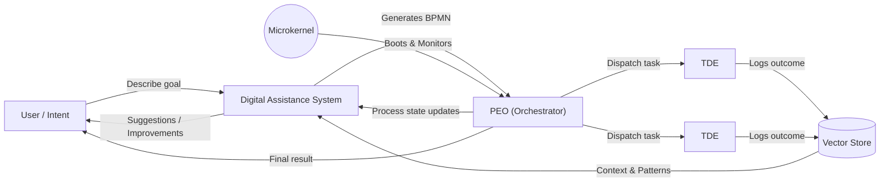
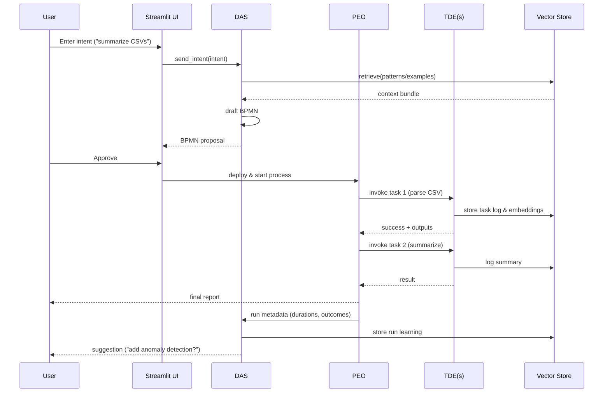
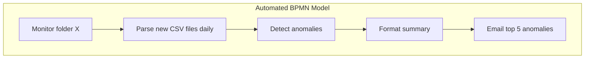
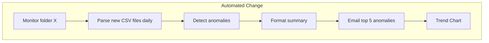

# KnowOS For Dummies (Plain-Language Guide)

## 1. What Is KnowOS?
Think of KnowOS as a "living workspace" that learns how you work, then helps you automate it. Instead of installing lots of apps or writing scripts, you describe what you do ("ingest these files and produce a weekly summary"), and KnowOS turns that into a visual workflow it can run again and again.

## 2. Why Does It Exist?
Modern software hides *how* things get done. Processes live in people’s heads, scattered docs, or brittle scripts. When someone leaves, the workflow leaves with them. KnowOS captures those workflows as editable diagrams so:
- Anyone can understand them at a glance
- The system can improve them over time
- You don’t start from scratch every time

## 3. The Core Idea (Super Simple)
Everything you do repeatedly can be described as a **process**. KnowOS makes processes first-class citizens:
1. You express intent (plain language)
2. It creates a process diagram (a flow of steps)
3. It runs each step safely
4. It learns what worked and suggests improvements

## 4. The Four Main Parts (No Jargon Version)
| Part | Plain Meaning | What It Does |
|------|---------------|--------------|
| Microkernel | Tiny starter brain | Boots the system and then watches quietly |
| PEO (Process Execution Orchestrator) | Conductor | Makes sure each step happens in the right order |
| TDE (Task Definition Executor) | Worker cell | Actually does a single task (analyze file, call API, write output) |
| DAS (Digital Assistance System) | Ambient helper | Generates new workflows, answers questions, improves things |

## 5. How a Workflow Runs (Story Version)
You: "Analyze these customer CSV files and give me a report."
1. System hears you → DAS drafts a workflow.
2. You approve it (or tweak visually if you want).
3. The PEO (conductor) starts the run.
4. Each step is handed to a TDE (worker cell) that does just its part.
5. Results + mistakes are logged so next time is smarter.

### 5a. Architecture at a Glance (Visual)

Key: Microkernel is passive after startup; DAS is the brain for generation + improvement; PEO coordinates; TDEs do atomic work; Vector Store is shared memory.

### 5b. Simple Run Sequence (Step Timing)

This shows only one PEO per process instance and multiple short-lived TDEs.

## 6. What Makes It Different
- Visual first: You can *see* how things run.
- AI assists but doesn’t hide logic.
- Every run is tracked (what happened, how long, what failed).
- You can evolve workflows instead of rebuilding.
- It can learn from both examples and natural language.

## 7. What You Give It vs What It Gives You
| You Provide | It Returns |
|-------------|------------|
| A goal ("pull market data and summarize trends") | A runnable process |
| Example docs or steps | A generalized reusable workflow |
| Feedback ("this step is wrong") | A revised version |
| Domain knowledge | Faster, smarter automation |

## 8. Safety & Control (Human Still in Charge)
- New generated processes can require approval
- Each task is sandboxed so one bad step doesn’t wreck your system
- You can roll back to earlier versions easily
- Sensitive content can be excluded from learning

## 9. What You Can Automate First
Great early candidates:
- File handling: ingest, clean, summarize
- Data prep + lightweight analysis
- Report generation & distribution
- API data pulls + consolidation
- Knowledge base building from documents

Avoid at first:
- Highly regulated actions without review
- Destructive operations (delete / overwrite) until trust is built

## 10. How It Learns (Without Being Creepy)
It stores:
- Process diagrams
- Task outcomes (success/failure, duration)
- Your feedback
- Patterns of reuse
It does *not* need raw confidential data to learn structure—just metadata about how steps performed.

## 11. Common Questions
**Q: Do I need to code?**  No. You *can*, but you don’t have to.

**Q: What if the AI generates something wrong?**  You reject or edit it; the system records why.

**Q: Can I export everything?**  Yes. Workflows and knowledge snapshots are portable.

**Q: Does it replace developers?**  No—it gives experts leverage and lets non-experts automate safely.

**Q: Is it just a fancy script runner?**  No. It understands structure, tracks outcomes, and evolves processes.

## 12. Quick Mental Model
"Google Docs for workflows" + "Git for process versions" + "A helpful analyst watching and improving quietly in the background."

## 13. A 60-Second Demo (Imagined)
1. Type: "Monitor folder X, summarize new CSVs daily, email top 5 anomalies."
2. System proposes a workflow: watch folder → parse CSV → detect anomalies → format summary → send.

3. You click approve.
4. Tomorrow it runs automatically; you see a green check.
5. After a week it suggests: "Add a trend chart?"

## 14. Roles
| Role | How They Benefit |
|------|------------------|
| Analyst | Automate recurring reporting |
| Engineer | Rapidly prototype system flows |
| Domain Expert | **Encode tribal knowledge** |
| Ops Lead | Audit what’s really happening |
| Exec | See process transparency & improvement metrics |

## 15. When It Shines
- Rapid onboarding (new people can see how things actually run)
- Replacing untracked manual glue work
- Experimenting with variations safely
- Building domain-specific "mini operating systems"

## 16. Limitations (Honest View)
- Needs initial examples or descriptions—can’t read your mind *(We create curated and approved 'a priori' knowledge to help here :))*
- Complex judgement-heavy steps still need a human
- Bad input descriptions = weak workflows
- Visual sprawl if you never prune unused processes

## 17. How to Start (First Week Plan)
Day 1: Describe 2–3 recurring tasks → generate workflows
Day 2: Run them manually; review logs
Day 3: Add a new variant (more data, different output)
Day 4: Introduce a dataset cataloging workflow
Day 5: Schedule first automated daily run
Day 6: Export a knowledge snapshot (prove portability)
Day 7: Prune or refine any noisy/unused workflows

## 18. Glossary (Plain)
- **Workflow / Process**: A series of steps with logic.
- **BPMN Diagram**: A visual flow chart the system can execute.
- **PEO**: The conductor that runs a workflow instance.
- **TDE**: The single-step executor.
- **DAS**: The intelligence that generates and improves workflows.
- **Vector Store**: Smart index of knowledge chunks for retrieval.
- **Snapshot**: A packaged export of everything you’ve taught it.

## 19. Success Signals Early
- You stop manually re-doing the same prep work
- People ask to see “the workflow” instead of “how did you do that?”
- New hires understand a process in a minute from the diagram
- The system suggests a change you actually keep

## 20. Elevator Pitch (Use This)
"KnowOS turns what you know into living, visual workflows that you can run, inspect, improve, and move anywhere. Describe it once; evolve it forever."

