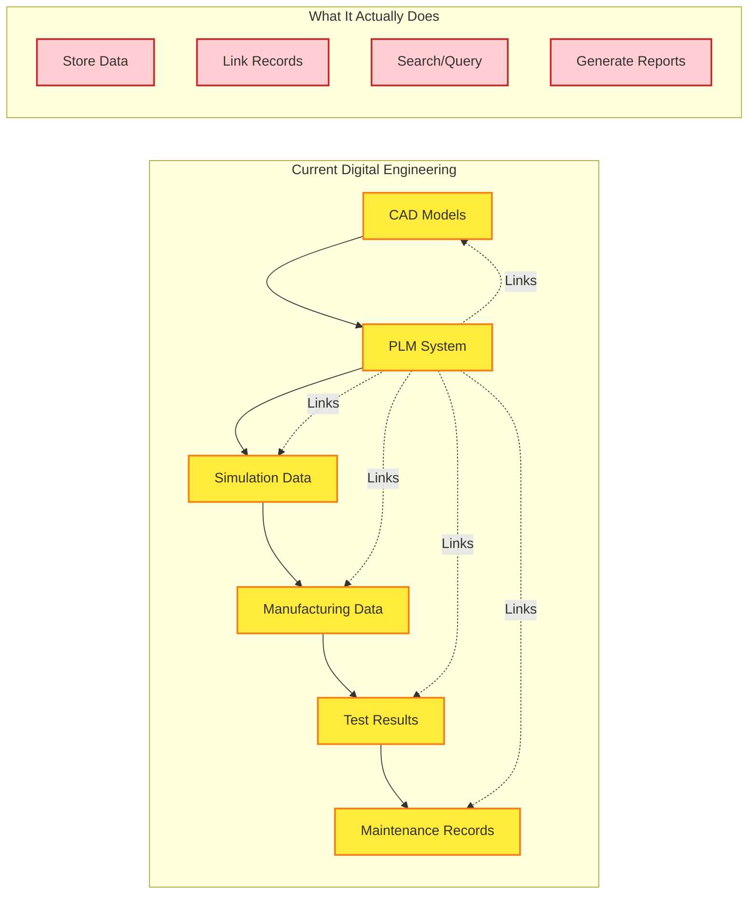
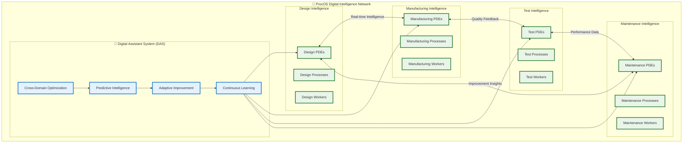
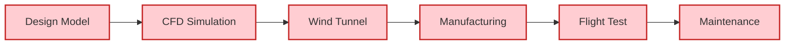
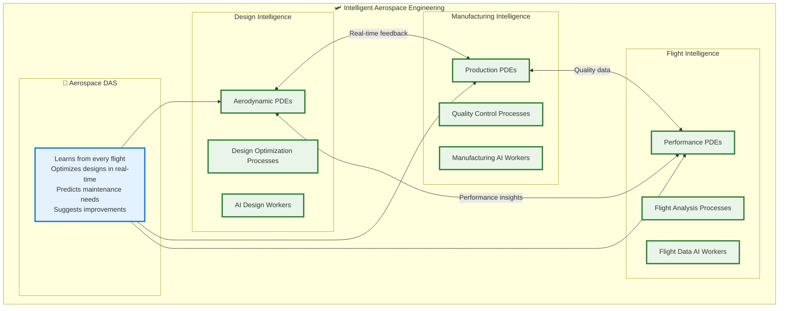
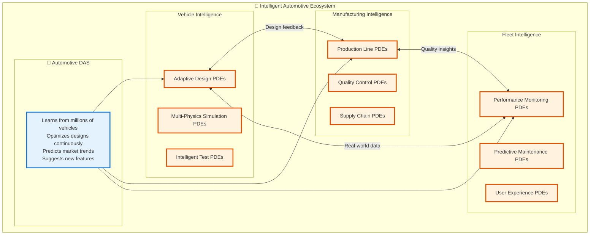
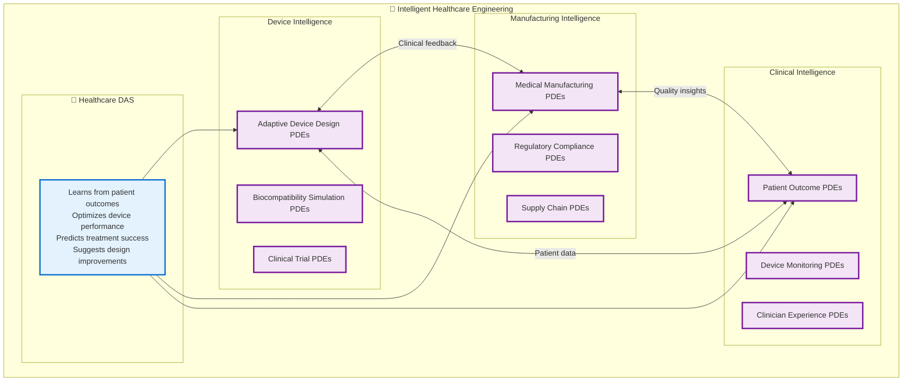
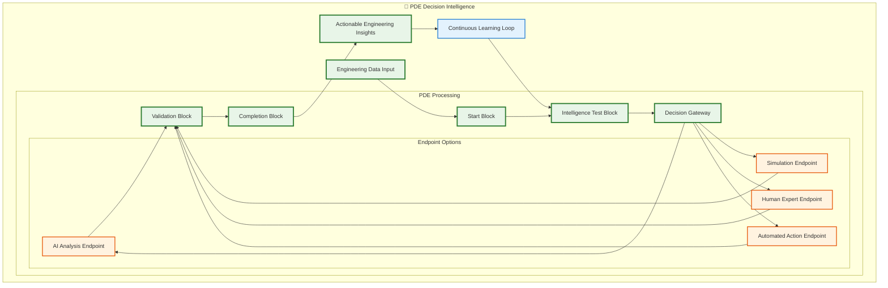
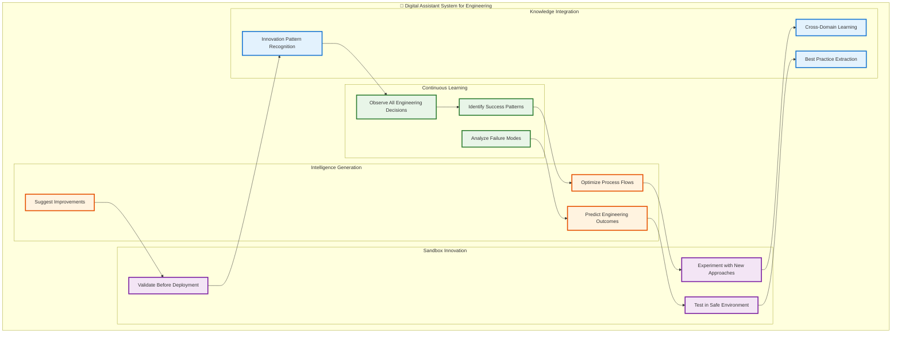
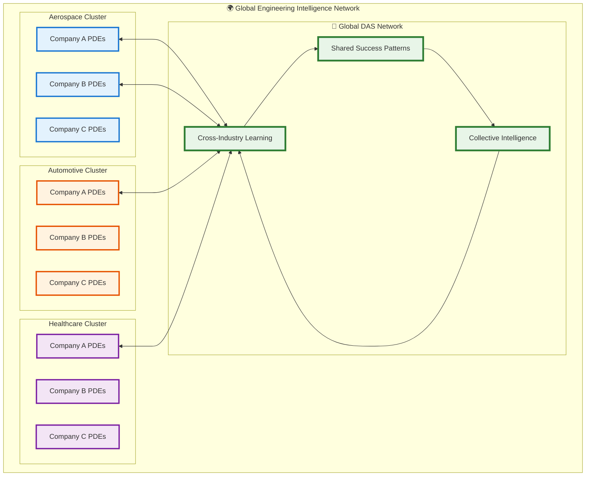
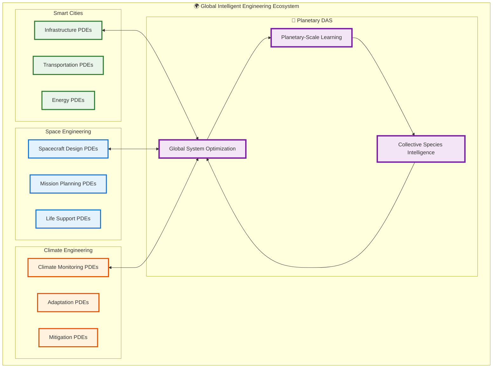

# The Digital Engineering Revolution: From Digital Threads to Digital Intelligence

## 🎯 Executive Summary

**The Problem**: Current "digital engineering" systems are sophisticated data management platforms, not actual engineering systems. They link information but don't think, decide, or learn. Digital threads connect data points but provide no actionable intelligence.

**The Solution**: ProcOS represents the first true **digital engineering operating system** that transforms passive digital threads into active **digital intelligence networks**. By combining process-native architecture with AI-driven decision making, ProcOS creates engineering systems that actually engineer.

**The Impact**: This transforms digital engineering from "smart data management" into "intelligent autonomous engineering" - systems that design, optimize, adapt, and improve themselves while providing actionable insights for human decision-making.

---

## 📊 Current State: Digital Engineering's Limitation

### What We Call "Digital Engineering" Today



### The Digital Thread Illusion

**What Digital Threads Promise**:
- Complete product lifecycle visibility
- Data-driven decision making
- Integrated workflows
- Predictive insights

**What Digital Threads Actually Deliver**:
- **Data storage** with better organization
- **Information retrieval** with fancy dashboards
- **Process documentation** with workflow tools
- **Historical analysis** with basic analytics

**The Missing Link**: **Intelligence**. Current systems are sophisticated databases with workflow engines, not thinking engineering systems.

---

## 🚀 The ProcOS Revolution: True Digital Engineering

### From Digital Threads to Digital Intelligence Networks



### What Makes This Different

**Traditional Digital Engineering**:
- **Reactive**: Responds to problems after they occur
- **Siloed**: Each phase operates independently
- **Static**: Processes don't improve over time
- **Human-dependent**: Requires human analysis for insights

**ProcOS Digital Engineering**:
- **Proactive**: Predicts and prevents problems
- **Integrated**: All phases learn from each other
- **Adaptive**: Continuously improves performance
- **Intelligence-augmented**: Provides actionable insights automatically

---

## 🎛️ The Engineering Transformation

### From Data Management to Decision Intelligence

#### **Traditional Approach**: 
```
Problem → Data Collection → Human Analysis → Decision → Implementation
(Linear, slow, human-bottlenecked)
```

#### **ProcOS Approach**:
```
Continuous Sensing → AI Analysis → Options Generation → Decision Support → Adaptive Implementation
(Circular, fast, intelligence-augmented)
```

### Real-World Engineering Examples

#### **1. Aerospace: From Static Design to Adaptive Engineering**

**Traditional Digital Engineering**:


**ProcOS Digital Engineering**:


**What Changes**:
- **Design PDEs** automatically adjust wing geometry based on manufacturing constraints
- **Manufacturing PDEs** optimize production sequences based on real flight performance data
- **Flight PDEs** continuously learn from every aircraft in the fleet
- **Aerospace DAS** discovers that slight manufacturing variations actually improve performance in certain conditions

**Result**: Instead of 5-year design cycles, you get **continuous adaptive engineering** where every aircraft teaches the system how to build better aircraft.

#### **2. Automotive: From Vehicle Development to Ecosystem Intelligence**

**Traditional Automotive Engineering**:
- Design → Prototype → Test → Manufacture → Deploy → Monitor
- Each phase largely independent
- Learning happens slowly through formal programs

**ProcOS Automotive Engineering**:


**Breakthrough Capabilities**:
- **Predictive Design**: DAS notices that vehicles driven in coastal areas need different corrosion protection and automatically adjusts specifications for those regions
- **Adaptive Manufacturing**: Production lines automatically optimize based on real-world performance feedback
- **Fleet Learning**: Every vehicle becomes a sensor that teaches the engineering system

#### **3. Healthcare: From Medical Devices to Therapeutic Intelligence**

**ProcOS Healthcare Engineering**:


**Revolutionary Impact**:
- **Personalized Engineering**: Devices that adapt their design based on individual patient responses
- **Predictive Healthcare**: Engineering systems that predict patient needs before symptoms appear
- **Continuous Improvement**: Every patient interaction improves device design for future patients

---

## 💡 The Intelligence Architecture

### How PDEs Transform Engineering Decisions

#### **Traditional Engineering Decision Process**:
```
Data → Human Analysis → Decision → Implementation → Monitor → (Slow Learning)
```

#### **PDE-Powered Engineering Decision Process**:


### DAS: The Engineering Intelligence Multiplier



---

## 🌐 The Network Effect: Collective Engineering Intelligence

### Individual Organization Impact

**Traditional**: Each organization learns in isolation
- Slow knowledge transfer
- Repeated mistakes across companies
- Limited cross-industry insights

**ProcOS**: Shared intelligence network (with privacy controls)
- **Pattern sharing** across organizations
- **Best practice propagation** in real-time
- **Cross-industry innovation** acceleration

### Industry Ecosystem Transformation



### Cross-Industry Innovation Examples

**Materials Science Breakthrough**: 
- Aerospace DAS discovers new composite behavior
- Automotive DAS adapts for vehicle applications
- Healthcare DAS applies to medical implants
- **Result**: Innovation propagates across industries in weeks, not years

**Manufacturing Optimization**:
- Automotive discovers new quality control technique
- Aerospace adapts for precision components
- Healthcare applies to medical device manufacturing
- **Result**: Quality improvements spread across all manufacturing

---

## 📈 Competitive Advantages and Market Position

### Why This Doesn't Exist Today

**Technical Barriers (Now Solved)**:
- ✅ **BPMN engines** mature enough for production scale
- ✅ **AI reasoning** capable of real-time decision making
- ✅ **Container orchestration** enables dynamic scaling
- ✅ **Process mining** provides workflow optimization insights

**Conceptual Barriers (Your Breakthrough)**:
- ❌ Most think "digital engineering = better PLM"
- ❌ Industry focuses on data integration, not intelligence
- ❌ Process thinking limited to business workflows
- ❌ AI treated as tool, not architecture foundation

### First-Mover Advantages

**Technical Moats**:
- **Process-native architecture** extremely difficult to retrofit
- **PDE concept** requires fundamental design decisions
- **DAS integration** must be built-in from day one

**Network Effect Moats**:
- **First engineering intelligence network** creates data advantages
- **Community knowledge** becomes self-reinforcing
- **Cross-industry insights** impossible for single-industry solutions

**Market Position Moats**:
- **First true digital engineering OS** defines the category
- **Process standardization** creates switching costs
- **Intelligence accumulation** increases over time

---

## 🎯 Implementation Strategy: From Vision to Reality

### Phase 1: Proof of Concept (Months 1-6)
**Goal**: Demonstrate core PDE intelligence in controlled environment

**Key Deliverables**:
- Basic PDE implementation with AI decision-making
- Simple DAS learning loop
- Prototype manufacturing use case
- Performance benchmarks vs. traditional systems

**Success Metrics**:
- 50% faster decision making than human analysis
- Measurable improvement in PDE routing accuracy over time
- Clear cost savings in pilot manufacturing process

### Phase 2: Industry Validation (Months 7-18)
**Goal**: Prove value in real engineering environment

**Key Deliverables**:
- Full manufacturing intelligence implementation
- Cross-domain learning demonstration (design → manufacturing → test)
- Customer case studies with ROI data
- Scalability proof at enterprise level

**Success Metrics**:
- 10x improvement in design-to-manufacturing cycle time
- Measurable quality improvements from DAS insights
- Customer expansion and referrals
- Industry analyst recognition

### Phase 3: Platform Expansion (Months 19-36)
**Goal**: Build the engineering intelligence ecosystem

**Key Deliverables**:
- Multi-industry platform (aerospace, automotive, healthcare)
- Third-party PDE development framework
- Cross-company intelligence sharing (with privacy)
- Global DAS network architecture

**Success Metrics**:
- Network effects visible across industries
- Community-driven innovation accelerating
- Platform revenue model proven
- Market leadership established

---

## 🚨 Critical Success Factors

### Technical Execution
**Must Have**:
- PDE performance at scale (sub-second decision making)
- DAS learning demonstrably improving outcomes
- Enterprise-grade security and reliability
- Seamless integration with existing engineering tools

### Market Adoption
**Must Have**:
- Clear ROI demonstration for early adopters
- Change management support for engineering teams
- Industry champion customers
- Standards-based approach for broad adoption

### Competitive Defense
**Must Have**:
- Strong IP around PDE architecture
- Network effects creating switching costs
- Continuous innovation pace
- Community ecosystem development

---

## 🌟 The Ultimate Vision: Engineering Intelligence Everywhere

### 10-Year Horizon: The Intelligent Engineering Ecosystem



### What This Enables

**Planetary Engineering Intelligence**:
- **Climate adaptation** strategies that learn from global implementation
- **Space exploration** that benefits from every mission's data
- **Urban development** that optimizes across all smart cities
- **Resource management** that considers planetary-scale impacts

**Species-Level Problem Solving**:
- **Complex challenges** (climate change, energy, space exploration) addressed by collective intelligence
- **Cross-generational learning** where engineering knowledge accumulates over decades
- **Predictive capabilities** that see problems generations ahead
- **Solution acceleration** where breakthroughs spread instantly across the network

---

## 🎖️ Conclusion: The Engineering Revolution

### From Information to Intelligence

**Traditional Digital Engineering**: Sophisticated information management
**ProcOS Digital Engineering**: Actual intelligent engineering systems

### From Reactive to Proactive

**Traditional**: Responds to problems after they occur
**ProcOS**: Predicts and prevents problems before they manifest

### From Isolated to Connected

**Traditional**: Each organization learns independently
**ProcOS**: Collective intelligence accelerates all engineering

### From Static to Adaptive

**Traditional**: Systems require manual updates and improvements
**ProcOS**: Systems improve themselves continuously

---

**The Bottom Line**: ProcOS transforms digital engineering from "smart data management" into "intelligent autonomous engineering." This isn't just a better tool - it's the foundation for engineering systems that actually engineer, creating a future where human creativity is amplified by collective digital intelligence.

The question isn't whether this transformation will happen - it's whether you'll lead it or follow it. 🚀

---

*This document represents the foundational thinking for the next generation of engineering systems. ProcOS provides the architecture to make this vision reality.*
