# ProcOS for Dummies
## The Operating System Where Processes Rule the World!

*Making sense of BPMN-driven computing, one flowchart at a time*

---

## Table of Contents

- [Welcome to ProcOS](#welcome-to-procos)
- [Chapter 1: What Is ProcOS?](#chapter-1-what-is-procos)
- [Chapter 2: The Microkernel Magic](#chapter-2-the-microkernel-magic)
- [Chapter 3: BPMN Basics for ProcOS](#chapter-3-bpmn-basics-for-procos)
- [Chapter 4: Workers and Services Demystified](#chapter-4-workers-and-services-demystified)
- [Chapter 5: Running Your First Process](#chapter-5-running-your-first-process)
- [Chapter 6: Troubleshooting and Tips](#chapter-6-troubleshooting-and-tips)
- [The Part of Tens](#the-part-of-tens)
- [Glossary](#glossary)

---

## Welcome to ProcOS! 🎉

Hello there, future process pioneer! Welcome to the wonderful, wacky, and surprisingly sensible world of **ProcOS** - the operating system that thinks in flowcharts instead of code.

If you've ever wondered what would happen if business process diagrams took over your computer, you're about to find out. Spoiler alert: It's actually pretty awesome!

### Who This Book Is For 👥

- **Complete beginners** who've never heard of BPMN (don't worry, we'll fix that!)
- **Business analysts** who want to understand how their flowcharts can literally run computers
- **Developers** who are tired of writing the same boring "if-then-else" code
- **Anyone curious** about why someone thought it was a good idea to let diagrams run an operating system

### What You'll Learn 🎯

By the end of this book, you'll understand:
- Why ProcOS exists (hint: it's not just to confuse people)
- How business processes can actually control computers
- Why this approach is brilliant (and occasionally maddening)
- How to create your first process without breaking anything

### Icons Used in This Book 📍

🎯 **Tip**: Helpful hints that will make your life easier  
⚠️ **Warning**: Things that might bite you if you're not careful  
🤓 **Technical Stuff**: Geeky details you can skip if you want  
💡 **Remember**: Important concepts worth remembering  
🎭 **Real World**: How this actually works in practice

---

## Chapter 1: What Is ProcOS?

### The Big Picture 🖼️

Imagine you're the manager of a really efficient company. Instead of telling employees exactly what to do line-by-line, you create flowcharts that show:
- "When this happens, do that"
- "If the customer says X, route them to department Y"
- "After completing step A, automatically start step B"

Now imagine your computer works the same way. Instead of running programs written in programming languages, it follows **visual flowcharts** that tell it what to do.

That's ProcOS in a nutshell! 🥜

### Traditional OS vs. ProcOS 🥊

**Traditional Operating System (The Old Way):**
```
You: "Computer, send an email"
Computer: *runs email.exe*
Email Program: *executes 10,000 lines of code*
You: "Wait, I wanted to send it to my boss first, then CC my team"
Computer: "Too bad! The programmer didn't think of that!"
```

**ProcOS (The New Way):**
```
You: "Computer, send an email"
Computer: *looks at email flowchart*
Email Process: "Who should approve this first?"
You: "My boss"
Process: "Done! Now routing to boss for approval..."
You: "Actually, let's add the team to CC"
Process: "No problem! Updating the flow..."
```

### Why BPMN Is the Boss 👑

**BPMN** stands for "Business Process Model and Notation" - fancy words for "flowcharts that computers can understand." Think of BPMN as the universal language between humans and computers.

💡 **Remember**: In ProcOS, BPMN isn't just documentation - it IS the program!

Here's what makes BPMN special:
- **Visual**: You can see what the computer is thinking
- **Flexible**: Change the flowchart, change how the system works
- **Business-Friendly**: Your boss can actually understand it
- **Standardized**: There are rules, so it's not just random shapes

### The "Processes Drive Everything" Philosophy 🚗

In ProcOS, literally everything is a process:


**The Beauty of Process-Driven Thinking:**
- **Everything is Visual**: You can literally see what your computer is doing
- **Easy to Modify**: Want to add a step? Just update the flowchart!
- **Understandable by Anyone**: Your grandmother could follow these diagrams
- **Reusable**: The same process patterns work for different tasks

🎯 **Tip**: If you can draw it as a flowchart, ProcOS can probably do it!

### Why This Isn't Completely Crazy 🤪

You might be thinking, "This sounds insane! Why would anyone want their computer to work this way?"

Great question! Here's why ProcOS actually makes sense:

**For Business People:**
- You can see exactly what your computer is doing
- You can change how it works without hiring a programmer
- It speaks your language (flowcharts, not code)

**For IT People:**
- No more "the business wants this, but the code does that" problems
- Everything is documented automatically (the flowchart IS the documentation)
- Easier to debug (just follow the flowchart)

**For Everyone:**
- System behavior is transparent
- Changes don't require complete rewrites
- You can experiment safely

⚠️ **Warning**: ProcOS might make you actually enjoy working with computers. Side effects may include increased productivity and reduced stress.

---

## Chapter 2: The Microkernel Magic

### What's a Microkernel? 🔬

Think of a microkernel as the world's most minimalist personal assistant. While other operating systems have assistants that try to do everything ("I'll manage your files, run your programs, handle your network, make your coffee, walk your dog..."), the ProcOS microkernel has exactly one job:

**"Start the process engine, then get out of the way."**

That's it. That's the whole job.

### The Bootstrap Dance 💃

When you turn on a ProcOS computer, here's what happens:

1. **Hardware wakes up**: "Hello world! I'm a computer!"
2. **Microkernel starts**: "Hi! I'm the microkernel. My job is super simple."
3. **Microkernel starts Camunda**: "Hey Camunda, you're the process expert. Take over!"
4. **Camunda loads processes**: "Got it! Loading all the process flowcharts..."
5. **Processes take control**: "We're in charge now! Everything flows through us!"
6. **Microkernel goes to sleep**: "My work here is done. Wake me if Camunda crashes."

🎭 **Real World**: It's like hiring a temp worker whose only job is to unlock the office and turn on the lights, then they leave and let the real workers take over.

### Why So Simple? 🤔

You might wonder, "Why doesn't the microkernel do more stuff?" 

Here's the brilliant part: **Less code = fewer bugs = more reliable system.**

Traditional operating system kernels have millions of lines of code. ProcOS's microkernel has hundreds. Which one do you think is more likely to crash?

🎯 **Tip**: The microkernel follows the "KISS" principle - Keep It Simple, Stupid!

### The Camunda Connection 🔗

**Camunda** is the "process engine" - the software that actually understands and runs BPMN flowcharts. Think of it as the interpreter between human-friendly flowcharts and computer-friendly execution.

```mermaid
graph LR
    subgraph "🚗 ProcOS Car Analogy"
        STARTER[🔑 Microkernel<br/>Starter Motor] --> ENGINE[🏭 Camunda<br/>Process Engine]
        FUEL[⛽ BPMN Processes<br/>Fuel/Instructions] --> ENGINE
        ENGINE --> WHEELS[🚗 Your Computer<br/>Goes Places!]
        
        STARTER -.-> SLEEP[😴 Microkernel<br/>Takes a Nap]
    end
    
    subgraph "👷 The Workers (External Tasks)"
        WORKER1[🔧 Generic Worker<br/>Mechanic]
        WORKER2[🤖 AI Worker<br/>Robot Assistant]
        WORKER3[📧 Email Worker<br/>Mail Carrier]
    end
    
    ENGINE -.->|assigns tasks| WORKER1
    ENGINE -.->|assigns tasks| WORKER2
    ENGINE -.->|assigns tasks| WORKER3
    
    classDef microkernel fill:#ffebee,stroke:#d32f2f,stroke-width:2px
    classDef engine fill:#e8f5e8,stroke:#388e3c,stroke-width:2px
    classDef process fill:#e3f2fd,stroke:#1976d2,stroke-width:2px
    classDef worker fill:#fff3e0,stroke:#f57c00,stroke-width:2px
    classDef sleep fill:#f5f5f5,stroke:#9e9e9e,stroke-width:2px
    
    class STARTER microkernel
    class ENGINE engine
    class FUEL,WHEELS process
    class WORKER1,WORKER2,WORKER3 worker
    class SLEEP sleep
```



**The Car Analogy Explained:**
- **🔑 Microkernel (Starter Motor)**: Gets everything started, then becomes inactive
- **🏭 Camunda (Engine)**: Powers the whole system by running BPMN processes
- **⛽ BPMN Processes (Fuel)**: Provide the instructions for what to do
- **🚗 Your Computer (Car)**: Actually goes places and does useful work
- **👷 Workers (Mechanics)**: Handle specific tasks when needed

### What Could Go Wrong? 😅

The microkernel approach isn't perfect. Here are some potential hiccups:

**The Good:**
- Super reliable (less code to break)
- Easy to understand
- Fast startup

**The Challenging:**
- If Camunda crashes, everything stops (it's a single point of failure)
- Slightly slower than traditional kernels (everything goes through processes)
- Requires learning BPMN (though that's also a good thing!)

⚠️ **Warning**: Don't try to run ProcOS on a toaster. While everything is process-driven, you still need actual computing hardware!

### Emergency Procedures 🚨

Sometimes things go wrong. Here's what the microkernel does:

**If Camunda crashes:**
1. Microkernel notices: "Hey, where'd everybody go?"
2. Restarts Camunda: "Come back! We need you!"
3. Reloads processes: "Let's try this again..."
4. If that fails: "PANIC! Calling for human help!"

**If the microkernel crashes:**
1. Hardware notices: "Nobody's home..."
2. Computer reboots: "Let's start over from the beginning"
3. Microkernel starts fresh: "What happened? Oh well, back to work!"

💡 **Remember**: The microkernel is like a really good babysitter - it watches everything but only intervenes when absolutely necessary.

---

## Chapter 3: BPMN Basics for ProcOS

### BPMN: The Language of Processes 🗣️

BPMN (Business Process Model and Notation) is like learning a new language, except instead of words, you use shapes. And instead of writing sentences, you draw flowcharts. And instead of telling stories, you... well, you tell stories, but to computers!

### The Basic Shapes You Need to Know 🔴🔷🔶

Think of BPMN shapes like Lego blocks - each piece has a specific purpose, and you can combine them to build amazing things.

#### Start Events (Circles) ⭕
**What they do**: "Hey everyone, we're starting something new!"
**When to use**: Beginning of any process
**Example**: "User clicks 'Send Email' button"

#### Tasks (Rectangles) ⬜
**What they do**: "Do this specific thing"
**When to use**: Any action that needs to happen
**Example**: "Check user's email address is valid"

#### Gateways (Diamonds) ♦️
**What they do**: "Make a decision or split the path"
**When to use**: When you need to choose between options
**Example**: "Is this email going to the boss? If yes, go left. If no, go right."

#### End Events (Thick Circles) ⚫
**What they do**: "We're done here!"
**When to use**: End of any process
**Example**: "Email successfully sent"

### Your First ProcOS Process 👶

Let's create the simplest possible process: making a peanut butter sandwich!

```
(Start) → [Get Bread] → [Get Peanut Butter] → [Spread It] → [Eat It] → (End)
```

In BPMN-speak, this becomes:
- **Start Event**: "I'm hungry for a sandwich"
- **Task 1**: "Get two slices of bread"
- **Task 2**: "Get peanut butter jar"
- **Task 3**: "Spread peanut butter on bread"
- **Task 4**: "Eat the sandwich"
- **End Event**: "Sandwich consumption complete"

🎯 **Tip**: Every process needs at least one Start Event and one End Event. Think of them as bookends for your process.

### Adding Intelligence with Gateways 🧠

Now let's make our sandwich process smarter:

```
(Start) → [Check Pantry] → <Have Bread?> 
                             ↙️        ↘️
                     [Make Sandwich]   [Go to Store]
                             ↘️        ↙️
                            [Eat It] ← [Buy Bread]
                               ↓
                            (End)
```

The diamond `<Have Bread?>` is a **Gateway** that asks a question and routes the process based on the answer.

⚠️ **Warning**: Don't make your first process too complex. Start simple and add complexity gradually. Nobody wants a 47-step sandwich-making process!

### External Tasks: When ProcOS Calls for Help 📞

Here's where it gets really cool. Sometimes your process needs to do something that requires calling another system. In ProcOS, these are called **External Tasks**.

**Example**: Sending an actual email
```
[Compose Email] → [External Task: Send via Email Service] → [Confirm Sent]
```

The middle step is an External Task because:
- ProcOS doesn't have a built-in email server
- It needs to call an external email service (like Gmail or Outlook)
- A "worker" handles the actual email sending

🤓 **Technical Stuff**: External Tasks are how ProcOS stays flexible. It can work with any service that has a worker to handle the task.

### Variables: How Processes Remember Things 🧠

Processes need to remember information as they flow. These are called **Variables**.

**Example**: Email process variables
- `recipient_email`: "boss@company.com"
- `subject`: "Weekly Report"
- `message_body`: "Here's this week's report..."
- `priority`: "high"

Variables flow through the process like a backpack that gets passed from person to person, with each person adding or using items from the backpack.

### Process Families: When Processes Have Children 👨‍👩‍👧‍👦

Sometimes a process needs to start other processes. Like a manager delegating tasks to team members.

**Parent Process**: "Send quarterly reports"
**Child Processes**: 
- "Generate sales report"
- "Generate marketing report" 
- "Generate financial report"
- "Combine all reports"
- "Email to executives"

💡 **Remember**: In ProcOS, processes can call other processes, just like functions calling other functions in programming.

### Common BPMN Mistakes (And How to Avoid Them) 😅

**Mistake 1**: Creating processes with no end
```
❌ [Start] → [Do Something] → [Do Something Else] → ... (goes on forever)
✅ [Start] → [Do Something] → [Do Something Else] → [End]
```

**Mistake 2**: Forgetting to handle errors
```
❌ [Start] → [Risky Task] → [End]
✅ [Start] → [Risky Task] → [End]
             ↓ (if error)
           [Handle Error] → [End]
```

**Mistake 3**: Making it too complicated
```
❌ A process with 47 tasks, 23 gateways, and 8 error handlers
✅ Break it into smaller, manageable processes
```

🎯 **Tip**: If you can't explain your process to your grandmother, it's too complex!

---

## Chapter 4: Workers and Services Demystified

### The Worker Ant Colony 🐜

Imagine ProcOS as a giant ant colony. The BPMN processes are like the queen ants giving orders: "Someone go get food!" But the queen doesn't actually get the food herself. That's where worker ants come in.

In ProcOS:
- **BPMN Processes** = Queen ants (give orders)
- **Workers** = Worker ants (do the actual work)
- **External Tasks** = Work orders ("Go fetch this specific thing")

### What Workers Actually Do 🔨

Workers are like super-specialized employees who each have one job:

**Email Worker**: "I only send emails. That's it. That's what I do."
**AI Worker**: "I talk to AI services like ChatGPT or local AI models."
**Python Worker**: "I run Python scripts. Give me code, I'll execute it."
**Generic Worker**: "I'm the Swiss Army knife - I can do lots of different things."

🎭 **Real World**: It's like having a company where each employee is really, really good at one specific thing, instead of everyone trying to do everything.

### The External Task Dance 💃

Here's how the whole system works together:

1. **BPMN Process**: "I need someone to send an email"
2. **Camunda**: "Posting 'email_send' task to the job board"
3. **Email Worker**: "I see an email task! That's my specialty!"
4. **Email Worker**: "Grabbing the task and sending the email..."
5. **Email Worker**: "Done! Email sent successfully!"
6. **Camunda**: "Great! Telling the process it's complete"
7. **BPMN Process**: "Awesome! Moving to the next step..."

### Types of Workers 👷‍♀️👷‍♂️

#### Generic Workers (The Swiss Army Knife) 🔧
These are the multi-tool workers that can handle various simple tasks:
- Sending HTTP requests
- Reading/writing files
- Basic data transformations
- Simple calculations

**Pros**: Flexible, easy to deploy
**Cons**: Not optimized for specific tasks

#### Specialized Workers (The Experts) 🎯
These workers are really good at one specific thing:
- **AI Worker**: Only talks to AI services
- **Email Worker**: Only sends emails
- **Python Worker**: Only runs Python scripts
- **Database Worker**: Only does database operations

**Pros**: Highly optimized, better error handling
**Cons**: Need more workers for more task types

#### Service Adapters (The Translators) 🔄
These aren't workers themselves, but they help workers talk to external services:
- **OpenAI Adapter**: Translates between worker and OpenAI API
- **Gmail Adapter**: Translates between worker and Gmail API
- **Slack Adapter**: Translates between worker and Slack API

🎯 **Tip**: Think of service adapters as translators at the United Nations - they help different systems understand each other.

### The Message Broker (The Post Office) 📮

Sometimes workers need to communicate with each other or with external systems. That's where the message broker comes in.

**RabbitMQ** is like the world's most efficient post office:
- Workers can send messages to queues
- Other workers can pick up messages from queues
- Messages can wait in queues until someone is ready to process them
- Nothing gets lost (usually)

**Example**: 
1. **AI Worker** finishes analyzing a document
2. **AI Worker** puts a message in the "document_processed" queue
3. **Email Worker** sees the message and sends a notification email
4. **Database Worker** sees the message and updates the document status

### Worker Configuration (Making Workers Smart) 🧠

Workers need to know what they're supposed to do. This is done through configuration:

```yaml
# Email Worker Configuration
worker:
  name: "email-worker-1"
  topics: ["email_send", "email_notify"]
  max_tasks: 5
  poll_interval: 3000  # Check for work every 3 seconds

email_service:
  provider: "gmail"
  smtp_server: "smtp.gmail.com"
  port: 587
  username: "your-email@gmail.com"
  # password stored securely elsewhere
```

💡 **Remember**: Configuration is like giving workers their job description and contact information for the services they need to use.

### Scaling Workers (More Ants!) 🐜🐜🐜

Need more work done? Add more workers!

**Low Traffic**: 1 worker of each type
**Medium Traffic**: 3-5 workers of each type
**High Traffic**: 10+ workers, maybe specialized by task type
**"Oh no, we're on the front page of Reddit" Traffic**: Auto-scaling with Kubernetes

🤓 **Technical Stuff**: Workers are stateless, which means you can add or remove them without breaking anything. It's like having a team where new members can jump in immediately without training.

### What Could Go Wrong? 😰

**Worker Dies**: No problem! Others pick up the slack, and the dead worker's tasks get reassigned.

**All Workers Die**: Big problem! The BPMN processes keep running, but no actual work gets done. It's like having managers with no employees.

**Worker Goes Rogue**: Each worker is sandboxed and monitored. If one goes crazy, it gets shut down without affecting others.

**Too Many Workers**: They start competing for tasks and wasting resources. It's like having 50 people trying to answer one phone.

⚠️ **Warning**: Don't create a worker for every possible task. Start with generic workers and specialize only when you need better performance or specific capabilities.

### The Service Ecosystem 🌍

Workers don't work in isolation. They connect to a whole ecosystem of services:

**Internal Services** (part of your ProcOS system):
- Database services
- File storage services
- Authentication services

**External Services** (provided by others):
- OpenAI for AI
- Gmail for email
- Slack for notifications
- GitHub for code management

**Local Services** (running on your machine):
- Ollama for local AI
- Local databases
- File systems

The beauty is that workers make all these services look the same to your BPMN processes. It's like having a universal remote that works with every device in your house.

---

## Chapter 5: Running Your First Process

### The "Hello World" of ProcOS 👋

Every programming tutorial starts with "Hello World" - a simple program that just says hello. Our ProcOS version is going to be even better: we're going to send ourselves an email saying "Hello from ProcOS!"

Why email? Because it involves:
- Taking input (email address, message)
- Making a decision (is this a valid email?)
- Calling an external service (email provider)
- Getting confirmation back

Perfect for learning!

### Before We Start: The Setup Checklist ✅

Make sure you have:
- [ ] ProcOS microkernel running
- [ ] Camunda engine started (check http://localhost:8080)
- [ ] At least one generic worker running
- [ ] Email service configured (Gmail, for example)
- [ ] A sense of adventure!

🎯 **Tip**: If any of these aren't working, go back to the setup chapter. We'll wait!

### Step 1: Design the Process 📝

Let's think through our "Hello Email" process:

1. **Start**: Someone wants to send a hello email
2. **Get Details**: Collect email address and message
3. **Validate**: Is the email address valid?
4. **Send Email**: Actually send the email
5. **Confirm**: Let the user know it worked
6. **End**: Process complete!

In flowchart form:
```
(Start) → [Get Email Details] → <Valid Email?> → [Send Email] → [Confirm] → (End)
                                      ↓
                                 [Show Error] → (End)
```

### Step 2: Create the BPMN File 📄

Here's our first BPMN process (don't worry about understanding every detail):

```xml
<?xml version="1.0" encoding="UTF-8"?>
<bpmn:definitions xmlns:bpmn="http://www.omg.org/spec/BPMN/20100524/MODEL"
                  xmlns:camunda="http://camunda.org/schema/1.0/bpmn">
  
  <bpmn:process id="hello_email_process" name="Hello Email Process" isExecutable="true">
    
    <!-- Start: Someone wants to send email -->
    <bpmn:startEvent id="start_hello" name="Start Hello Email">
      <bpmn:outgoing>to_get_details</bpmn:outgoing>
    </bpmn:startEvent>
    
    <!-- Get email details from user -->
    <bpmn:userTask id="get_email_details" name="Get Email Details">
      <bpmn:extensionElements>
        <camunda:formData>
          <camunda:formField id="recipient_email" label="Email Address" type="string" />
          <camunda:formField id="message" label="Message" type="string" />
        </camunda:formData>
      </bpmn:extensionElements>
      <bpmn:incoming>to_get_details</bpmn:incoming>
      <bpmn:outgoing>to_validate</bpmn:outgoing>
    </bpmn:userTask>
    
    <!-- Validate email address -->
    <bpmn:serviceTask id="validate_email" name="Validate Email">
      <bpmn:extensionElements>
        <camunda:externalTask topic="email_validation"/>
      </bpmn:extensionElements>
      <bpmn:incoming>to_validate</bpmn:incoming>
      <bpmn:outgoing>to_check_valid</bpmn:outgoing>
    </bpmn:serviceTask>
    
    <!-- Decision: Is email valid? -->
    <bpmn:exclusiveGateway id="check_email_valid" name="Email Valid?">
      <bpmn:incoming>to_check_valid</bpmn:incoming>
      <bpmn:outgoing>to_send_email</bpmn:outgoing>
      <bpmn:outgoing>to_show_error</bpmn:outgoing>
    </bpmn:exclusiveGateway>
    
    <!-- Send the actual email -->
    <bpmn:serviceTask id="send_hello_email" name="Send Hello Email">
      <bpmn:extensionElements>
        <camunda:externalTask topic="email_send"/>
      </bpmn:extensionElements>
      <bpmn:incoming>to_send_email</bpmn:incoming>
      <bpmn:outgoing>to_confirm</bpmn:outgoing>
    </bpmn:serviceTask>
    
    <!-- Show success message -->
    <bpmn:userTask id="confirm_sent" name="Email Sent Successfully!">
      <bpmn:incoming>to_confirm</bpmn:incoming>
      <bpmn:outgoing>to_end_success</bpmn:outgoing>
    </bpmn:userTask>
    
    <!-- Show error message -->
    <bpmn:userTask id="show_error" name="Invalid Email Address">
      <bpmn:incoming>to_show_error</bpmn:incoming>
      <bpmn:outgoing>to_end_error</bpmn:outgoing>
    </bpmn:userTask>
    
    <!-- End events -->
    <bpmn:endEvent id="end_success" name="Success">
      <bpmn:incoming>to_end_success</bpmn:incoming>
    </bpmn:endEvent>
    
    <bpmn:endEvent id="end_error" name="Error">
      <bpmn:incoming>to_end_error</bpmn:incoming>
    </bpmn:endEvent>
    
    <!-- Connect everything with sequence flows -->
    <bpmn:sequenceFlow id="to_get_details" sourceRef="start_hello" targetRef="get_email_details"/>
    <bpmn:sequenceFlow id="to_validate" sourceRef="get_email_details" targetRef="validate_email"/>
    <bpmn:sequenceFlow id="to_check_valid" sourceRef="validate_email" targetRef="check_email_valid"/>
    <bpmn:sequenceFlow id="to_send_email" sourceRef="check_email_valid" targetRef="send_hello_email">
      <bpmn:conditionExpression>${email_valid == true}</bpmn:conditionExpression>
    </bpmn:sequenceFlow>
    <bpmn:sequenceFlow id="to_show_error" sourceRef="check_email_valid" targetRef="show_error">
      <bpmn:conditionExpression>${email_valid == false}</bpmn:conditionExpression>
    </bpmn:sequenceFlow>
    <bpmn:sequenceFlow id="to_confirm" sourceRef="send_hello_email" targetRef="confirm_sent"/>
    <bpmn:sequenceFlow id="to_end_success" sourceRef="confirm_sent" targetRef="end_success"/>
    <bpmn:sequenceFlow id="to_end_error" sourceRef="show_error" targetRef="end_error"/>
    
  </bpmn:process>
</bpmn:definitions>
```

💡 **Remember**: You don't need to write this XML by hand! Camunda has a visual modeler where you can drag and drop shapes, and it creates the XML for you.

### Step 3: Deploy Your Process 🚀

Save your BPMN file as `hello_email.bpmn` and deploy it:

```bash
# Using our handy deployment script
python scripts/deploy_processes.py --process-dir ./my_processes
```

If everything works, you should see:
```
✅ Deployed: hello_email.bpmn
```

### Step 4: Start Your Process 🏁

Now for the fun part! Let's start an instance of our process:

1. Open Camunda Cockpit in your browser: http://localhost:8080/camunda/app/cockpit/
2. Click on "Process Definitions"
3. Find "Hello Email Process" and click "Start Instance"
4. Watch the magic happen!

### Step 5: Follow the Process Flow 👀

Here's what should happen:

1. **Process Starts**: You'll see a token (like a little dot) at the start event
2. **Get Details**: The process waits at "Get Email Details" for you to fill out the form
3. **Fill Out Form**: Enter your email and a message like "Hello from ProcOS!"
4. **Validation**: The process calls the email validation worker
5. **Decision**: Based on validation, it either sends email or shows error
6. **Email Sent**: If valid, the email worker sends your message
7. **Confirmation**: You see "Email Sent Successfully!"
8. **Process Ends**: The token reaches the end event

🎭 **Real World**: You just orchestrated multiple services (validation, email) using a visual flowchart that a non-programmer could understand and modify!

### What You Just Accomplished 🏆

Congratulations! You just:

1. **Designed** a business process using BPMN
2. **Deployed** it to ProcOS
3. **Executed** it end-to-end
4. **Integrated** multiple services (validation, email)
5. **Handled** both success and error cases

And the best part? You can now modify the process without writing any code:
- Add more validation steps
- Send to multiple recipients
- Add approval workflows
- Integrate with other services

### Troubleshooting Your First Process 🔧

**Process won't start?**
- Check that it's deployed correctly
- Look at Camunda logs for errors
- Verify your BPMN syntax

**Stuck at validation?**
- Is your validation worker running?
- Check worker logs
- Try a simpler email address

**Email not sending?**
- Is your email worker configured correctly?
- Check email service credentials
- Look for authentication errors

**Process just hangs?**
- Check that all required workers are running
- Look for external task topics that don't have workers
- Restart workers if needed

⚠️ **Warning**: Your first process might not work perfectly. That's normal! Debugging is part of the learning process.

### Next Steps 🚶‍♀️

Now that you've run your first process, try:
1. **Modify** the message or add more form fields
2. **Add** a confirmation email back to yourself
3. **Create** a process that sends emails to multiple people
4. **Design** a process for a different task entirely

🎯 **Tip**: The best way to learn ProcOS is to build processes for real tasks you need to do. Start simple and add complexity gradually!

---

## Chapter 6: Troubleshooting and Tips

### When Things Go Wrong (And They Will) 😅

Welcome to the wonderful world of debugging! Don't worry - in ProcOS, at least you can see what's happening through visual process diagrams. It's like having X-ray vision for your computer problems.

### The Most Common Problems 🎯

#### Problem 1: "My Process Won't Start" 😵

**Symptoms**: You click "Start Process" and nothing happens, or you get an error message.

**Most Likely Causes**:
- BPMN file has syntax errors
- Process isn't deployed correctly
- Camunda engine isn't running

**How to Fix**:
1. **Check Camunda**: Go to http://localhost:8080 - do you see the welcome page?
2. **Check Deployment**: Look in Camunda Cockpit → Deployments. Is your process there?
3. **Check BPMN Syntax**: Use Camunda Modeler to open your .bpmn file - any red errors?

🎯 **Tip**: Start with the simplest possible process (Start → Task → End) and make sure that works before adding complexity.

#### Problem 2: "My Process Is Stuck" 🐌

**Symptoms**: Process starts but gets stuck at a particular step and never moves forward.

**Most Likely Causes**:
- No worker available for an external task
- Worker crashed or isn't polling
- Waiting for user input that never comes

**How to Fix**:
1. **Check the Cockpit**: Look at your process instance - where is the token stuck?
2. **Check Workers**: Are they running? Check their logs for errors
3. **Check External Tasks**: In Cockpit → Process Definition → External Tasks - any tasks waiting?

💡 **Remember**: In BPMN, tokens (the execution pointer) are like breadcrumbs showing you exactly where your process is stuck.

#### Problem 3: "My Worker Keeps Failing" 💥

**Symptoms**: External tasks keep failing and retrying, or workers crash.

**Most Likely Causes**:
- Service configuration is wrong (bad API keys, URLs, etc.)
- Network connectivity issues
- Service you're calling is down
- Worker code has bugs

**How to Fix**:
1. **Check Worker Logs**: What's the actual error message?
2. **Test Service Manually**: Can you call the service directly (curl, Postman)?
3. **Check Configuration**: Are API keys, URLs, credentials correct?
4. **Simplify**: Create a minimal test case

⚠️ **Warning**: Failed external tasks will retry automatically. After the maximum retry limit, they become "incidents" that need manual resolution.

#### Problem 4: "Everything's Slow" 🐢

**Symptoms**: Processes take forever to complete, or the system feels sluggish.

**Most Likely Causes**:
- Not enough workers for the workload
- Workers are busy with long-running tasks
- Database performance issues
- Network latency to external services

**How to Fix**:
1. **Add More Workers**: Scale up worker pools
2. **Check Worker Utilization**: Are they all busy?
3. **Optimize External Calls**: Cache results, use faster services
4. **Database Tuning**: Check Camunda database performance

### Debugging Like a Pro 🕵️‍♀️

#### Visual Debugging with Cockpit 👁️

Camunda Cockpit is your best friend for debugging:

1. **Process Instances**: See all running and completed processes
2. **Activity Instance Tree**: See exactly where each process is
3. **Variables**: Check what data is flowing through
4. **Incidents**: See what failed and why
5. **External Tasks**: Monitor task queues and failures

🎯 **Tip**: When something goes wrong, always start by looking at the process instance in Cockpit. The visual representation usually makes the problem obvious.

#### Log Reading 101 📋

**Microkernel Logs**: System startup and health monitoring
```
2025-01-15 10:30:15 - ProcOS-Kernel - INFO - 🚀 ProcOS Kernel Bootstrap Starting
2025-01-15 10:30:20 - ProcOS-Kernel - INFO - ✅ Camunda is ready
```

**Worker Logs**: Task execution and service calls
```
2025-01-15 10:35:42 - EmailWorker - INFO - Processing task: email_send
2025-01-15 10:35:43 - EmailWorker - ERROR - Failed to send email: Authentication failed
```

**Camunda Logs**: Process execution and engine events
```
ENGINE-09005 Task 'send_email' created
ENGINE-13005 Activity 'send_email' started
ENGINE-13006 Activity 'send_email' ended
```

#### Using Variables for Debugging 🔍

Add debug variables to your processes:
- `debug_step`: Track which step you're at
- `debug_timestamp`: When did each step happen
- `debug_data`: What data was processed

Example in your BPMN:
```xml
<camunda:inputParameter name="debug_step">email_validation</camunda:inputParameter>
<camunda:inputParameter name="debug_timestamp">${now()}</camunda:inputParameter>
```

### Performance Tips 🏃‍♂️

#### Worker Optimization

**Right-Size Your Worker Pools**:
- Start with 2-3 workers per task type
- Monitor queue depths and response times
- Scale up if tasks are waiting too long
- Scale down if workers are mostly idle

**Batch Processing**:
- Process multiple similar tasks together
- Use message queues for non-urgent tasks
- Implement circuit breakers for external services

#### Process Design Best Practices

**Keep Processes Simple**:
- One process = one business goal
- Break complex processes into smaller sub-processes
- Limit the number of external service calls per process

**Smart Error Handling**:
- Always handle expected errors in your BPMN
- Use retry strategies with exponential backoff
- Implement compensation for rollback scenarios

### Security Tips 🔒

#### Secure Your Workers

**Sandbox External Code**:
- Run Python/script execution in containers
- Limit resource usage (CPU, memory, network)
- Don't trust user input - validate everything

**Secure Service Calls**:
- Use HTTPS for all external service calls
- Store API keys securely (not in BPMN files!)
- Implement proper authentication

#### Process Security

**Input Validation**:
- Validate all user inputs in your processes
- Sanitize data before passing to external services
- Use allowlists, not blocklists

**Access Control**:
- Control who can start which processes
- Implement approval workflows for sensitive operations
- Log all process executions for audit trails

### Monitoring and Alerting 📊

#### What to Monitor

**System Health**:
- Camunda engine response time
- Worker availability and health
- Database performance
- External service connectivity

**Process Health**:
- Process completion rates
- Average execution times
- Error rates by process type
- Queue depths for external tasks

#### Setting Up Alerts

**Critical Alerts** (wake you up at night):
- Camunda engine down
- All workers of a type offline
- Process error rate > 50%

**Warning Alerts** (fix during business hours):
- Worker response time > 30 seconds
- Process queue depth > 100
- External service errors > 10%

### The "It Works on My Machine" Problem 🤷‍♀️

This is a classic in software development, and ProcOS isn't immune:

**Common Environment Differences**:
- Different versions of Camunda
- Different external service configurations
- Different network connectivity
- Different resource constraints

**Solutions**:
- Use Docker for consistent environments
- Document all external dependencies
- Test with realistic data volumes
- Have staging environments that match production

⚠️ **Warning**: Just because your process works with one email doesn't mean it'll work with 1000 emails per minute!

### When to Ask for Help 🆘

**Signs You Need Help**:
- You've been debugging the same issue for more than 2 hours
- The error messages don't make any sense
- Everything worked yesterday but not today
- You're starting to question your life choices

**Where to Get Help**:
- Camunda Forum: Great for BPMN and engine questions
- ProcOS Documentation: Check for known issues
- Stack Overflow: General programming questions
- Your Friendly Neighborhood Developer: Sometimes fresh eyes help

💡 **Remember**: Everyone gets stuck sometimes. The key is knowing when to ask for help instead of banging your head against the wall.

### Recovery Strategies 🚑

#### When Processes Go Haywire

**Process Instance Recovery**:
- Cancel stuck process instances
- Retry failed external tasks
- Modify process variables to fix data issues
- Skip problematic steps if necessary

**System Recovery**:
- Restart workers (they're stateless, so it's safe)
- Restart Camunda engine (process state is preserved in database)
- Restart entire ProcOS system as last resort

#### Backup and Restore

**What to Backup**:
- Camunda database (process state and history)
- BPMN process definitions
- Worker configurations
- External service credentials

**When to Backup**:
- Before deploying new processes
- Before major configuration changes
- Regularly (daily for production systems)

🎯 **Tip**: Test your backups! A backup you can't restore is just an expensive paperweight.

---

## The Part of Tens

### Ten Ways ProcOS Makes Life Easier 😊

1. **Visual Debugging**: See exactly where your process is stuck - no more black box systems!

2. **Change Without Coding**: Business analysts can modify processes without bothering developers

3. **Built-in Documentation**: The process diagram IS the documentation - it's always up to date

4. **Easy Integration**: Add new services by just creating workers - no need to rewrite core systems

5. **Transparent Operations**: Every system operation is visible through process instances

6. **Flexible Scaling**: Need more capacity? Just add more workers!

7. **Error Transparency**: When things fail, you can see exactly what failed and why

8. **Version Control**: Different versions of processes can run simultaneously

9. **Audit Trails**: Complete history of who did what when - compliance teams love this

10. **Experimentation**: Try new processes safely without affecting existing ones

### Ten BPMN Gotchas That Will Bite You 😬

1. **Forgetting End Events**: Your process starts but never officially ends - like a conversation that just trails off...

2. **Unconnected Tasks**: You have tasks that aren't connected to anything - they're like islands in your process

3. **Missing Error Handling**: When something goes wrong, your process just explodes instead of handling it gracefully

4. **Infinite Loops**: Creating processes that can go in circles forever - your computer will hate you

5. **Too Many Gateways**: Making processes so complex they look like spaghetti - nobody can follow them

6. **Wrong Gateway Types**: Using exclusive gateways when you need parallel ones - traffic jams in your process

7. **Variable Name Typos**: `user_email` vs `userEmail` - small typos, big problems

8. **Missing External Task Topics**: Your process calls for a worker that doesn't exist - like calling a disconnected phone number

9. **Hardcoded Values**: Putting specific emails, URLs, or data directly in your process - makes it impossible to reuse

10. **Overly Complex First Process**: Trying to build the Death Star when you should start with a paper airplane

⚠️ **Warning**: Learn from others' mistakes - these gotchas have claimed many BPMN beginners!

### Ten Signs You're Ready for Advanced ProcOS 🎓

1. **You Dream in Flowcharts**: You start designing processes for everyday activities like making coffee

2. **You See External Tasks Everywhere**: Every problem looks like it needs a worker to solve it

3. **You Speak BPMN**: Words like "gateways," "tokens," and "external tasks" roll off your tongue naturally

4. **You Debug Visually**: Instead of reading logs, you look at process diagrams first

5. **You Think in Processes**: You naturally break down complex problems into step-by-step processes

6. **You Love Variables**: You understand how data flows through processes and can design complex variable schemes

7. **You Handle Errors Gracefully**: Your processes have proper error handling and compensation

8. **You Scale Workers**: You can monitor and tune worker performance like a pro

9. **You Design for Reuse**: Your processes are modular and can be combined with other processes

10. **You Evangelize ProcOS**: You can't stop telling people about how awesome process-driven computing is

🎯 **Tip**: If you've reached this level, consider contributing to the ProcOS community or mentoring other beginners!

---

## Glossary

**BPMN** (Business Process Model and Notation): The visual language used to define processes. Think of it as flowcharts that computers can understand and execute.

**Camunda**: The process engine that actually runs BPMN processes. It's like the interpreter that turns your flowcharts into computer actions.

**External Task**: A step in a process that requires calling an external service or worker. It's like saying "someone else needs to handle this part."

**Gateway**: A decision point in a BPMN process, usually shown as a diamond shape. It asks questions like "Is the email valid?" and routes the process based on the answer.

**Microkernel**: The tiny piece of code that starts ProcOS and then gets out of the way. It's like a helpful intern whose only job is to turn on the lights and unlock the doors.

**Process Instance**: A specific execution of a process definition. If a process definition is like a recipe, a process instance is like actually cooking that recipe.

**Service Adapter**: A piece of code that translates between workers and external services. It's like a translator that helps different systems understand each other.

**Token**: The "execution pointer" in a BPMN process that shows where the process currently is. You can see tokens moving through process diagrams in Camunda Cockpit.

**Variable**: Data that flows through a process, like the ingredients in a recipe or the attachments in an email.

**Worker**: A program that handles external tasks. Workers are like specialized employees who are really good at one specific job.

---

## Conclusion: Welcome to the Process-Driven Future! 🚀

Congratulations! You've made it through the wonderful, wacky world of ProcOS. You now understand:

- Why someone thought it was a good idea to let flowcharts run computers (and why they were right!)
- How BPMN processes can control everything from email to AI to coffee machines
- Why workers are like really specialized employees
- How to create, deploy, and debug your own processes
- What to do when things go wrong (and they will!)

### What's Next? 🤔

Now that you understand ProcOS basics, you can:

1. **Build Real Processes**: Start with simple tasks you actually need to do
2. **Explore Advanced Features**: Sub-processes, message events, timers, and more
3. **Join the Community**: Share your processes and learn from others
4. **Contribute**: Help make ProcOS even better

### The Big Picture 🌟

ProcOS represents a fundamental shift in how we think about computing:

- **From Code to Processes**: Instead of writing programs, we design workflows
- **From Black Boxes to Transparency**: Every operation is visible and understandable
- **From Rigid to Flexible**: Change behavior by updating processes, not rewriting code
- **From Technical to Business-Friendly**: Non-programmers can understand and modify system behavior

### A Final Thought 💭

Traditional operating systems ask: "How can we make the computer run programs faster?"

ProcOS asks: "How can we make the computer understand what humans actually want to accomplish?"

That's a much more interesting question, and ProcOS is just the beginning of answering it.

Welcome to the future of computing - where processes drive everything, and humans and computers finally speak the same language! 🎉

---

*Remember: In ProcOS, you're not just using a computer - you're conducting an orchestra of processes, and you're the maestro! 🎼*