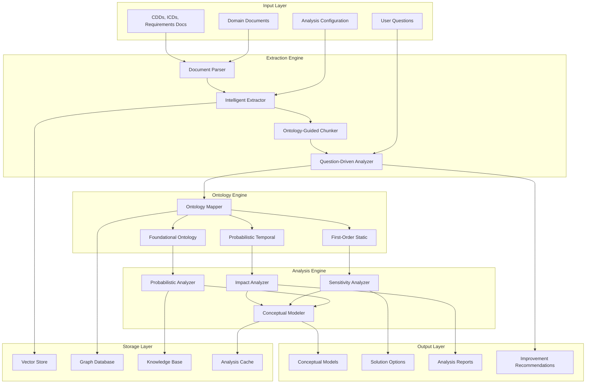

# Ontology-Driven Requirements Analysis System (ODRAS) - Comprehensive Specification

**Authors:** [User's Name], with AI-assisted drafting based on 30+ years of multidisciplinary engineering experience  
**Date:** August 04, 2025  
**Document Type:** Technical Specification  
**Version:** 1.0  
**Status:** Initial Specification

---

## Executive Summary

The Ontology-Driven Requirements Analysis System (ODRAS) is an advanced evolution of the reqFLO framework, integrating our comprehensive SE ontology series (foundational, first-order, and probabilistic) to provide intelligent requirements extraction, analysis, and conceptual modeling from domain documents like Capability Development Documents (CDDs). The system employs LLM-powered extraction, probabilistic modeling, sensitivity analysis, and impact assessment to deliver risk-aware conceptual solutions for complex system requirements.

Building on the proven reqFLO architecture (PDF extraction → LLM analysis → Neo4j/Qdrant storage), ODRAS adds user-driven question-based extraction, ontology-guided chunking, probabilistic uncertainty quantification, temporal modeling, and multi-variant conceptual solution generation with sensitivity studies.

---

## 1. System Architecture Overview

> **🎯 CRITICAL ARCHITECTURAL DECISION**: ODRAS will be implemented using **DADMS BPMN workflows** for orchestration, NOT hardcoded pipelines. Each capability described below will be implemented as independent microservices orchestrated through visual BPMN process definitions in the DADMS workflow engine. This approach ensures flexibility, extensibility, stakeholder palatability, and enables non-programmers to modify analysis workflows through the DADMS interface without code changes.

### 1.1 Core Architecture Evolution

**Foundation (reqFLO)**:
```
PDF Documents → Regex Extraction → LLM Classification → Neo4j/Qdrant Storage
```

**Enhanced (ODRAS)**:
```
Domain Documents → Intelligent Extraction → Ontology Mapping → Probabilistic Analysis → Conceptual Modeling → Solution Selection
```

**DADMS BPMN Orchestrated (Implementation Reality)**:
```
Document Upload Event → BPMN Workflow Trigger → Service Orchestration → Decision Gateways → Results Delivery
```

### 1.2 Architectural Components



---

## 2. Functional Specifications

### 2.1 Document Processing and Extraction

**2.1.1 Enhanced Document Parser**
- **Supported Formats**: PDF, DOCX, TXT, XML, HTML, Markdown
- **Content Types**: CDDs, ICDs, SOWs, Requirements Documents, Technical Specifications
- **Metadata Extraction**: Document structure, sections, tables, figures, references
- **Quality Assessment**: Document completeness, consistency, ambiguity detection

**Implementation**:
```python
class DocumentProcessor:
    def __init__(self, ontology_engine):
        self.supported_formats = ['.pdf', '.docx', '.txt', '.xml', '.html', '.md']
        self.ontology_engine = ontology_engine
        
    def process_document(self, file_path, extraction_config):
        """
        Enhanced document processing with ontology guidance
        """
        document = self.parse_document(file_path)
        structure = self.extract_structure(document)
        metadata = self.extract_metadata(document, structure)
        content = self.extract_content(document, structure)
        
        return {
            'document': document,
            'structure': structure,
            'metadata': metadata,
            'content': content,
            'quality_score': self.assess_quality(content)
        }
```

**2.1.2 Intelligent Requirements Extractor**
- **Pattern Recognition**: Advanced regex patterns + ML-based sentence classification
- **Context Awareness**: Section-aware extraction with hierarchical understanding
- **Requirement Types**: All SE ontology classifications (Functional, Performance, Physical, etc.)
- **Relationship Detection**: Cross-references, dependencies, conflicts

**Enhanced Patterns**:
```python
ADVANCED_REQUIREMENT_PATTERNS = {
    # Ontology-driven patterns
    'capability': r'.*\b(capable of|capability to|ability to)\b.*',
    'system_level': r'.*\b(system shall|system must|system will)\b.*',
    'component_level': r'.*\b(component shall|subsystem must)\b.*',
    'interface': r'.*\b(interface with|connect to|communicate via)\b.*',
    'performance': r'.*\b(within|less than|greater than|at least).*\b(seconds?|minutes?|hours?|Hz|kHz|MHz|GHz|kg|lbs|meters?|feet)\b.*',
    'constraint': r'.*\b(constrained by|limited to|bounded by|not exceed)\b.*',
    'temporal': r'.*\b(during|throughout|for the duration|until|after)\b.*',
    'probabilistic': r'.*\b(probability|likelihood|risk|reliability|confidence)\b.*'
}
```

### 2.2 Question-Driven Analysis Framework

**2.2.1 User Question Processing**
- **Question Types**: What/How/Why/When/Where queries about system capabilities
- **Ontological Mapping**: Questions mapped to ontology elements and relationships
- **Context Injection**: Questions guide extraction focus and analysis depth
- **Iterative Refinement**: Follow-up questions based on initial findings

**Example Question Set**:
```yaml
system_definition:
  - "What systems are described in this document?"
  - "How are system boundaries defined?"
  - "What constitutes mutual specific dependence between components?"

capability_analysis:
  - "What capabilities are required by the stakeholders?"
  - "How do functions aggregate into capabilities?"
  - "What is the performance envelope for each capability?"

risk_assessment:
  - "What uncertainties exist in the requirements?"
  - "How sensitive are system solutions to requirement changes?"
  - "What are the failure modes and their probabilities?"

solution_space:
  - "What alternative architectures could satisfy requirements?"
  - "How do different solutions compare on cost/performance/risk?"
  - "What are the key decision points in the solution space?"
```

**2.2.2 Question-Answer Engine**
```python
class QuestionDrivenAnalyzer:
    def __init__(self, ontology_engine, llm_client):
        self.ontology = ontology_engine
        self.llm = llm_client
        
    def analyze_with_questions(self, document_content, user_questions):
        """
        Perform question-driven analysis with ontology guidance
        """
        analysis_plan = self.create_analysis_plan(user_questions)
        
        for question in analysis_plan:
            # Map question to ontology elements
            ontology_focus = self.map_question_to_ontology(question)
            
            # Extract relevant content
            relevant_content = self.extract_relevant_content(
                document_content, question, ontology_focus
            )
            
            # Generate answer with uncertainty
            answer, confidence = self.generate_answer(
                question, relevant_content, ontology_focus
            )
            
            yield {
                'question': question,
                'answer': answer,
                'confidence': confidence,
                'ontology_elements': ontology_focus,
                'supporting_content': relevant_content
            }
```

### 2.3 Ontology-Guided Chunking and Storage

**2.3.1 Smart Chunking Strategy**
- **Semantic Boundaries**: Chunk based on ontological relationships, not just size
- **Overlap Strategy**: Intelligent overlap preserving entity relationships
- **Context Preservation**: Maintain ontological context across chunks
- **Hierarchical Structure**: Multi-level chunking (document → section → requirement → entity)

**Implementation**:
```python
class OntologyGuidedChunker:
    def __init__(self, ontology_engine, chunk_size=1024, overlap_ratio=0.2):
        self.ontology = ontology_engine
        self.chunk_size = chunk_size
        self.overlap_ratio = overlap_ratio
        
    def chunk_with_ontology(self, content, extraction_results):
        """
        Create chunks preserving ontological relationships
        """
        chunks = []
        
        # First pass: Identify ontological boundaries
        boundaries = self.identify_ontology_boundaries(content, extraction_results)
        
        # Second pass: Create chunks respecting boundaries
        for boundary_start, boundary_end in boundaries:
            chunk_content = content[boundary_start:boundary_end]
            
            # Ensure chunk contains complete ontological elements
            ontology_elements = self.extract_ontology_elements(chunk_content)
            
            # Add context from adjacent chunks if needed
            if len(ontology_elements['incomplete_references']) > 0:
                chunk_content = self.add_context(chunk_content, content, boundaries)
            
            chunks.append({
                'content': chunk_content,
                'start_pos': boundary_start,
                'end_pos': boundary_end,
                'ontology_elements': ontology_elements,
                'relationships': self.extract_relationships(chunk_content),
                'context_level': self.assess_context_completeness(ontology_elements)
            })
            
        return chunks
```

**2.3.2 Enhanced Vector Storage**
- **Multi-Modal Embeddings**: Text + ontology structure + metadata
- **Hierarchical Indexing**: Document → Section → Chunk → Entity levels
- **Relationship Vectors**: Embeddings for ontological relationships
- **Temporal Indexing**: Version control and change tracking

### 2.4 Probabilistic Ontology Extraction

**2.4.1 Uncertainty-Aware Extraction**
- **Confidence Scoring**: Probabilistic confidence for each extracted entity
- **Ambiguity Resolution**: Multiple interpretations with likelihood scores
- **Source Tracking**: Confidence propagation from source to derived entities
- **Ensemble Methods**: Multiple extraction models with consensus building

**2.4.2 Bayesian Ontology Networks**
```python
class ProbabilisticOntologyExtractor:
    def __init__(self, base_extractor, uncertainty_model):
        self.base_extractor = base_extractor
        self.uncertainty_model = uncertainty_model
        
    def extract_with_uncertainty(self, content, context):
        """
        Extract ontology elements with uncertainty quantification
        """
        # Base extraction
        base_results = self.base_extractor.extract(content)
        
        # Uncertainty assessment
        uncertainties = self.uncertainty_model.assess_uncertainties(
            content, base_results, context
        )
        
        # Probabilistic refinement
        refined_results = self.refine_with_probabilities(
            base_results, uncertainties
        )
        
        return {
            'entities': refined_results['entities'],
            'relationships': refined_results['relationships'],
            'uncertainties': uncertainties,
            'confidence_scores': refined_results['confidence_scores'],
            'alternative_interpretations': refined_results['alternatives']
        }
        
    def build_bayesian_network(self, extracted_entities):
        """
        Create Bayesian network representing entity dependencies
        """
        network = BayesianNetwork()
        
        # Add nodes for each entity
        for entity in extracted_entities:
            network.add_node(entity['id'], entity['type'], entity['confidence'])
            
        # Add edges for relationships
        for relationship in extracted_entities['relationships']:
            network.add_edge(
                relationship['source'], 
                relationship['target'],
                relationship['type'],
                relationship['strength']
            )
            
        return network
```

### 2.5 Conceptual Model Generation

**2.5.1 Multi-Variant Solution Generation**
- **Architecture Alternatives**: Generate multiple system architectures satisfying requirements
- **Technology Options**: Different technological approaches for each function
- **Configuration Variants**: Parameter variations within architectures
- **Hybrid Solutions**: Combinations of different approaches

**2.5.2 Conceptual Model Framework**
```python
class ConceptualModelGenerator:
    def __init__(self, ontology_engine, solution_database):
        self.ontology = ontology_engine
        self.solutions = solution_database
        
    def generate_conceptual_models(self, requirements, constraints, objectives):
        """
        Generate multiple conceptual models satisfying requirements
        """
        # Analyze requirements space
        req_analysis = self.analyze_requirements_space(requirements)
        
        # Generate solution alternatives
        alternatives = self.generate_alternatives(req_analysis, constraints)
        
        # Evaluate each alternative
        evaluated_models = []
        for alternative in alternatives:
            model = self.create_conceptual_model(alternative, requirements)
            evaluation = self.evaluate_model(model, objectives, constraints)
            
            evaluated_models.append({
                'model': model,
                'evaluation': evaluation,
                'confidence': evaluation['confidence'],
                'risk_factors': evaluation['risks'],
                'trade_offs': evaluation['trade_offs']
            })
            
        # Rank and return top models
        return self.rank_models(evaluated_models, objectives)
        
    def create_conceptual_model(self, alternative, requirements):
        """
        Create detailed conceptual model from alternative
        """
        model = ConceptualModel()
        
        # Map requirements to system elements
        for req in requirements:
            system_elements = self.map_requirement_to_elements(req, alternative)
            model.add_elements(system_elements)
            
        # Add relationships and dependencies
        relationships = self.derive_relationships(model.elements, alternative)
        model.add_relationships(relationships)
        
        # Add temporal and probabilistic aspects
        temporal_aspects = self.add_temporal_modeling(model)
        probabilistic_aspects = self.add_probabilistic_modeling(model)
        
        model.temporal_model = temporal_aspects
        model.probabilistic_model = probabilistic_aspects
        
        return model
```

### 2.6 Sensitivity Analysis and Impact Assessment

**2.6.1 Multi-Dimensional Sensitivity Analysis**
- **Parameter Sensitivity**: How solution performance varies with parameter changes
- **Requirement Sensitivity**: Impact of requirement modifications on solutions
- **Technology Sensitivity**: Effects of technology choice variations
- **Environmental Sensitivity**: Robustness to operating condition changes

**2.6.2 Implementation Framework**
```python
class SensitivityAnalyzer:
    def __init__(self, conceptual_models, monte_carlo_engine):
        self.models = conceptual_models
        self.mc_engine = monte_carlo_engine
        
    def perform_sensitivity_analysis(self, model, parameters, variations):
        """
        Comprehensive sensitivity analysis of conceptual model
        """
        baseline_performance = self.evaluate_baseline(model)
        
        sensitivity_results = {}
        
        for param in parameters:
            param_results = []
            
            for variation in variations[param]:
                # Create modified model
                modified_model = self.apply_variation(model, param, variation)
                
                # Evaluate performance
                performance = self.evaluate_model_performance(modified_model)
                
                # Calculate sensitivity metrics
                sensitivity = self.calculate_sensitivity(
                    baseline_performance, performance, variation
                )
                
                param_results.append({
                    'variation': variation,
                    'performance': performance,
                    'sensitivity': sensitivity,
                    'confidence_interval': self.calculate_ci(performance)
                })
                
            sensitivity_results[param] = param_results
            
        return {
            'baseline': baseline_performance,
            'sensitivities': sensitivity_results,
            'critical_parameters': self.identify_critical_parameters(sensitivity_results),
            'robustness_metrics': self.calculate_robustness(sensitivity_results)
        }
        
    def monte_carlo_sensitivity(self, model, parameter_distributions, n_samples=10000):
        """
        Monte Carlo-based sensitivity analysis
        """
        samples = self.mc_engine.generate_samples(parameter_distributions, n_samples)
        
        results = []
        for sample in samples:
            modified_model = self.apply_parameter_sample(model, sample)
            performance = self.evaluate_model_performance(modified_model)
            results.append({
                'parameters': sample,
                'performance': performance
            })
            
        # Analyze results
        sensitivity_indices = self.calculate_sobol_indices(results)
        
        return {
            'samples': results,
            'sensitivity_indices': sensitivity_indices,
            'parameter_importance': self.rank_parameter_importance(sensitivity_indices),
            'interaction_effects': self.analyze_interactions(results)
        }
```

**2.6.3 Impact Analysis Framework**
```python
class ImpactAnalyzer:
    def __init__(self, system_model, stakeholder_model):
        self.system_model = system_model
        self.stakeholders = stakeholder_model
        
    def analyze_requirement_impact(self, requirement_changes, conceptual_models):
        """
        Analyze impact of requirement changes on conceptual models
        """
        impact_analysis = {}
        
        for change in requirement_changes:
            change_impacts = []
            
            for model in conceptual_models:
                # Direct impacts
                direct_impact = self.assess_direct_impact(change, model)
                
                # Cascading impacts
                cascading_impact = self.assess_cascading_impact(change, model)
                
                # Stakeholder impacts
                stakeholder_impact = self.assess_stakeholder_impact(change, model)
                
                # Risk implications
                risk_impact = self.assess_risk_impact(change, model)
                
                change_impacts.append({
                    'model_id': model.id,
                    'direct_impact': direct_impact,
                    'cascading_impact': cascading_impact,
                    'stakeholder_impact': stakeholder_impact,
                    'risk_impact': risk_impact,
                    'mitigation_options': self.identify_mitigations(change, model)
                })
                
            impact_analysis[change['id']] = {
                'change': change,
                'impacts': change_impacts,
                'overall_severity': self.calculate_overall_severity(change_impacts),
                'recommendations': self.generate_recommendations(change, change_impacts)
            }
            
        return impact_analysis
```

---

## 3. Technical Implementation Specifications

> **📋 IMPLEMENTATION NOTE**: The technical specifications below describe the **microservice capabilities** that will be orchestrated by DADMS BPMN workflows. Each major capability (document processing, ontology mapping, probabilistic analysis, etc.) will be implemented as independent services with standard APIs. The actual execution flow, decision logic, and error handling will be defined in visual BPMN process definitions within the DADMS workflow engine, making the system highly configurable and maintainable without code changes.

### 3.1 Technology Stack Evolution

**Base Requirements (from reqFLO)**:
```
PyPDF2          # Document parsing
nltk            # Natural language processing
requests        # HTTP client
qdrant-client   # Vector database
neo4j           # Graph database
```

**Enhanced Requirements (ODRAS)**:
```python
# Core Libraries
numpy>=1.24.0
scipy>=1.10.0
pandas>=2.0.0
networkx>=3.0

# ML/AI Libraries
transformers>=4.30.0
torch>=2.0.0
sentence-transformers>=2.2.0
openai>=0.27.0
anthropic>=0.3.0

# Document Processing
pypdf>=3.0.0
python-docx>=0.8.11
beautifulsoup4>=4.12.0
markdown>=3.4.0

# Database Libraries
qdrant-client>=1.3.0
neo4j>=5.8.0
redis>=4.5.0

# Probabilistic/Statistical
pymc>=5.4.0
arviz>=0.15.0
SALib>=1.4.5
scipy>=1.10.0

# Ontology/Knowledge
rdflib>=6.3.0
owlrl>=6.0.2
sparqlwrapper>=2.0.0

# Visualization
plotly>=5.14.0
matplotlib>=3.7.0
graphviz>=0.20.0

# API/Web
fastapi>=0.100.0
uvicorn>=0.22.0
pydantic>=2.0.0

# Configuration/Testing
pydantic-settings>=2.0.0
pytest>=7.4.0
pytest-asyncio>=0.21.0
```

### 3.2 System Architecture Implementation

**3.2.1 Microservice Architecture for BPMN Orchestration**

> **Note**: The following code examples show the **service capabilities** that will be called by DADMS BPMN workflows. Each service will expose REST APIs that the BPMN engine can orchestrate through service tasks, decision gateways, and parallel branches.

```python
# Example: Document Processing Service (called by BPMN workflow)
class DocumentProcessingService:
    def __init__(self, config: DocumentConfig):
        self.config = config
        
    async def process_document(self, document_path: str, processing_options: dict):
        """
        Document processing service endpoint - called by BPMN workflow
        """
        # Process document and return structured data
        document_data = await self.document_processor.process(document_path)
        
        return {
            'status': 'success',
            'document_data': document_data,
            'next_service': 'extraction_service'  # BPMN workflow decides next step
        }

# Example: Ontology Mapping Service
class OntologyMappingService:
    async def map_to_ontology(self, extraction_results: dict):
        """
        Ontology mapping service endpoint - called by BPMN workflow
        """
        ontology_mapping = await self.ontology_engine.map_to_ontology(
            extraction_results
        )
        
        return {
            'status': 'success',
            'ontology_mapping': ontology_mapping,
            'confidence_score': ontology_mapping.get('confidence', 0.0)
        }

# BPMN Workflow coordinates these services:
# Document Upload Event → Document Processing Service → 
# Extraction Service → Ontology Mapping Service → 
# [Decision Gateway: High Confidence?] → 
# Probabilistic Analysis Service → Conceptual Modeling Service → 
# Results Delivery
```

### 3.3 Configuration Management

**3.3.1 Configuration Schema**
```python
from pydantic import BaseSettings, Field
from typing import List, Dict, Optional

class ODRASConfig(BaseSettings):
    # Document Processing Configuration
    supported_formats: List[str] = ['.pdf', '.docx', '.txt', '.xml', '.html', '.md']
    max_file_size: int = 100_000_000  # 100MB
    ocr_enabled: bool = True
    
    # Ontology Configuration
    ontology_files: List[str] = [
        'foundational_ontology.owl',
        'first_order_ontology.owl', 
        'probabilistic_ontology.owl'
    ]
    custom_ontology_paths: List[str] = []
    
    # LLM Configuration
    llm_provider: str = 'openai'  # openai, anthropic, ollama
    llm_model: str = 'gpt-4'
    max_tokens: int = 4096
    temperature: float = 0.1
    
    # Extraction Configuration
    chunk_size: int = 1024
    chunk_overlap: float = 0.2
    extraction_methods: List[str] = ['regex', 'ml', 'llm']
    confidence_threshold: float = 0.7
    
    # Analysis Configuration
    monte_carlo_samples: int = 10000
    sensitivity_parameters: List[str] = ['performance', 'cost', 'risk']
    uncertainty_propagation: bool = True
    
    # Storage Configuration
    vector_db_url: str = 'http://localhost:6333'
    graph_db_url: str = 'bolt://localhost:7687'
    graph_db_auth: tuple = ('neo4j', 'testpassword')
    
    # Output Configuration
    output_formats: List[str] = ['json', 'html', 'pdf']
    visualization_enabled: bool = True
    
    class Config:
        env_file = '.env'
        case_sensitive = False
```

### 3.4 API Interface Design

**3.4.1 REST API Endpoints**
```python
from fastapi import FastAPI, UploadFile, File, HTTPException
from typing import List, Optional

app = FastAPI(title="ODRAS API", version="1.0.0")

@app.post("/analyze/document")
async def analyze_document(
    file: UploadFile = File(...),
    questions: List[str] = [],
    analysis_type: str = "full",
    confidence_threshold: float = 0.7
):
    """
    Analyze uploaded document with optional user questions
    """
    try:
        # Process document
        results = await odras_system.process_document(
            file.file, questions
        )
        
        return {
            "status": "success",
            "analysis_id": results.analysis_id,
            "conceptual_models": results.conceptual_models,
            "sensitivity_analysis": results.sensitivity_analysis,
            "recommendations": results.recommendations
        }
    except Exception as e:
        raise HTTPException(status_code=500, detail=str(e))

@app.get("/analysis/{analysis_id}/models")
async def get_conceptual_models(analysis_id: str):
    """
    Retrieve conceptual models for specific analysis
    """
    models = await storage_manager.get_conceptual_models(analysis_id)
    return {"models": models}

@app.post("/analysis/{analysis_id}/sensitivity")
async def run_sensitivity_analysis(
    analysis_id: str,
    parameters: List[str],
    variations: Dict[str, List[float]]
):
    """
    Run additional sensitivity analysis on existing models
    """
    results = await analysis_engine.additional_sensitivity_analysis(
        analysis_id, parameters, variations
    )
    return {"sensitivity_results": results}

@app.get("/ontology/validate")
async def validate_ontology():
    """
    Validate loaded ontology consistency
    """
    validation_results = await ontology_engine.validate_consistency()
    return {"validation": validation_results}
```

---

## 4. Output Specifications

### 4.1 Analysis Results Structure

**4.1.1 Primary Output Format**
```json
{
  "analysis_metadata": {
    "analysis_id": "uuid-string",
    "timestamp": "2025-08-04T10:30:00Z",
    "document_source": "path/to/document.pdf",
    "user_questions": ["question1", "question2"],
    "processing_time": 45.6,
    "confidence_level": 0.85
  },
  
  "extraction_results": {
    "requirements": [
      {
        "requirement_id": "req_001",
        "text": "The system shall achieve...",
        "classification": "Performance",
        "confidence": 0.92,
        "ontology_mapping": {
          "entities": ["System", "Component", "Function"],
          "relationships": ["specifies", "performs", "realizes"]
        },
        "uncertainties": {
          "interpretation_alternatives": 3,
          "ambiguity_score": 0.15
        }
      }
    ],
    
    "ontology_elements": {
      "systems": [...],
      "components": [...], 
      "functions": [...],
      "capabilities": [...],
      "relationships": [...]
    }
  },
  
  "conceptual_models": [
    {
      "model_id": "model_001",
      "name": "Hybrid Propulsion Architecture",
      "description": "Combined electric/chemical propulsion",
      "architecture": {
        "systems": [...],
        "interfaces": [...],
        "data_flows": [...]
      },
      "performance_metrics": {
        "cost": {"estimate": 1000000, "confidence_interval": [800000, 1200000]},
        "reliability": {"estimate": 0.95, "confidence_interval": [0.92, 0.98]},
        "performance": {"estimate": 100, "confidence_interval": [95, 105]}
      },
      "risk_factors": [
        {
          "factor": "Technology Maturity",
          "impact": "High",
          "probability": 0.3,
          "mitigation": "Prototype development"
        }
      ]
    }
  ],
  
  "sensitivity_analysis": {
    "critical_parameters": [
      {
        "parameter": "power_requirement",
        "sensitivity_index": 0.85,
        "impact_on_cost": 0.6,
        "impact_on_performance": 0.9
      }
    ],
    "robustness_metrics": {
      "overall_robustness": 0.78,
      "weak_points": ["battery_capacity", "thermal_management"]
    }
  },
  
  "impact_analysis": {
    "requirement_changes": [
      {
        "change_type": "performance_increase",
        "affected_models": ["model_001", "model_002"],
        "cascading_effects": [...],
        "mitigation_cost": 50000
      }
    ]
  },
  
  "recommendations": {
    "preferred_solution": "model_001",
    "rationale": "Best balance of performance, cost, and risk",
    "next_steps": [
      "Develop prototype of critical subsystem",
      "Conduct detailed cost analysis",
      "Perform risk mitigation study"
    ],
    "requirement_improvements": [
      {
        "original": "The system should be fast",
        "improved": "The system shall respond within 100ms with 95% reliability",
        "rationale": "Added measurable criteria and reliability specification"
      }
    ]
  }
}
```

### 4.2 Visualization Outputs

**4.2.1 Interactive Model Visualization**
- **Architecture Diagrams**: Interactive system architecture with zoom/pan
- **Ontology Graphs**: Relationship visualization with filtering
- **Sensitivity Charts**: Parameter sensitivity with confidence bands
- **Risk Heatmaps**: Risk factors across different solutions

**4.2.2 Report Generation**
- **Executive Summary**: High-level findings and recommendations
- **Technical Analysis**: Detailed methodology and results
- **Appendices**: Supporting data, assumptions, limitations

---

## 5. Implementation Roadmap

> **⚠️ PREREQUISITE**: Before beginning ODRAS implementation, the **DADMS BPMN workflow engine** must be operational with service orchestration capabilities. ODRAS services will be orchestrated through visual BPMN process definitions, not hardcoded pipelines.

### 5.0 Phase 0: DADMS BPMN Foundation (Prerequisites)
- **DADMS workflow engine** operational and tested
- **Service orchestration** capabilities verified
- **BPMN process designer** interface functional
- **Basic service integration** patterns established

### 5.1 Phase 1: Foundation Enhancement (Weeks 1-4)
- **Week 1**: Enhance document processing capabilities
- **Week 2**: Implement question-driven extraction
- **Week 3**: Integrate SE ontology mapping
- **Week 4**: Basic probabilistic analysis

### 5.2 Phase 2: Advanced Analytics (Weeks 5-8)
- **Week 5**: Conceptual model generation
- **Week 6**: Sensitivity analysis framework
- **Week 7**: Impact analysis implementation
- **Week 8**: Integration testing

### 5.3 Phase 3: User Interface and Deployment (Weeks 9-12)
- **Week 9**: API development and documentation
- **Week 10**: Visualization components
- **Week 11**: Report generation system
- **Week 12**: Deployment and user testing

### 5.4 Phase 4: Validation and Refinement (Weeks 13-16)
- **Week 13**: Real-world document testing
- **Week 14**: Performance optimization
- **Week 15**: User feedback integration
- **Week 16**: Final documentation and release

---

## 6. Validation and Testing Strategy

### 6.1 Test Data Sets
- **Synthetic CDDs**: Generated with known ground truth
- **Historical Documents**: Real CDDs with expert annotations
- **Edge Cases**: Poorly structured, ambiguous documents
- **Multi-Modal**: Documents with tables, figures, references

### 6.2 Validation Metrics
- **Extraction Accuracy**: Precision/recall for requirement identification
- **Ontology Mapping**: Correctness of entity/relationship extraction
- **Model Quality**: Expert evaluation of conceptual models
- **Sensitivity Validation**: Comparison with expert analysis

### 6.3 Performance Benchmarks
- **Processing Speed**: Documents per hour
- **Accuracy Targets**: >90% precision, >85% recall
- **User Satisfaction**: Task completion time, error rates
- **System Reliability**: Uptime, error handling

---

## 7. Integration Considerations

### 7.1 Existing Tool Integration
- **reqFLO Compatibility**: Smooth migration path from current system
- **DADMS Integration**: Connection with DADMS decision support
- **Enterprise Tools**: DOORS, Cameo, MATLAB integration
- **Version Control**: Git integration for analysis versioning

### 7.2 Scalability Requirements
- **Document Volume**: Handle 1000+ documents simultaneously
- **User Concurrency**: Support 50+ concurrent users
- **Analysis Complexity**: Multi-hour complex analysis jobs
- **Storage Growth**: Terabyte-scale knowledge base

---

## 8. Conclusion

The Ontology-Driven Requirements Analysis System (ODRAS) represents a significant evolution from the foundational reqFLO system, integrating our comprehensive SE ontology series to provide intelligent, probabilistic analysis of complex requirements documents. By combining question-driven extraction, ontology-guided processing, and advanced sensitivity analysis, ODRAS enables engineers and decision-makers to navigate the complexity of modern system requirements with confidence and rigor.

The system's modular architecture ensures scalability and maintainability while the probabilistic foundation provides realistic uncertainty quantification essential for risk-aware decision making. Integration with our established SE ontology trilogy ensures theoretical rigor grounded in practical application, maintaining the 95% application focus that has driven this research.

**Key Innovation**: The fusion of user questions, ontological reasoning, and probabilistic analysis creates a uniquely powerful tool for transforming document-based requirements into actionable, risk-quantified system solutions.

---

## References

1. reqFLO Baseline Implementation (User's existing system)
2. SE Ontology for Dummies (Prerequisite reading)
3. Foundational SE Ontology White Paper (Paper 1)
4. First-Order SE Ontology White Paper (Paper 2)  
5. Probabilistic SE Ontology White Paper (Paper 3)
6. User's 30+ years engineering experience

---

*This specification provides the blueprint for implementing a next-generation requirements analysis system that bridges the gap between document-based requirements and engineered solutions through ontological reasoning and probabilistic analysis.*